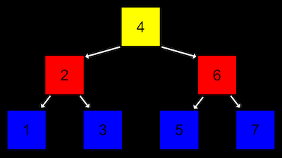
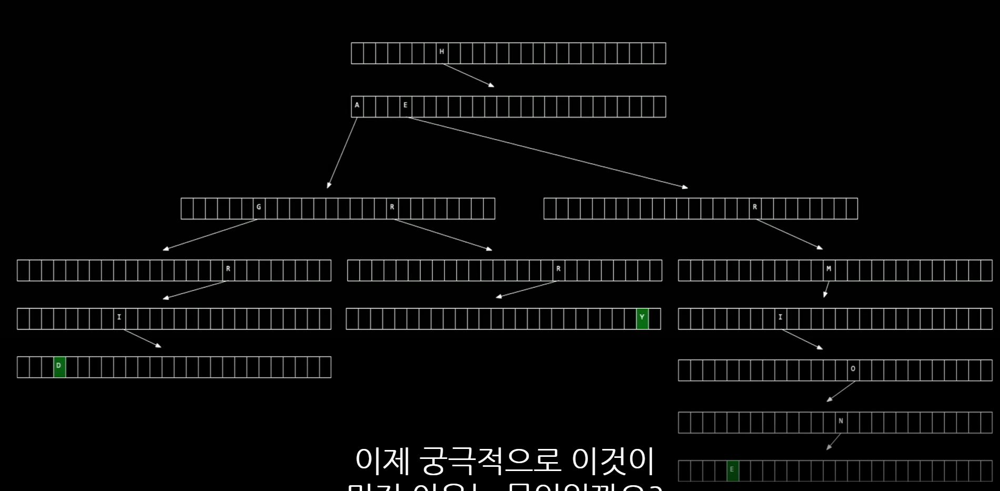

# 자료구조

> 1. malloc과 포인터 복습
> 2. 배열의 크기 조정하기
> 3. 연결 리스트: 도입
> 4. 연결 리스트: 코딩
> 5. 연결 리스트: 시연
> 6. 연결 리스트: 트리
> 7. 해시 테이블
> 8. 트라이
> 9. 스택, 큐, 딕셔너리

# 1. malloc과 포인터 복습

```c
int main(void)
{
    int *x;
    int *y;

    x = malloc(sizeof(int));

    *x = 42;
    *y = 13;
}
```

위 코드가 잘못 되었다는 것은 맨 마지막 줄을 보면 깨닫는다. 왜일까? 바로 y에는 메모리를 할당시켜주지 않았기 때문이다. 그렇다면 아래와 같은 코드를 추가 하면 에러가 발생하진 않을 것 같다!

```c
y = x;
*y = 13;
```

자 이제 컴파일은 될 것이다. 프린트를 해보면 omg x,y값이 같은 걸로 나온다 왜지? 같은 메모리를 보기 때문이다. 즉, 각자 값을 활용하고 싶으면 따로 메모리를 할당해줘야하는 것은 매우 당연하다

# 2. 배열의 크기 조정하기

우리는 배열을 종종 이용하다. 하지만 배열의 크기는 정적이다. 동적으로 메모리할당을 한 다음에 값을 넣을 수도 있지만 어찌되었든 배열의 크기를 변경하는 것은 불가능하다. 그런데 우리가 값을 더 추가하고 싶으면 어떻게 해야할까? 즉, 3개원소가 들어가는 배열에 4번째 원소를 넣고 싶은 상황이다. 그러면 아래처럼 배열을 하나 더 만들고 복사하는 방식을 이용해도 나쁘진 않을 거 같다.

```c
#include <stdio.h>
#include <stdlib.h>

int main(void)
{
    //int 자료형 3개로 이루어진 list 라는 포인터를 선언하고 메모리 할당
    int *list = malloc(3 * sizeof(int));

    // 포인터가 잘 선언되었는지 확인
    if (list == NULL)
    {
        return 1;
    }

    // list 배열의 각 인덱스에 값 저장
    list[0] = 1;
    list[1] = 2;
    list[2] = 3;

    //int 자료형 4개 크기의 tmp 라는 포인터를 선언하고 메모리 할당
    int *tmp = malloc(4 * sizeof(int));

    if (tmp == NULL)
    {
        return 1;
    }

    // list의 값을 tmp로 복사
    for (int i = 0; i < 3; i++)
    {
        tmp[i] = list[i];
    }

    // tmp배열의 네 번째 값도 저장
    tmp[3] = 4;

    // list의 메모리를 초기화
    free(list);

    // list가 tmp와 같은 곳을 가리키도록 지정
    list = tmp;

    // 새로운 배열 list의 값 확인
    for (int i = 0; i < 4; i++)
    {
        printf("%i\n", list[i]);
    }

    // list의 메모리 초기화
    free(list);
}
```

하지만 위 동작도 코드가 길어지고 아래도 뭔가 반복되는 행위가 많다. 이럴때 `realloc`을 이용하는 방법이 있다.

```c
#include <stdio.h>
#include <stdlib.h>

int main(void)
{
    int *list = malloc(3 * sizeof(int));
    if (list == NULL)
    {
        return 1;
    }

    list[0] = 1;
    list[1] = 2;
    list[2] = 3;

    // tmp 포인터에 메모리를 할당하고 list의 값 복사
    int *tmp = realloc(list, 4 * sizeof(int));
    if (tmp == NULL)
    {
        return 1;
    }

    // list가 tmp와 같은 곳을 가리키도록 지정
    list = tmp;

    // 새로운 list의 네 번째 값 저장
    list[3] = 4;

    // list의 값 확인
    for (int i = 0; i < 4; i++)
    {
        printf("%i\n", list[i]);
    }

    //list 의 메모리 초기화
    free(list);
}
```

그런데 어찌되었든 유동적이지 않아서 불편함은 그대로 있는 느낌이다.

# 3. 연결리스트: 도입

자 아이디어를 생각해보자. 산재해있는 변수들이 있다고 하자 `{0x123:1,0x789:2,0x456:3}` 이런식으로 데이터가 있다고 해보자. 나는 이것을 하나 배열처럼 관리를 하고 싶지만 값이 더 추가될 수도 있고 여기서 없애버릴 수도 있어서 그것에 대해 용이하게 하고 싶다.

그렇다면 어떠한 데이터 구조가 값도 가지고 다음 배열의 메모리 위치도 가지며 되지 않을까? 그렇다 이것이 바로 연결리스트의 시작이다.

그럼 아이디어를 생각해보자 데이터 형태는 다음과 같을 것이다 `위치, 값, 다음 값의 위치` 위치는 근데 메모리가 할당되면 자동으로 생기는 것이니 그렇게 크게 신경쓰지 않아도 될 것 같다. 즉, 우리는 **값**과 **다음 값의 위치**만 관리할 수 있도록 도와주면 될 것 같다. 그러니 다음과 같은 자료구조를 만들어보자!

```c
typedef struct node
{
    int number;
    struct node *next;
}
node;
```

node안에서는 아직 생성되지 않은 node를 쓸 수 없는데 그것을 해결하기 위해 위와같이 코딩하면 된다!

# 4. 연결 리스트: 코딩

저 아이디어를 가지고 코딩을 짜보자

```c
#include <stdio.h>
#include <stdlib.h>

//연결 리스트의 기본 단위가 되는 node 구조체를 정의합니다.
typedef struct node
{
    //node 안에서 정수형 값이 저장되는 변수를 name으로 지정합니다.
    int number; 

    //다음 node의 주소를 가리키는 포인터를  *next로 지정합니다.
    struct node *next;
}
node;

int main(void)
{
    // list라는 이름의 node 포인터를 정의합니다. 연결 리스트의 가장 첫 번째 node를 가리킬 것입니다. 
    // 이 포인터는 현재 아무 것도 가리키고 있지 않기 때문에 NULL 로 초기화합니다.
    node *list = NULL;

    // 새로운 node를 위해 메모리를 할당하고 포인터 *n으로 가리킵니다.
    node *n = malloc(sizeof(node));
    if (n == NULL)
    {
        return 1;
    }

    // n의 number 필드에 1의 값을 저장합니다. “n->number”는 “(*n).numer”와 동일한 의미입니다. 
    // 즉, n이 가리키는 node의 number 필드를 의미하는 것입니다. 
    // 간단하게 화살표 표시 ‘->’로 쓸 수 있습니다. n의 number의 값을 1로 저장합니다.
    n->number = 1;

    // n 다음에 정의된 node가 없으므로 NULL로 초기화합니다.
    n->next = NULL;

    // 이제 첫번째 node를 정의했기 떄문에 list 포인터를 n 포인터로 바꿔 줍니다.
    list = n;

    // 이제 list에 다른 node를 더 연결하기 위해 n에 새로운 메모리를 다시 할당합니다.
    n = malloc(sizeof(node));
    if (n == NULL)
    {
        return 1;
    }

    // n의 number와 next의 값을 각각 저장합니다.
    n->number = 2;
    n->next = NULL;

    // list가 가리키는 것은 첫 번째 node입니다. 
    //이 node의 다음 node를 n 포인터로 지정합니다.
    list->next = n;

    // 다시 한 번 n 포인터에 새로운 메모리를 할당하고 number과 next의 값을 저장합니다.
    n = malloc(sizeof(node));
    if (n == NULL)
    {
        return 1;
    }

    n->number = 3;
    n->next = NULL;

    // 현재 list는 첫번째 node를 가리키고, 이는 두번째 node와 연결되어 있습니다. 
    // 따라서 세 번째 node를 더 연결하기 위해 첫 번째 node (list)의 
    // 다음 node(list->next)의 다음 node(list->next->next)를 n 포인터로 지정합니다.
    list->next->next = n;

    // 이제 list에 연결된 node를 처음부터 방문하면서 각 number 값을 출력합니다. 
    // 마지막 node의 next에는 NULL이 저장되어 있을 것이기 때문에 이 것이 for 루프의 종료 조건이 됩니다.
    for (node *tmp = list; tmp != NULL; tmp = tmp->next)
    {
        printf("%i\n", tmp->number);
    }

    // 메모리를 해제해주기 위해 list에 연결된 node들을 처음부터 방문하면서 free 해줍니다.
    while (list != NULL)
    {
        node *tmp = list->next;
        free(list);
        list = tmp;
    }
}
```

# 6. 연결 리스트: 시연

연결 리스트의 원리를 학생들의 시연을 통해 살펴보았습니다.

배열과 비교해서 **연결 리스트**는 새로운 값을 추가할 때 다시 메모리를 할당하지 않아도 된다는 장점이 있습니다.

하지만 이런 유동적인 구조는 그 대가가 따릅니다. 구조가 정적인 배열과 달리 연결 리스트에서는 임의 접근이 불가능합니다. 

연결 리스트에 값을 추가하거나 검색하는 경우를 생각해 봅시다.

이를 위해서는 해당하는 위치까지 연결 리스트의 각 node들을 따라 이동해야 합니다.

따라서 연결 리스트의 크기가 n 일때 그 실행 시간은 **O(n)**이 됩니다.

배열의 경우 임의 접근이 가능하기 때문에 (정렬 되어 있는 경우) 이진 검색을 이용하면 **O(log n)**의 실행 시간이 소요 되는 것에 비해서 다소 불리합니다. 

이처럼 여러 데이터 구조는 각각 장단점이 존재합니다.

프로그래밍을 할 때 목적에 부합하는 가장 효율적인 데이터 구조를 고민해서 사용하는 것이 중요합니다.

# 7. 연결리스트: 트리

트리는 연결리스트를 기반으로 하는 새 데이터 구조이다. 노드가 가지고 있는 값보다 작으면 왼쪽 크면 오른쪽으로 간다고 생각해보자. 이런 식으로 진행을 한다면 `search`나 `insert`를 할 때 `log(n)`밖에 안걸릴 것이다.



그렇다면 검색함수를 한번 구현해보자

```c
//이진 검색 트리의 노드 구조체
typedef struct node
{
    // 노드의 값
    int number;

    // 왼쪽 자식 노드
    struct node *left;
 
   // 오른쪽 자식 노드
    struct node *right;
} node;

// 이진 검색 함수 (*tree는 이진 검색 트리를 가리키는 포인터)
bool search(node *tree)
{
    // 트리가 비어있는 경우 ‘false’를 반환하고 함수 종료
    if (tree == NULL)
    {
        return false;
    }
    // 현재 노드의 값이 50보다 크면 왼쪽 노드 검색
    else if (50 < tree->number)
    {
        return search(tree->left);
    }
    // 현재 노드의 값이 50보다 작으면 오른쪽 노드 검색
    else if (50 > tree->number)
    {
        return search(tree->right);
    }
    // 위 모든 조건이 만족하지 않으면 노드의 값이 50이므로 ‘true’ 반환
    else {
        return true;
    }
}
```

# 7. 해시 테이블

해시 테이블은 **‘연결 리스트의 배열’**입니다. 여러 값들을 몇 개의 바구니에 나눠 담는 상황을 생각해 봅시다.

각 값들은 **‘해시 함수’**라는 맞춤형 함수를 통해서 어떤 바구니에 담기는 지가 결정 됩니다.

각 바구니에 담기는 값들은 그 바구니에서 새롭게 정의되는 연결 리스트로 이어집니다.

이와 같이 연결 리스트가 담긴 바구니가 여러개 있는 것이 ‘연결 리스트의 배열’, 즉 ‘해시 테이블’이 됩니다.

쉬운 예로 아래 그림과 같이 사람의 이름이 해시 테이블에 저장되며, 해시 함수는 **‘이름의 가장 첫 글자’**인 경우를 생각해 보겠습니다.

그 경우 알파벳 개수에 해당하는 총 26개의 포인터들이 있을 수 있으며, 각 포인터는 그 알파벳을 시작으로 하는 이름들을 저장하는 연결 리스트를 가리키게 됩니다.


만약 해시 함수가 이상적이라면, 각 바구니에는 단 하나의 값들만 담기게 될 것입니다.

따라서 검색 시간은 **O(1)**이 됩니다.

하지만 그렇지 않은 경우, 최악의 상황에는 단 하나의 바구니에 모든 값들이 담겨서 **O(n)**이 될 수도 있습니다.

일반적으로는 최대한 많은 바구니를 만드는 해시 함수를 사용하기 때문에 거의 O(1)에 가깝다고 볼 수 있습니다.

# 8. 트라이

트라이는 기본적으로는 트리의 형태이다. 각 노드가 배열로 이루어져 있고 그 다음 것을 찾기 위해 설정되어있다. 그림을 보면 쉽게 이해가 된다



이 구조의 장점은 이름 길이는 상수이므로 `O(k) => O(1)` 시간복잡도가 즉 최소한으로 일정하다는 것이다! 검색에는 매우 용이하다. 하지만 단점은 메모리를 너무 많이 먹는 다는 것이 아주 큰 단점이다.

# 9. 스택, 큐, 딕셔너리

**큐**

큐는 메모리 구조에서 살펴봤듯이 값이 아래로 쌓이는 구조입니다.

값을 넣고 뺄 때 **‘선입 선출’** 또는 **‘FIFO’**라는 방식을 따르게 됩니다. 가장 먼저 들어온 값이 가장 먼저 나가는 것이죠.

은행에서 줄을 설 때 가장 먼저 줄을 선 사람이 가장 먼저 업무를 처리하게 되는 것과 동일합니다.

**배열**이나 **연결 리스트**를 통해 구현 가능합니다.

**스택**

반면 스택은 역시 메모리 구조에서 살펴봤듯이 값이 위로 쌓이는 구조입니다.

따라서 값을 넣고 뺄 때 **‘후입 선출’** 또는 **‘LIFO’**라는 방식을 따르게 됩니다. 가장 나중에 들어온 값이 가장 먼저 나가는 것이죠.

뷔페에서 접시를 쌓아 뒀을 때 사람들이 가장 위에 있는(즉, 가장 나중에 쌓인) 접시를 가장 먼저 들고 가는 것과 동일합니다.

역시 **배열**이나 **연결 리스트**를 통해 구현 가능합니다.

**딕셔너리**

딕셔너리는 **‘키’**와 **‘값’**이라는 요소로 이루어져 있습니다.

‘키’에 해당하는 ‘값’을 저장하고 읽어오는 것이죠. 마치 대학교에서 ‘학번’에 따라서 ‘학생’이 결정되는 것과 동일합니다.

일반적인 의미에서 **‘해시 테이블’**과 동일한 개념이라고도 볼 수 있습니다.

역시 ‘키’를 어떻게 정의할 것인지가 중요합니다.

 