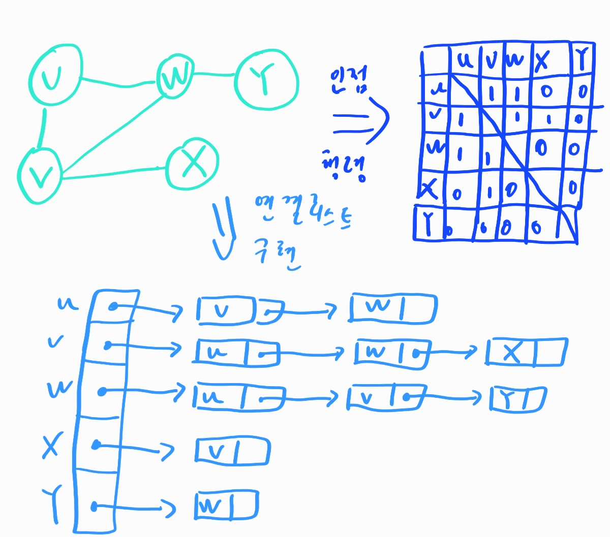

# 그래프

그래프는 가장 일반화된 자료구조이다. 지하철 노선도와 같은 것들이 대표적인 그래프의 예라고 생각할 수 있다. 노드끼리 어떻게 연결되어있는가 이 생각을 해야한다.

그래프의 종류는 다음과 같이 나눌 수가 있다.

- 무방향 그래프: **간선에 방향이 표시되지 않은 그래프**. 양방향으로 갈수 있는 길을 의미한다.
- 방향 그래프: **간선에 방향이 표시된 그래프**. 단방향으로만 갈수 있다.
- 가중치 그래프: **간선에 비용이나 가중치가 할당된 그래프**. 일종에 톨게이트를 생각하면 된다.
- 부분 그래프. 그래프를 구성하는 정점의 잡합과 간선의 집합들이 부분집합으로 이루어진 것을 부분그래프라고 할 수 있다.

그래프와 관련된 용어는 아래와 같다

- 인접 정점: **간선에 의해 직접 연결된 정점**
- 정저의 차수: 그 **정점에 연결된 간선의 수**, 무방향에선 딱히 나누진 않지만 방향 그래프에서는 외부에서 오는 간선의 수를 **진입 차수**, 정점에서 외부로 향하는 간선의 수를 **진출 차수**
- 경로: 말그대로
- 단순 경로, 싸이클: **경로 중에서 반복되는 간선이 없는 경로를 단순 경로**, `시작정점 == 종료 정점`이면 **사이클**
- 연결 그래프: 모든 정점들 사이에 경로가 존재하면 연결그래프 아니면 비연결 그래프
- 트리: **사이클이 없는** 그래프
- 완전 그래프: 모든 정점 간에 간선이 존재하는 그래프

그래프를 표현하는 방법은 **인접 행렬**과 **링크드 리스트**가 있다. 아래 그림과 같이 구현이 가능하고 단방향도 구현이 가능하다.



그래프를 순회하는 방식에는 두가지가 있고 매우 익숙한 방법이다. **DFS**와 **BFS**, DFS는 스택 또는 재귀로 편하게 구현이 가능하고 BFS의 경우에는 큐로 편하게 구현이 가능하니 구현하고 싶은 방향으로 편하게 구현해보자

# 가중치 그래프

가중치 그래프란 그래프에서 가중치를 표현한 것으로 그래프처럼 표현하는 것이 당연히 가능하다. 하지만 인접행렬에서 1대신 가중치를 표기하고 링크드 리스트로 표현할 때는 cost 속성을 추가시켜서 표현해주는 것이 좋다.

가중치 그래프도 DFS나 BFS로 표현해도 괜찮긴 하다. 하지만 가중치 그래프를 위한 전문적인 알고리즘이 존재한다. 알아보도록 하자

## Kruskal

Kruskal의 알고리즘은 **탐욕적인 방법**이라는 알고리즘 설계에서 중요한 기법 중의 하나를 사용한다. 결정을 할 때마다. **그 순간 최적**이라고 생각되는 것을 선택한다. 어찌보면 말이 안되겠다고 생각하지만 **Kruskal**알고리즘은 증명이 되어 선택을 이용할 수 있는 알고리즘이다. kruskal은 모든 정점을 방문하며 최소의 가중치를 지니는 루트를 제공한다.

Kruskal알고리즘은 아래와 같은 순서를 가진다.

1. 그래프의 모든 간선을 가중치에 따라 오름차순으로 정렬한다
2. 가장 가중치가 작은 간선 e를 뽑는다
3. e를 신장 트리에 넣었을 때 사이클이 생기면 넣지 않고 2번으로 이동한다.
4. 사이클이 생기지 않으면 최소 신장 트리에 삽입한다.
5. n-1개의 간선이 삽입될 때 까지 2번으로 이동한다.

이렇게 써놓으니 매우 간단해 보인다. 하지만 아직 해결하지 못한 부분이 있다. 사이클이 생기는지를 검사하바는 방법이다. 이미 선택된 간선들의 집합에 새로운 간선을 추가할 때 사이클을 생성하는 지를 검사하여야 한다. 

### union,find 연산

그렇다면 이 방법을 적절히 해결해줄 `union`연산과 `find`연산에 대해 알아보자. `union(x,y)`는 원소 x, y가 속해있는 집합을 입력으로 받아들여 합집합을 만드는 연산이다. `find(x)` 연산은 여러 집합들 중에서 원소 x가 속해있는 집합을 반환하는 연산이다. 아래와 같은 집합이 있다고 하자.

`{1},{2},{3},{4},{5},{6}`

`union(1,4)`,`union(5,2)`를 이용하면 위 집합은 다음과 같아질 것이다. `{1,4},{5,2},{3},{6}`

`find(2)`를 이용하면 우리는 `{5,2}`를 반환받을 것이며 `union(4,5)` 와 `union(3,6)`을 입력하면 집합은 다음과 같아질 것이다. `{1,4,5,2,},{3,6}` 이것을 대략적인 코드로 구현하면 아래와 같을 것이다.

```python
# mine_union_find
parent = []
set_size = 0
def init_set(nSets):
    global set_size,parent
    set_size = nSets
    for i in range(nSets):
        parent.append(-1)

def find(id):
    while parent[id] >= 0:
        id = parent[id]
    return id

def union(s1,s2):
    global set_size
    parent[s1] = s2
    set_size -= 1
```

## kruskal 알고리즘의 구현

그렇다면 union,find를 통해 kruskal알고리즘을 한번 구현해보자. 사이클 검사과정을 중심으로 kruskal알고리즘을 설명하면 아래와 같다

1. 초기에는 모든 정점이 각각 고유한 집합이다.
2. 최소 가중치 간선(u,v)가 선택되면 u와 v가 각각 속한 집합을 찾는다. 이때 `find(u)`와 `find(v)`연산을 실행한다.
3. 두 집합이 같으면 사이클이 발생한다는 소리이므로 이 간선은 버린다
4. 두 집합이 다르면 간선을 삽입하고 집합을 하나로 합친다. `union(u,v)` 연산을 사용하면 된다!

어때 어렵지 않지 않은가? ~~아잇 씨파~~ 

```python
import mine_union_find
def Kruskal(vertex,adj): # vertext는 정점 리스트, adj는 인접행렬
    vsize = len(vertex)
    mine_union_find.init_set(vertex)
    eList = []

    for i in range(vsize-1):
        for j in range(i+1,vsize):
            if adj[i][j] != None:
                eList.append((i,j,adj[i][j]))

    # 가중치 순으로 정렬 시키자
    eList.sort(key = lambda e: e[2], reverse = True)

    edgeAccepted = 0
    while edgeAccepted < vsize - 1: # 간선의 선택수는 노드-1개이다
        selected_line = eList.pop(-1)
        uset = mine_union_find.find(selected_line[0])
        vset = mine_union_find.find(selected_line[1])

        if uset != vset:
            edgeAccepted += 1
            mine_union_find.union(uset,vset)
            print("추가된 간선 : ",vertex[selected_line[0]],vertex[selected_line[1]],selected_line[2])
```

## Prim

Prim알고리즘은 하나의 정점에서붵 시작하여 트리를 단계적으로 확장해나가는 방법이다. 다음과 같은 알고리즘으로 진행된다.

1. 그래프에서 시작 정점을 선택하여 초기 트리를 만든다.
2. 현재 트리의 정점들과 인접한 정점들 중에서 간선의 가중치가 가장 작은 정점 v를 선택한다.
3. 이 정점 v와 이때의 간선을 트리에 추가한다.
4. 모든 정점이 삽입될 때까지 2번으로 이동한다.

kruskal이 간선을 기반으로 하면 prim알고리즘은 정점을 기반으로 한다. 위 순서를 보면 왠지 kruskal보다 쉬워보이기도 한다. ~~예?~~ 하지만 생각보다 구현하는데에 처리해야할 사항이 있다. 현재의 MST에 인접한 정점들 중에서 가장 가까운 정점을 찾는 과정이다. 이를 위해 dist라는 배열을 사용한다. 배열의 크기는 그래프 정점의 수와 같다

- `dist[i]`는 현재까지 구성된 MST에서 i번째 정점까지의 가장 가까운 거리를 저장한다. 처음에는 시작 정점의 dist 값은 0이고 나머지 정점의 dist는 무한대가 된다.
- 정점이 MST에 추가되면 dist값들이 갱신된다. 예를 들어, MST에 u가 추가된다면 당연히 `dist[u] = 0`으로 변경된다.
- u와 인접한 정점 v의 거리 `dist[v]`도 변경되어야 한다. 즉, 추가되는 정점 u와의 간선 `(u,v)`의 가중치가 기존의 `dist[v]`보다 작으면 `dist[v]`는 이 가중치 값으로 갱신되어야한다.
- 이 과정은 모든 정점이 MST에 포함될 때까지 진행된다.

```python
import sys
INF = sys.maxsize
# 현재 트리에 인접한 정점들 중에서 가장 가까운 정점을 찾는 함수
def getMinVertex(dist,selected):
    minv = 0
    mindist = INF
    for v in range(len(dist)):
        if not selected[v] and mindist > dist[v]:
            mindist = dist[v]
            minv = v
            
    return minv

def MSTPrim(vertex,adj):
    vsize = len(vertex)
    dist = [INF]*vsize
    selected = [False]*vsize
    dist[0] = 0 # dist[시작점], 이경우는 시작점이 0 인 케이스

    for i in range(vsize):
        u = getMinVertex(dist,selected)
        selected[u] = True
        for v in range(vsize):
            if adj[u][v] != None:
                if selected[v] == False and adj[u][v]<dist[v]:
                    dist[v] = adj[u][v]
    print(dist)
```

