# 탐색트리

> 탐색트리는 탐색을 위한 트리 기반 자료구조이다

이진 탐색의 트리는 기본은 다음과 같다

- 모든 노드들은 유일한 키값을 가진다
- 루트 노드의 왼쪽은 루트 노드보다 키 값이 작다
- 루트 노드의 오른쪽은 루트 노드보다 키 값이 크다
- 왼쪽 노드와 오른쪽 노드의 서브트리도 이진 탐색 트리이다

그렇다면 이진 탐색 트리 노드의 객채는 다음과 같이 생겼을 것이다.

```python
class BSTNode:
    def __init__(self,key,value,left=None,right=None):
        self.key = key
        self.value = value
        self.left = left
        self.right = right
```

그렇다면 `search`를 어떻게 진행해야할까? search를 진행할 수 있는 요소는 두가지가 있다. `key`와 `value`값이라고 생각할 수 있다!

key값을 통한 search는 매우 쉽다! 마참내~

```python
def search_bst_recursion(n,key):
    if n == None:
        return None
    elif n.key == key:
        return n
    elif n.key > key:
        return search_bst_recursion(n.left,key)
    elif n.key < key:
        return search_bst_recursion(n.right,key)

def search_bst_while(n,key):
    while n!=None:
        if n.key == key:
            return n
        elif n.key < key:
            n = n.right
        elif n.key > key:
            n = n.left
    return None
```

하지만 `key`값을 찾는 것보다는 value를 많이 이용할 듯 하다. 그렇다면 어떻게 진행을 할 수가 있을까? 과거의 기억을 조금 떠올려보자. 우리에게는 트리를 순회하는 방법이 있다! 그렇다 전위, 후위, 중위, 레벨 순회 같은 원하는 방식으로 우리는 search를 진행할 수가 있다. **전위 순회**만 한번 진행해보도록 하자

```python
def preorder_search(n,value):
    if n == None:
        return None
    if n.value == value:
        return n
    res = preorder_search(n.left,value)
    if res != None:
        return res
    else:
        return preorder_search(n.right,value)
```

삭제 연산을 생각해보자. 삭제연산은 다음과 같은 경우가 있을 것이다.

- 단말 노드 삭제
- 자식이 하나인 노드 삭제
- 자식이 둘인 노드 삭제

이렇게 경우의 수가 세가지 일 것이다. 일단 그렇다면 하나씩 구현 해보자.

- 단말 노드 삭제

  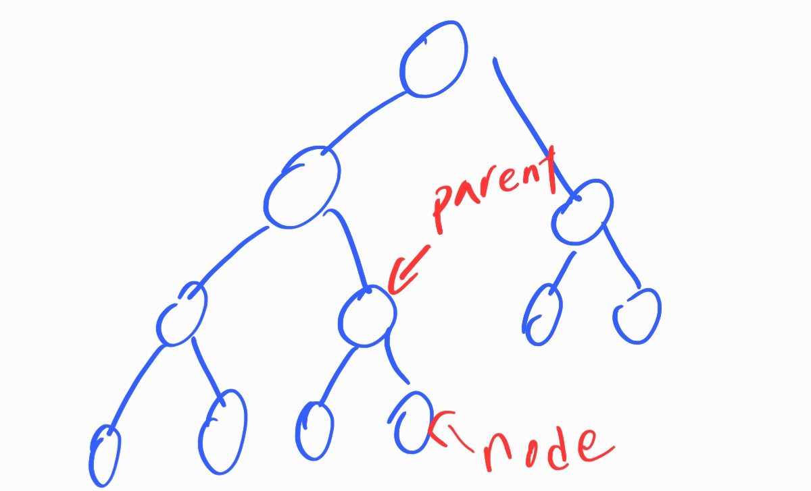

  ```python
  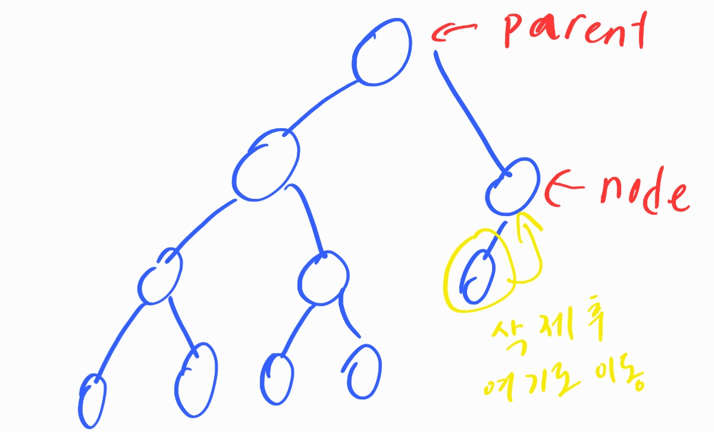def delete_only_node(parent,node,root):
      if parent == None:
          root = None
      else:
          if parent.left == node:
              parent.left = None
          elif parent.right == node:
              parent.right = None
      return root
  ```

- 자식 노드가 하나 있는 경우

  

  ```python
  def delete_has_one_child(parent,node,root):
      child = None
      if node.left != None:
          child = node.left
      elif node.right != None:
          child = node.right
      
      if child == None: # 잘못된 루트 삭제를 할려는 경우
          return None
      
      if node == root:
          root = child
      else:
          if parent.left == node:
              parent.left = node
          elif parent.right == node:
              parent.right = node
      return root
  ```

- 자식 노드가 둘 있는 경우 (이 경우에는 삭제가 아니라 후계자 노드가 삭제 노드를 대신한다고 생각하자)

  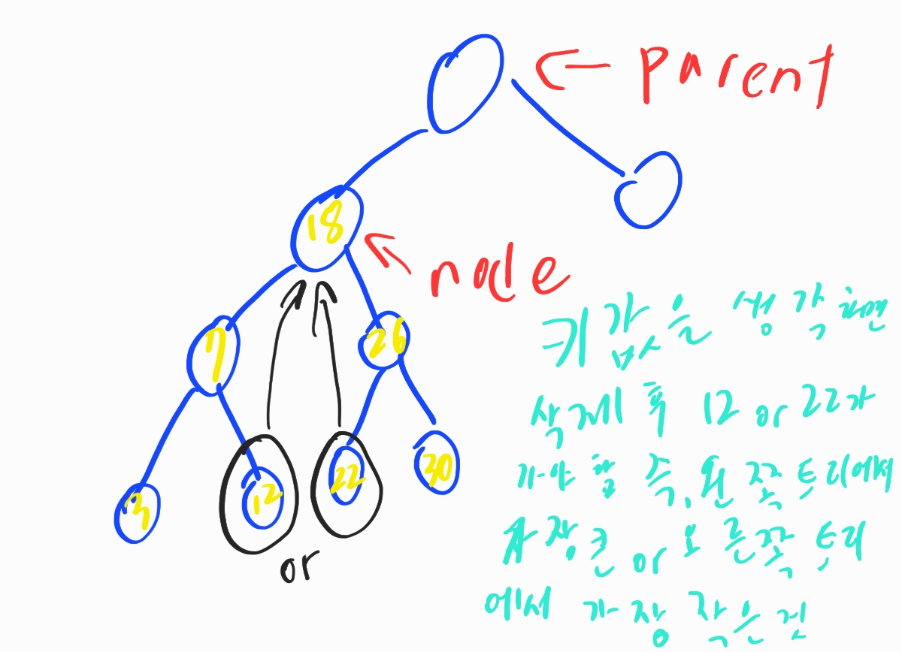

  ```python
  def delete_has_both_node(parent,node,root):
      successor_parent = node
      successor = node.right
      while node.left != None:
          successor_parent = successor
          successor = successor.left
      
      if successor_parent.left == successor:
          successor_parent.left = successor.right
      elif successor_parent.right == successor:
          successor_parent.right = successor.right
      
      node.key = successor.key
      node.value = successor.value
      node = successor
  
      return node
  ```

위 세가지를 경우에 맞게 나누어도 되지만 하나로 뭉쳐도 괜찮다 위와 같이 함수를 세가지로 나누고 아래처럼 하나로 묶는 방법도 있다

```python
def delete_bst(root,key):
    if root == None:
        return None
    
    parent = None
    node = root
    while node != None and node.key != key:
        parent = node
        if node.key < key:
            node = node.right
        else:
            node = node.left
    
    if node == None:
        return None
    if node.left == None and node.right == None:
        root = delete_only_node(parent,node,root)
    elif node.left == None or node.right == None:
        root = delete_has_one_child(parent,node,root)
    else:
        root = delete_has_both_node(parent,node,root)
    return root
```

## 이진트리를 이용한 맵

우리는 이진트리를 이용해서 맵형식에 데이터도 만들수가 있다. 그것을 한번 클래스로 정의해보자

```python
import mine_node
import mine_binary_search_tree
class BSTMap:
    def __init__(self):
        self.root = None
    
    def isEmpty(self):
        return self.root == None
    
    def clear(self):
        self.root = None
    
    def size(self):
        if self.root == None:
            return 0
        else:
            return 1 + self.size(self.root.left) + self.size(self.root.right)
    
    def search(self,key):
        return mine_binary_search_tree.search_bst_recursion(self.root,key)
    
    def search_value(self,value):
        return mine_binary_search_tree.preorder_search(self.root,value)
    
    def insert_node(self,key,value=None):
        node = mine_node.BSTNode(key,value)
        if self.isEmpty():
            self.root = node
        else:
            mine_binary_search_tree.insert(self.root,node)
    
    def delete(self,key):
        self.root = mine_binary_search_tree.delete_bst(self.root,key)
```

## 균형이진탐색트리

트리의 균형기법은 정말 많고 중요하다. 하지만 복잡하기에 조금 나중에 제대로 알아보고 일단 지금은 AVL트리만을 알아보자

## AVL트리

AVL트리란 Adelson-Velskii와 Landis에 의해 제안된 트리이다. 항상 균형을 보장하기 때문에 탐색과 삽입, 삭제 연산에 항상 `O(logn)`이 걸린다. 어떤 노드의 **균형 인수**는 **왼쪽 서브트리의 높이와 오른쪽 서브트리의 높이 차**로 정의된다. 아래 그림이 일반적인 AVL트리이다.

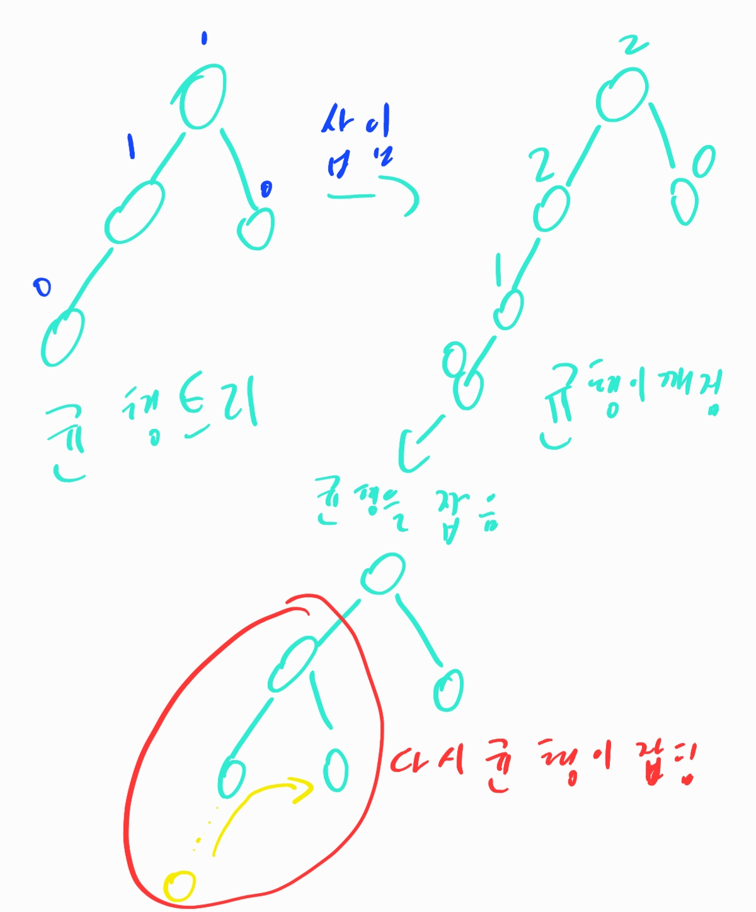

그렇다면 AVL트리가 균형을 잡는데에 어떠한 방법을 쓸까? 다양한 방법이 있으니 차근차근 알아보자

- LL회전

  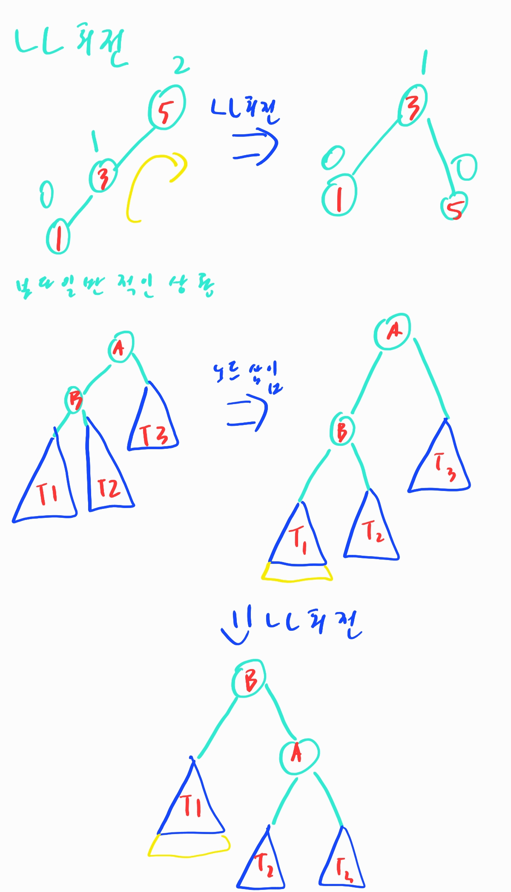

  ```python
  def LLRotate(A):
      B = A.left
      A.left = B.right
      B.right = A
      return B
  ```

- RR회전

  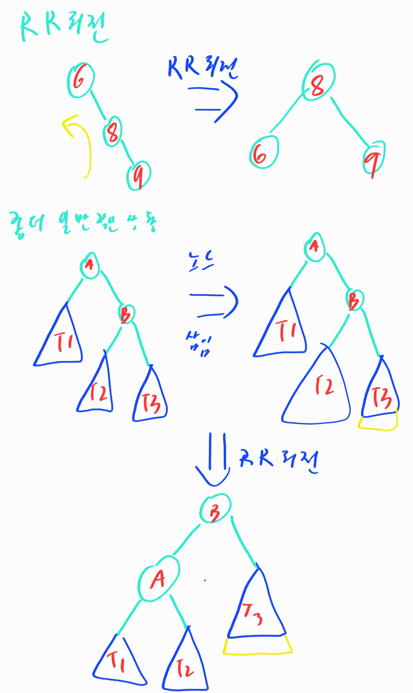

  ```python
  def RRRotate(A):
      B = A.right
      A.right = B.left
      B.left = A
      return B
  ```

- RL회전

  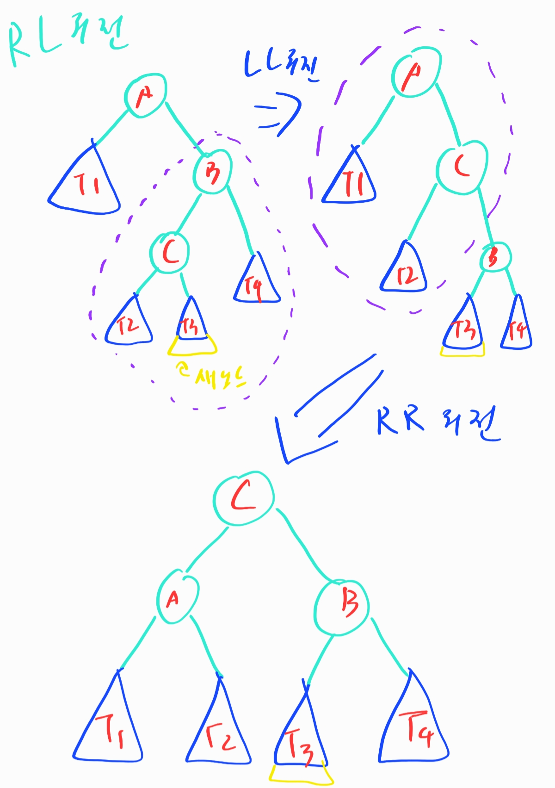

  ```python
  def RLRotate(A):
      B = A.right
      A.right = LLRotate(B)
      return RRRotate(A)
  ```

- LR회전

  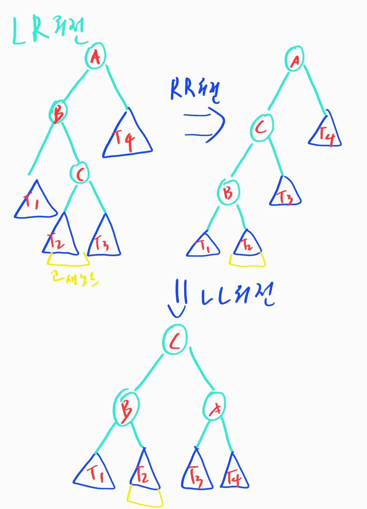

  ```python
  def LRRotate(A):
      B = A.left
      A.left = RRRotate(B)
      return LLRotate(A)
  ```

위와 같은 상황들이 회전상황들이다. 그렇다면 이것을 이제 자동화 시켜보자 상황별로 함수를 실행 시키면 될 것 같다. 그러기 위해서 일단 height를 알 수 있는 함수가 필요할 듯 하다.

```python
def calc_height(n):
    if n == None:
        return 0
    hleft = calc_height(n.left)
    hright = calc_height(n.right)
    if hleft>hright:
        return hleft + 1
    else:
        return hright + 1
```

그렇다면 이제 전체적으로 균형을 잡는 함수를 만들어 보자!

```python
def rebalance(parent):
    hleft  = calc_height(parent.left)
    hright = calc_height(parent.right)
    hdiff  = hleft - hright

    if hdiff > 1:
        if calc_height(parent.left.left) - calc_height(parent.left.right) > 0:
            parent = LLRotate(parent)
        else:
            parent = LRRotate(parent)
    elif hdiff < -1:
        if calc_height(parent.right.left) - calc_height(parent.right.left) < 0:
            parent = RRRotate(parent)
        else:
            parent = RLRotate(parent)
    
    return parent
```

그렇다면 삽입도 자연스럽게 진행될 것이라고 생각할 수가 있다.

```python
def insert_avl(parent,node):
    if parent.key < node.key:
        if parent.right == None:
            parent.right = node
        else:
            parent.right = insert_avl(parent.right,node)
        return rebalance(parent)
    
    elif parent.key > node.key:
        if parent.left == None:
            parent.left = node
        else:
            parent.left = insert_avl(parent.left,node)
        return rebalance(parent)
    
    else:
        print("key값 중복")
```

## 레드블랙트리

레드블랙트리는 노드에 색을 부여하여 트리의 균형을 유지하며, 탐색, 삽입, 삭제 연산의 수행시간이 각각 `O(logN)`을 넘지 않는 매우 효율적인 자료구조이다. 구조 조건은 다음과 같다

1. 노드는 레드 혹은 블랙 중의 하나이다.
2. 루트 노드는 블랙이다.
3. 모든 리프 노드들(NIL)은 블랙이다.
4. 레드 노드의 자식노드 양쪽은 언제나 모두 블랙이다. (즉, 레드 노드는 연달아 나타날 수 없으며, 블랙 노드만이 레드 노드의 부모 노드가 될 수 있다)
5. 어떤 노드로부터 시작되어 그에 속한 하위 리프 노드에 도달하는 모든 경로에는 리프 노드를 제외하면 모두 같은 개수의 블랙 노드가 있다.

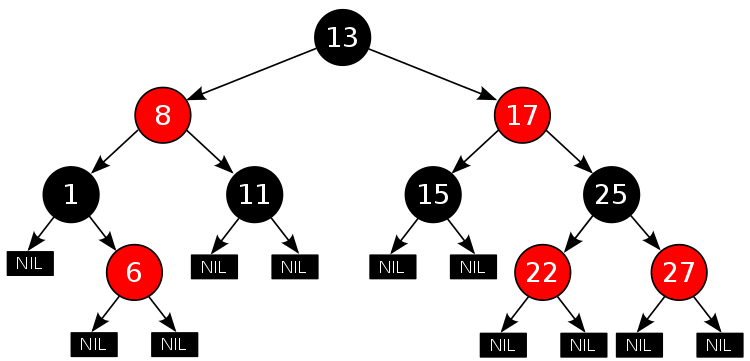

[세부적인 내용은 이것을 더 참고하고 정리해보자 아직은 이른듯 하다](https://ko.wikipedia.org/wiki/%EB%A0%88%EB%93%9C-%EB%B8%94%EB%9E%99_%ED%8A%B8%EB%A6%AC)

## B트리

B트리는 데이터베이스 또는 데이터를 다루기에 좋은 균형트리이다. 균형트리라 기본적으로 모든 연산이 `O(logN)`의 시간을 갖는다는 이점이 있다. 그렇다면 차이점은 무엇인가? 일단 B트리의 특징과 예시 형태는 다음과 같다

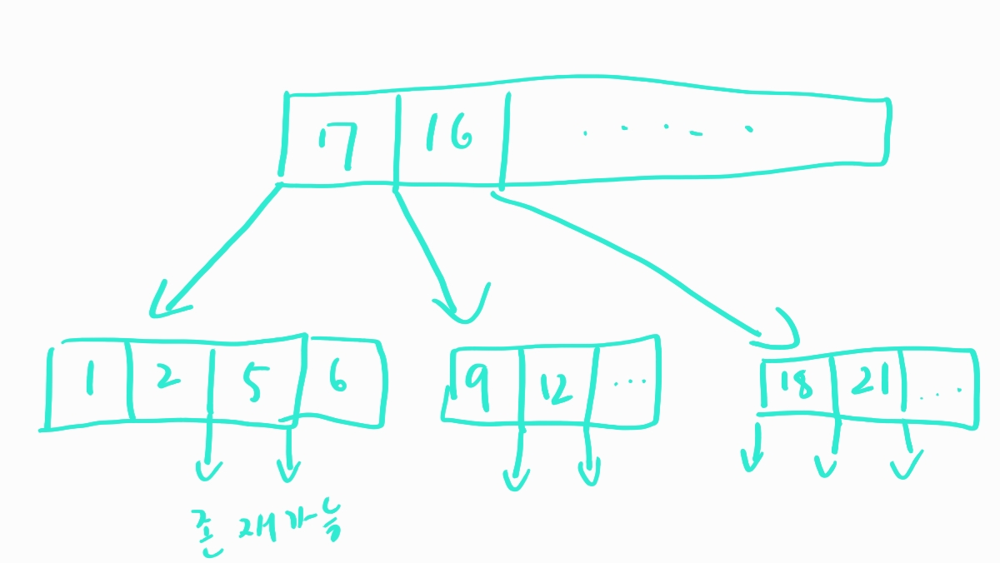

1. 노드의 자료수가 K라면 자식의 수는 K+1이어야 한다
2. 자료는 정렬된 상태로 저장된다.
3. 한 노드 N 의 왼쪽 서브트리는 N의 키 작은 값으로 되어 있고, 오른쪽 서브트리는 큰 값으로 되어 있다.
4. ROOT 노드는 적어도 2개 이상의 자식을 가져야한다. ( 트리가 ROOT 노드로만 구성되어있을 경우 예외, 위의 특징 ① 때문에)
5. ROOT 노드를 제외한 모든 노드는 적어도 ⌊ M/2 ⌋ 개의 키를 가지고 있어야 한다. ( ⌊ ⌋ : floor function - 소수점을 버린다.)  (B 트리의 장점 - 저장 장치의 효율성, 즉 각 노드마다 반 이상 키 값이 저장되어 있다.)
6. 리프노드로 가는 경로의 길이는 모두 같다 = 리프노드는 모두 같은 레벨에 있다.
7. 입력 자료는 중복될 수 없다.

검색은 어떻게 할까?

1. 이진검색으로 키값을 통해 손쉽게 검색이 가능하다
2. 중위순회로도 가능하지만 이경우 성능이 좋지는 않다

삽입은 어떻게 진행이 될까? 전체적인 진행 방식은 아래 순서대로 이루어진다

1. 자료는 항상 리프노드에 추가된다.
2. 리프 노드의 선택은 ROOT 노드부터 시작해 하향식으로 탐색하며 결정한다.
3. 선택한 리프 노드에 여유가 있다면 그냥 삽입. 여유가 없다면 분할한다.

3번을 보면 분할이 필요하다고 한다. 그렇다면 분할은 어떻게 진행될까? 다음과 같은 두가지 경우로 나눌 수 있을 거 같고 각 상황별로 쪼개는 방법은 그림과 같다

1. 리프만 꽉 차있는 경우

   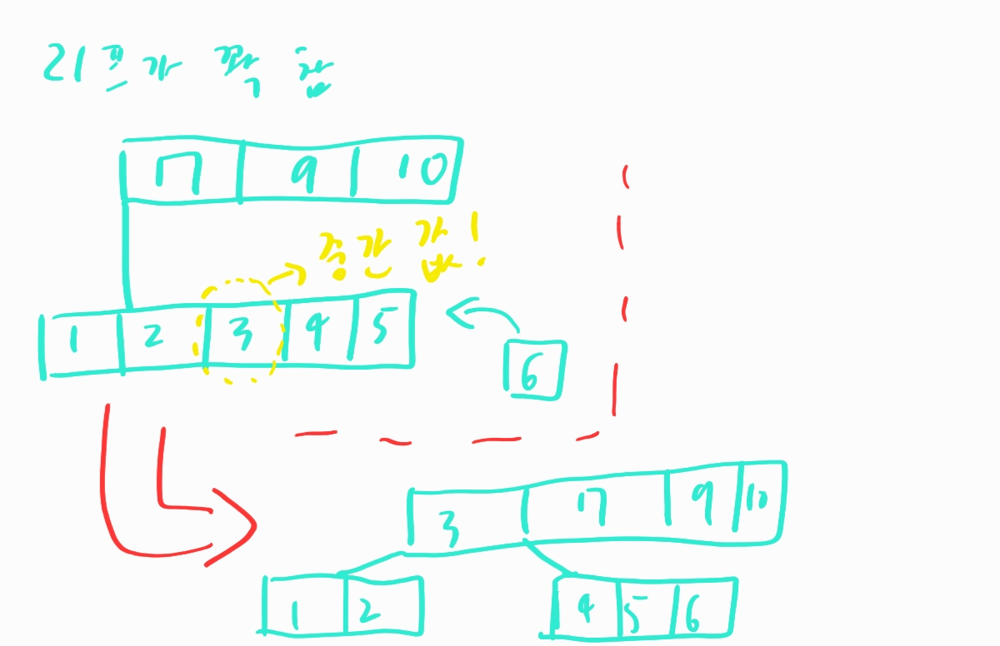

   중간값을 가진 노드를 부모에 올리고 그 부모를 기준으로 리프를 다시 쪼개면 된다

2. 부모마저 꽉차있을 경우

   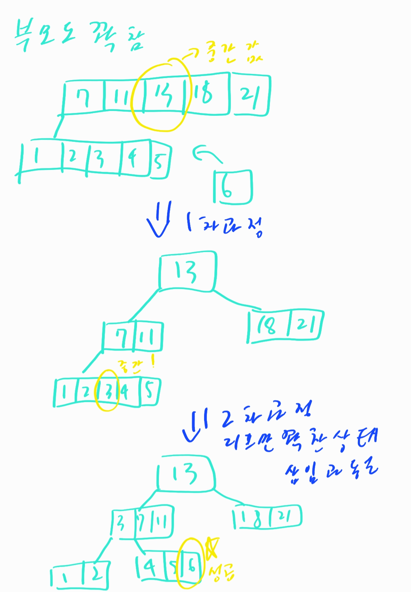

   일단 부모를 기준으로 쪼개서 루트를 다시 만든다. 그리고 쪼개진 것을 기준으로는 리프만 꽉 차있는 상황일테니 위와 같은 상황을 한번더 해주면 손쉽게 넣을 수가 있다.

삽입은 진행할 수 있게 되었다! 그렇다면 삭제는 어떻게 진행할 수 있을까? 기본적인 시행은 아래와 같다

1. 삭제할려는 키 값을 가진 노드가 가지고 있는 키 갯수를 해당 키 값 삭제 후에 M/2 개 이상이 되도록 해야한다.
2. 형제한테 빌리기 / 형제와 결합하기
3. 삭제 키가 있는 노드가 내부 노드인 경우 - 대체 키를 찾아 대체한다.( 왼쪽 서브트리 중 가장 큰 값 OR 오른쪽 서브트리 중 가장 작은 값.)

삭제 하는 예시는 아래와 같다

1. 리프 노드에서 삭제

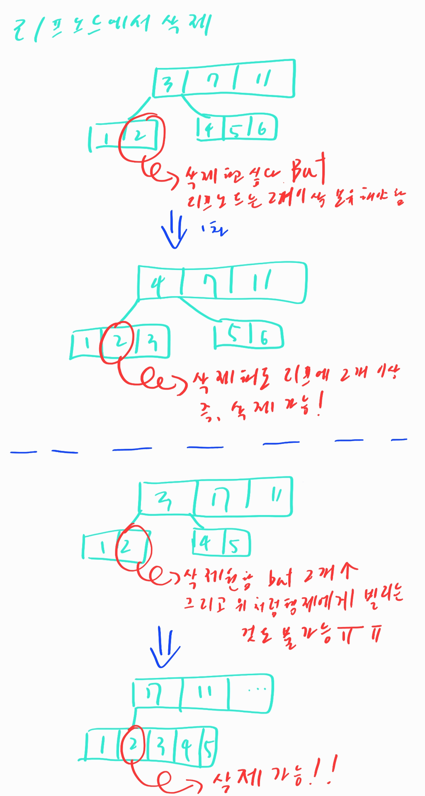

2. 내부노드에서 삭제

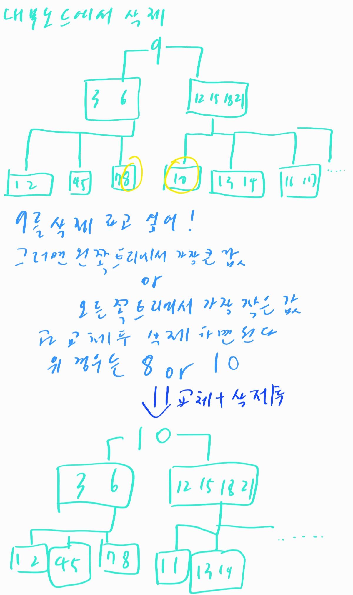