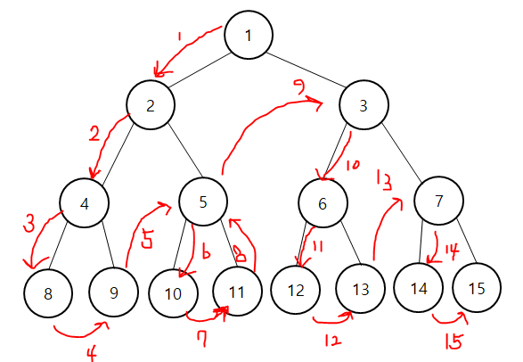
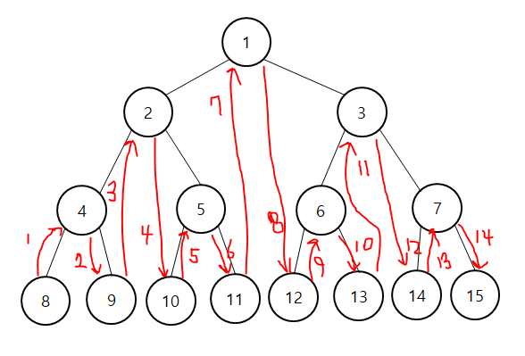
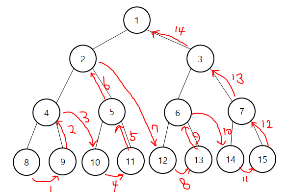
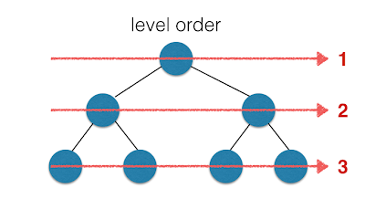
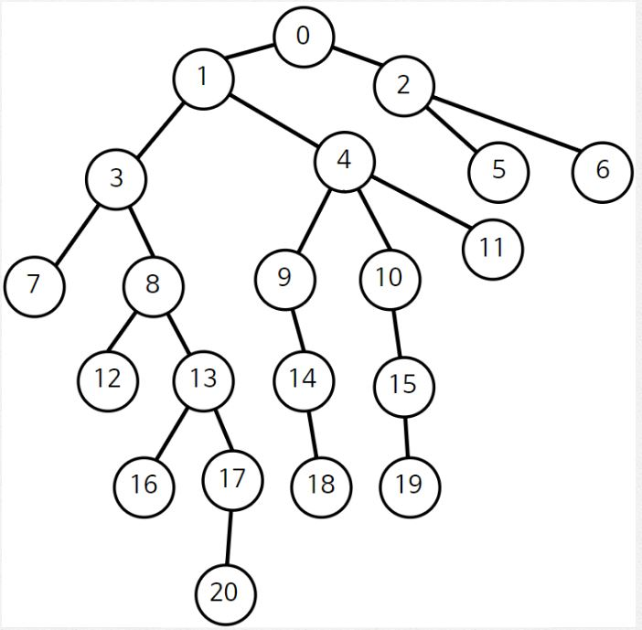

#  트리

자료구조의 형태는 나무를 생각하면 좀 편하다.

트리에도 다양한 형태가 있고 그중 대표적인 트리는 이진트리라고 할 수 있겠다. 이진트리는 두가지 표현하는 방법이 있다. 리스트로 표현하거나 아니면 클래스로 구현을 하거나.

리스트로 표현 하는 방식은 간단하다. 어느 한 노드의 위치가 `i`이면 왼쪽 노드는 `2i`, 오른쪽 노드는 `2i+1`, 부모 노드는 `i/2`이다. 하지만 완전하지 않은 노드면 리스트로 표현할 때 빈자리가 많이 생기게 되는 단점이 있다. 그러니 클래스로 한번 구현해보자

```python
class TNode:
    def __init__(self,elem,left=None,right=None):
        self.data = elem
        self.left = left
        self.right = right
```

트리에 대한 용어는 다음과 같이 정리를 할 수가 있다

- 루트 - 트리 최상위 노드
- 자식 노드 - 노드 하위에 연결된 노드
- 차수 - 자식 노드 수
- 부모 노드 - 노드의 상위에 연결된 노드
- 이파리 - 자식이 없는 노드
- 형제 노드 - 동일한 부모를 가지는 노드
- 조상 노드 - 루트까지의 경로상에 있는 모든 노드들의 집합
- 후손 노드 - 노드 아래로 매달린 모드 노드들의 집합
- 서브트리 - 노드 자신과 후손 노드로 구성된 트리
- 레벨 - 루트가 레벨 1에 있고, 아래 층으로 내려가며 레벨이 1씩 증가한다. 레벨은 깊이와 같다
- 높이 - 트리의 최대 레벨
- 키 - 탑색에 사용되는ㄴ 노드에 저장된 정보

## 순회

트리를 순회하면서 어떤 데이터가 있는지 체크를 해보자. 방법은 다양한 방법이 있다. 하나씩 알아보자 [그림참고](https://hongku.tistory.com/160)

1. 전위 순회

   

   ```python
   def preorder(n):
       if n is not None:
           print(n.data)
           preorder(n.left)
           preorder(n.right)
   ```

2. 중위 순회

   

   ```python
   def inorder(n):
       if n is not None:
           inorder(n.left)
           print(n.data)
           inorder(n.right)
   ```

3. 후위 수회

   

   ```python
   def postorder(n):
       if n is not None:
           postorder(n.left)
           postorder(n.right)
           print(n.data)
   ```

4. 레벨 순회 [그림 참고](http://nospblog.blogspot.com/2013/12/data-structure-level-order.html)

   

   ```python
   from collections import deque
   def levelorder(n):
       Que = deque()
       Que.append(n)
       while Que:
           node = Que.popleft()
           if node is not None:
               print(node.data)
               Que.append(node.left)
               Que.append(node.right)
   ```

## 트리의 응용: 힙

힙은 최대힙, 최소힙으로 나뉜다. 최대힙은 부모노드가 자식노드보다 값이 큰 트리의 힙이고 최소힙은 부모노드가 자식노드보다 값이 작은 힙이다.

힙을 이진트리 클래스로 구현해도 된다. 하지만 값을 추가하거나 빼는 과정에서 부모를 찾아서 서로의 값을 바꾸는 방식으로 해야해서 조금은 귀찮은 면이 있다. 그래서 아이러니하게도 힙구조는 배열에서 구현하는게 조금더 편한 감이 있다.

```python
class MaxHeap:
    def __init__(self):
        self.heap = []
        self.heap.append(0)  # 0번 항목은 사용하지 않는다

    def size(self):
        return len(self.heap) - 1
    
    def isEmpty(self):
        return self.size() == 0
    
    def Parent(self,i):
        return self.heap[i//2]
    
    def left(self,i):
        return self.heap[2*i]
    
    def right(self,i):
        return self.heap[2*i+1]
    
    def insert(self,number):
        self.heap.append(number)
        i = self.size()
        while i>=1 and number > self.Parent(i):
            self.heap[i] = self.heap[i//2]
            i = i//2
        self.heap[i] = number
    
    def delete(self):
        parent = 1
        child = 2
        if not self.isEmpty():
            hroot = self.heap[1]
            last = self.heap[self.size()]
            while child < self.size():
                if child<self.size() and self.left(parent) < self.right(parent):
                    child += 1
                    # 기본은 왼쪽 자식을 보는데 오른쪽 자식이 클 경우 오른쪽 자식으로 타겟 변경
                if last >= self.heap[child]:
                    break
                self.heap[parent] = self.heap[child]
                # 부모에 자식을 가져다 놓는다
                parent = child
                child = child * 2
            
            self.heap[parent] = last # 마지막 정리하기 위함
            self.heap.pop() # 사이즈를 줄여야해서 pop을 한다
            return hroot
```

## 최소 공통 조상

어떠한 트리에서든 이제 제일 가까운 공통 조상이 궁금해질 수가 있다. 그렇다면 어떻게 찾을 수 있을까? 두노드가 같은 레벨로 주어지면 편할텐데 같을 확률으 매우 적을 것이다! 다음과 같이 생각해보자

1. 모든 노드에 대해 깊이를 구한다
2. 모든 노드에 대해 2^n 번째 부모 노드를 구한다(1,2,4.... 번째 부모)
3. 최소 공통 조상을 구할 두 노드를 설정
4. 두 노드의 높이가 같도록 거슬러 올라간다
5. 최상단 노드로부터 내려오는 방식으로 두 노드의 공통 부모를 찾는다

예제를 가지고 해보자 [예제 주소 나동빈님 블로그](https://blog.naver.com/PostView.nhn?blogId=ndb796&logNo=221282478466&parentCategoryNo=&categoryNo=128&viewDate=&isShowPopularPosts=true&from=search)



```python
checked = [False]*21
depth = [0]*21
atree = [
    [1,2],
    [3,4],
    [5,6],
    [7,8],
    [9,10,11],
    [],
    [],
    [],
    [12,13],
    [14],
    [15],
    [],
    [],
    [16,17],
    [18],
    [19],
    [],
    [20],
    [],
    [],
    []
]
parent = [None]*21
```

1. 모든 노드에 대해 깊이를 구한다

   ```python
   def dfs(x,dep):
       checked[x] = True
       depth[x] = dep
       for i in atree[x]:
           if checked[i]:
               continue
           parent[i] = x
           dfs(i,dep+1)
   ```

2. 모든 노드에 대한 2^n번째 부모 노드를 구한다.

   ```python
   def setParent():
       dfs(0,0)
       for i in range(20,-1,-1):
           j = parent[i]
           while len(j) > 0:
               j = parent[j[0]]
               if len(j) == 0:
                   break
               parent[i].append(j[0])
   ```

3. 최소 공통 조상을 구할 두 노드를 설정

   이건 알아서 ㅎㅎ

4. 두 노드의 깊이가 동일하도록 거슬러 올라갑니다

   ```python
   def setSameDepth(A,B):
       while depth[A] > depth[B]:
           A = parent[A][0]
       while depth[A] < depth[B]:
           B = parent[B][0]
       
       return A,B
   ```

5. 최상단 노드부터 내려오는 방식으로 두 노드의 공통 부모를 찾아냅니다.

   ```python
   def findSameParent(A,B):
       value1,value2 = setSameDepth(A,B)
       while value1 != value2:
           value1 = parent[value1][0]
           value2 = parent[value2][0]
       return value1
   # 올라가는 방식이 더 편한듯
   ```

이러한 트리구조를 그래프로 이용해서 케빈베이컨 게임이란 것도 있기는 하다. bfs로 쉽게 풀리긴 한다.