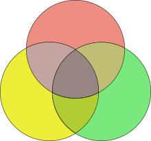
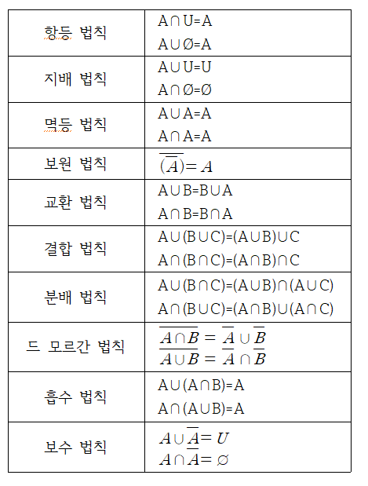

# 집합

> 1. 집합의 뜻과 부분집합
> 2. 집합의 연산
> 3. 유한집합의 원소의 개수

## 1. 집합의 뜻과 부분 집합

1. 집합과 원소
   1. 우리의 직관 또는 사고의 대상이 되는 것 중에서 확정되어 있으며 또 서로 구별할 수 있는 것의 모임 전체를 한 덩어리로 생각한 것을 `집합`이라고 한다.
   2. 집합을 구성하고 있는 개개의 대상을 그 집합의 `원소` 또는 `원` 이라 한다.
   3. a가 집합 S의 원소일 때, `a는 S에 속한다`고 말하고, `a ∈ S`로 나타낸다
   4. 아닌 경우에는 `a ∈ S`
   5. 원소가 없는 것은 공집합으로 `∅` 또는 `{}` 로 표시한다
2. 집합의 표시법
   1. 원소나열법: `P = {a, b, c, d, ...}`
   2. 조건제시법: `S = {x | f(x)}`
3. 집합의 포함관계
   1. 집합 A의 모든 원소가 집합 B에 속할 떄,
      1. 즉, 임의의 x에 대하여 `x ∈ A 이면 x ∈ B 이다.`
   2. 이를 A를 B의 부분집합이라 하며 `A ⊂ B`로 나타낸다.
   3. `A ⊂ B` 이며 `B ⊂ A`일 때 A와 B는 서로 같다 또는 상등이라고 한다
   4. `A ⊂ B` 이며 `A != B`이면 A는 B의 진부분집합이라 한다

## 2. 집합의 연산

1. 집합에서의 연산
   1. 합집합
      - 
   2. 교집합
      - 
   3. 전체집합과 여집합
      - 
   4. 차집합
      - 
2. 연산법칙
   1. 교환법칙
   2. 결합법칙
   3. 분배법칙
   4. 흡수법칙
   5. 드 모르간의 법칙
   - 

## 3. 유한집합의 원소의 개수

- 유한집합 M의 원소의 개수를 n(M)으로 나타낸다
- n(A^c) = n(U) - n(A) (U는 전체 집합)
- n(A ∪ B) = n(A) + n(B) - n(A ∩ B)

## 참고자료

- 수학의 정석
