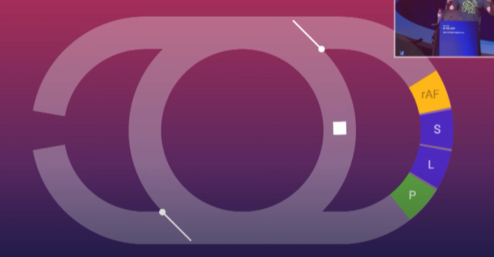

# Event Loop

[참고 영상 1](https://www.youtube.com/watch?v=cCOL7MC4Pl0) [참고 영상 2](https://www.youtube.com/watch?v=8aGhZQkoFbQ)



이벤트 루프는 위와 같은 형식으로 생겼다고 생각하면 이해가 쉽다. 가운데 메인스레드에서 작업을 하다 왼쪽에 테스크큐에 할일이 생기면 테스크큐로 가는 길이 열리고 rerender가 필요하면 오른쪽으로 가는 길이 먼저 열린다

그리고 우선 순위는 큐가 먼저이다. 그래서 아래 코드가 조금 이상하게 작동하는 것을 이해할 수가 있다

```javascript
button.addEventListener("click", () => {
  box.style.transform = "translateX(1000px)";
  box.style.transition = "transform 1s ease-in-out";
  box.style.transform = "translateX(500px)";
});
```

위 코드를 생각해보자. 한번에 계산해서 렌더링 된다는 걸 생각하자. 테스큐에 도착을 하면 위에 것들을 한번에 계산해서 리랜더쪽으로 롬겨서 랜더링을 시킬 것이다.

그렇다면 아래는 어떨까

```javascript
button.addEventListener("click", () => {
  box.style.transform = "translateX(1000px)";
  box.style.transition = "transform 1s ease-in-out";
  requestAimationFram(() => {
    box.style.transform = "translateX(500px)";
  });
});
```

웃긴 점은 위 코드도 똑같다 (크롬에서는). 왜? 랜더전에 `raf`가 먼저 있다는 사실이다! 그렇다 우리는 그러면 이걸 해결하기 위해서는 조금 비직관적이지만 아래와 같이 짜야할 것이다.

```javascript
button.addEventListener("click", () => {
  box.style.transform = "translateX(1000px)";
  box.style.transition = "transform 1s ease-in-out";
  requestAimationFrame(() => {
    reuquestAnimationFrame(() => {
      box.style.transform = "translateX(500px)";
    });
  });
});
```

위에가 비 직관적이라 싫다면 아래와 같은 방법도 있긴 하다

```javascript
button.addEventListener("click", () => {
  box.style.transform = "translateX(1000px)";
  box.style.transition = "transform 1s ease-in-out";
  getComputedStyle(box).transform;
  box.style.transform = "translateX(500px)";
});
```

위에서 추가된 코드는 이벤트 루프를 무시하고 바로 계산을 해서 적용시키는 함수이다.

테스크큐 말고도 마이크로 테스크 큐도 있는데 참 특이하다

- 테스크큐 동작 원리
  - 큐에 차있는 하나의 동작을 처리한다
- 애니메이션 콜백
  - 로직으로 인해 추가되는 것들을 제외한 원래 있던 동작들을 모두 순차적으로 처리한다
- 마이크로 테스크 큐
  - 큐에 있는 모든 로직 뿐만 아니라 로직으로 인해 추가된 또다른 로직들도 다 없어질 때까지 큐가 작동한다.

위와 같은 상황때문에 아래 코드가 참 특이하게 작동한다

```javascript
button.addEventListener("click", () => {
  Promist.resolve().then(() => console.log("microtask 1"));
  console.log("listener 1");
});

button.addEventListener("click", () => {
  Promist.resolve().then(() => console.log("microtask 2"));
  console.log("listener 2");
});
```

위 코드를 랜더링 된 버튼에서 누른다면 `listener 1 => microtask 1 => listener 2 => microtask 2`으로 로그가 나오고 `button.click()`으로 자바스크립트를 실행시킨다면 `listener 1 => listenere 2 => microtask 1 => microtask 2`으로 로그가 나온다.
