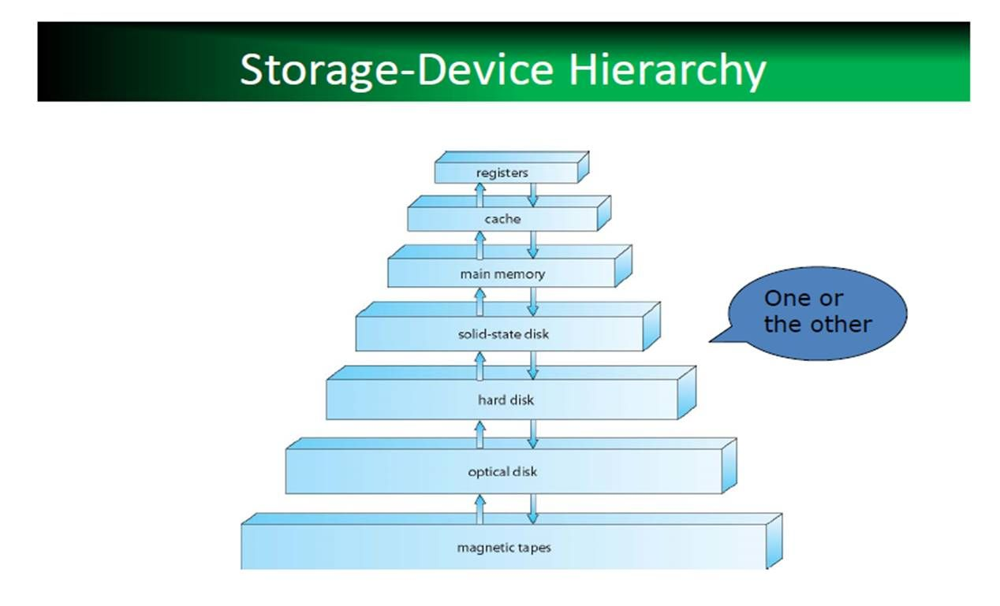
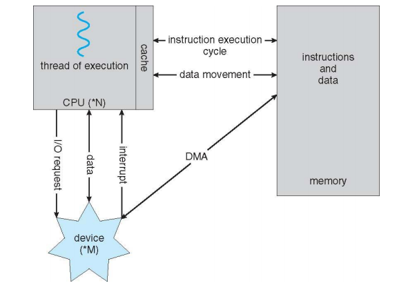
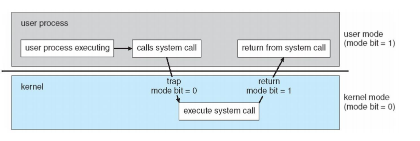
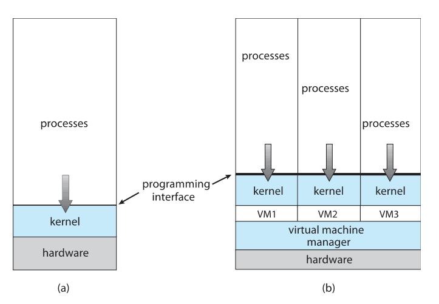
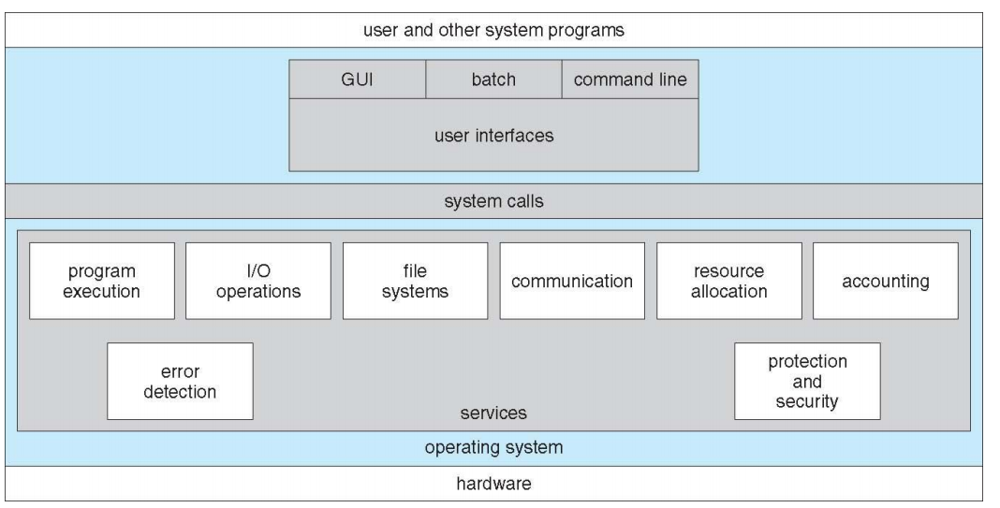

# 2. 운영체제의 개념과 구조

> operating system concepts chapter 1-2

- Defining Operating Systems

  - There are NO universaaly accepted definition of an operating system

  - A more common definition is that

    - the one program running at all times on the computer
    - usually called the kernel

  - Along with the kernel, there are two other types of programs

    - system programs
    - application programs

  - A bootstrap program is

    - the first program to run on computer power-on

  - Interrupts

    - Hardware may trigger an interrupt at any time
      - by sending a signal to the CPU, usually by way of the system bus

  - von Neumann architecture

    - A typical instruction-execution cycle
      - first fetches an intruction from memory
      - and stores that instruction in the [**instruction register**](https://ko.wikipedia.org/wiki/%EB%AA%85%EB%A0%B9_%EB%A0%88%EC%A7%80%EC%8A%A4%ED%84%B0)
    - the instruction is then decoded
      - and may cause operands to be fetched from memory
      - and stored in some internal register
    - After the instruction on the operands

  - The wide variety of storage systems can be organized in a hierarchy according to

    - storage capacity
    - and access time
    - 

  - I/O structure

    

## Computer System Architecture

- Definitions of computer System Components

  - CPU

  - Processor

  - Core

  - Multicore

  - Multiprocessor

  - Multiprogramming

    - os가 여러 프로그램을 동시에 메모리에 올려두고 동시에 실행시키는 것

  - Multitasking = Multiprocessing

    - a logical extension of multiprogramming
      - in which cpu switches jobs so frequently that
      - users can interact with each job while it is runnging
    - **CPU Scheduling**
      - If serveral processes are ready to run at the same time,
      - the system must choose which process wull run next

  - Two separate mode of operations

    - user mode and kernel mode
    - to ensure that an incorrect program
      - cannot cause other programs to execute incorrectly

    

## Virtualization

- Virtualization is
  - a technology that allow us
    - to abstract the hardware of a single computer
    - into several different execution environments
  - VMM: Virual Machine Manager
    - VMware, XEN, WSL, and so on.
  - 

##  operating system services

다양한 것을 제공해야함

유저는 cli, gui 등으로 이용한다. 실제 컴퓨터는 어떻게 조절하는가? **system call**을 이용하여 조절한다