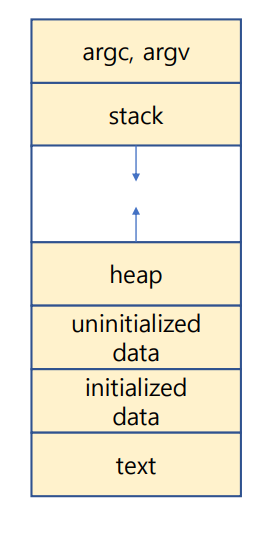
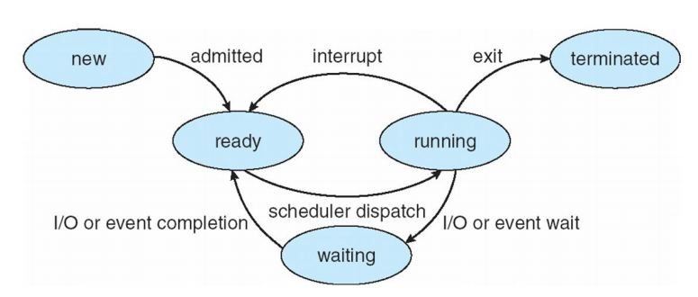
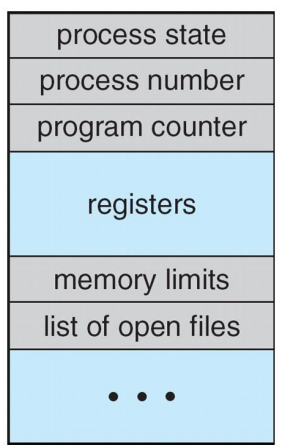
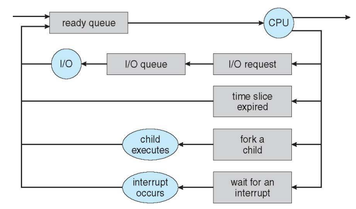
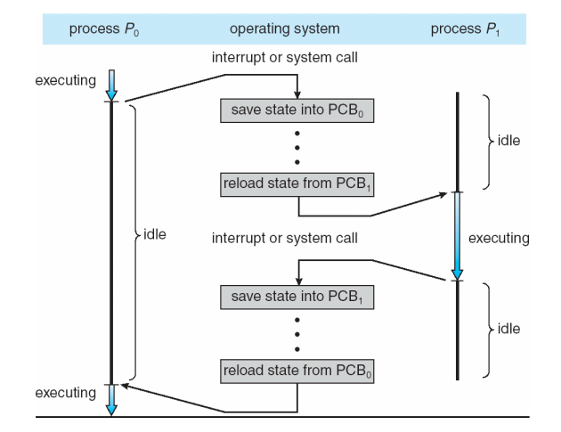
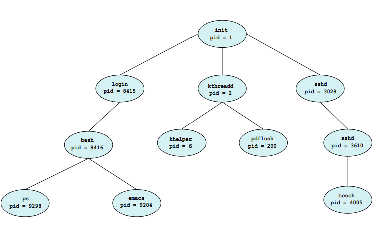

# 3 - 1 프로세스의 이해

기본적인 흐름을 이해하자. 데이터의 흐름은 `CPU <=> 메모리 <=> HDD or SSD` 와 같다. 그리고 메모리에 올라가 있는 것을 프로세스라고 한다. 그러니 OS의 기본역할은 프로세스를 관리해야한다.

프로세스는 여러 섹션으로 나뉜다. 아래와 같음

- Text section

  - the executable code

- Data section

  - global variables

- Heap section

  - memory that is dynamically allocated during program run time

- stack section

  - temporary data storage when invoking function
  - such as function parameters, return addresses, and local variables

- 그림으로 설명

  - 

- 코드로써 설명

  - ```c
    #include <stdio.h>
    #include <stdlib.h>
    
    int x;
    int y - 15;
    
    int main(int argc, char *argv[])
    {
        int *values;
        int i;
        
        values = (int *)malloc(sizeof(int)*5);
        
        for (i = 0; i < 5; i++)
            values[i] = i;
        
        return 0;
    }
    ```

  - 위 코드의 이미지 상황

    - 
    - main은 스텍에 올라간다

  - 위 코드의 os에서의 size는 리눅스에서 아래와 같이 확인이 가능하다

    - ```bash
      size ./a.out
      ```

- 프로세스는 상태를 계속해서 변경한다

  - new: 생성되었을 때
  - running: cpu 에 올라가서 실행되고 있는 상태
  - waiting: 스케줄에서 대기하고 있는 상태
  - ready: cpu에 바로 올라가기 전 상태. 레디큐에 올라가 있는 상태이다
  - terminated: 프로세스가 끝나고 종료한 상태
  - 

- 그렇다면 프로세스 관리를 어떻게 해야하는데 (개발자 입장에서)

  - PCB(process control block) or TCB(task control block)으로 관리하자
  - 각 프로세스가 운용될 때 os가 알아야할 정보를 pcb에 담아야 한다
  - 그러면 pcb에 뭐가 있는데?
    - 프로세스 상태
    - 프로그램 카운터 (필요한 명령어의 메모리 주소)
    - cpu registers: IR DR
    - cpu scheduling information: 스케줄링 정보
    - accounting information: 어떤 유저가 실행 시켰는지
    - I/O status information
    - 

- 프로세스란?

  - a program that performs a single thread of execution
  - 현대 os는 멀티 프로세스 그리고 프로세스 내에서 멀티 스레드를 실행 시킬 수 있도록 고안되어있다

- 멀티 프로세싱(멀티프로그래밍)의 목적

  - 동시에 여러 프로세스를 실행시켜보자
  - cpu의 최대치를 사용해보자

- cpu 스케쥴링 큐 (FIFO)

  - 프로세스가 시스템에 오면 래디큐에 들어간다
  - 그리고 시피유의 실행을 준비하고 기다린다
  - 

- Context Switch

  - the context of a process is represeted in the PCB
  - when an interrupt occurs
    - 현재 상태를 저장
    - 그리고 회복한다
  - 정확히 이게 뭔데
    - cpu코어에 다른 프로세스를 넘겨주는것 두가지 일을 한다
      - 현재 프로세스의 상태를 저장하고
      - 새로운 프로새스의 상태를 복원하는것
  - 

- os가 제공해야만 하는 메카니즘

  - process creation
  - process termination

- 프로세스는 계속해서 새 프로세스를 만들 수 있다

  - 부모 프로세스, 자식 프로세스라고 생각하고 만드는 작업을 생각해보면 아래 그립과 같다
  - 


