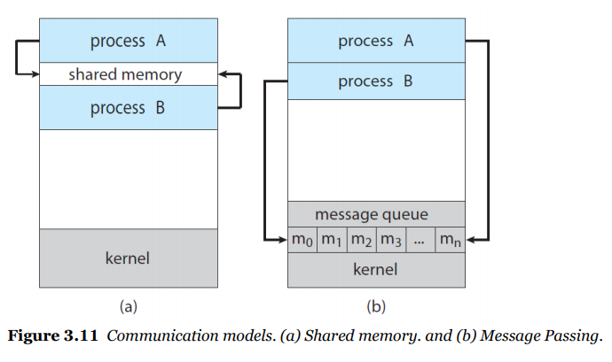

# 3 - 3 프로세스간 통신

- 프로세스가 동시에 실행되는 상태는
  - 두가지 경우이다.
    - 각각 독립적으로 실행된다
      - 이 경우에는 크게 문제가 생기지 않는다
    - 또는 서로 협력하면서 실행된다
      - 서로 간에 데이터가 공유되기 때문에 이 경우 문제가 생길 수도 있다
- 협럭하는 프로세스
  - IPC: Inter-Process Communication
    - 협력하는 프로세스는 ipc 메카니즘이 필요하다
      - ipc메커니즘으로 데이터를 교환하는 것이 허락되고
      - 서로 **send data**, **receive data**를 교환한다
    - 기본 모델
      - shared memory
      - message passing
      - 
      - producer-consumer problem(생산자 소비자 문제)
        - 협력 프로세스의 컨셉을 설명하기 위해 있는 문제
        - 생산자는 정보를 제공하고 소비자는 거 정보를 소비한다
        - **shared-memory** 를 이용하는 방법
          - shared memory는 생산자와 소비자가 공유하는 메모리의 주소이다
          - 컨텍스트 스위칭을 활용해 어느 한쪽에서 사용을 하고 있는데 다를 쪽에서 이용하려고 하면 기다리게 하는 방식을 이용하자
          - 그 방법으로 **buffer**을 이용한다
            - 생산자는 buffer을 채울 수가 있고
            - 소비자는 buffer을 비우게 할 수가 있다
          - shared memory의 스키마는 프로세스가 메모리 영역을 공유하는 것을 필요로 한다
            - 이 코드의 복잡성은 생각보다 엄청 높다
        - **message-Passing**을 이용하기
          - OS가 프로세스의 협업에 관한 방법을 제공한다.
            - 즉, 코드를 짜는 사람은 os에게 메시지만 던져주는 것으로 해결하면 된다
          - 메모리를 직접 관리하지 않으니 그래도 좀 덜 복잡한 편이긴 하다
          - 선택해야할 사항들이 조금 있다
            - 생산자와 소비자의 커뮤니케이션을 직접적으로 아니면 간접적으로 전달할 것인지
            - 동기적으로 할 것인지 비동기적으로 할 것인지
            - automatic or explicit
          - under ***direct*** communication
            - 각자 프로세스는 커뮤니케이션을 원하면
              - 전달 대상을 명시적으로 정해주고 메시지를 보내야 한다
            - 스키마의 형태는 다음과 같을 것이다
              - send(P, message) - P에게 message를 보냄
              - receive(Q, message) - Q에게서 message를 받음
            - 링크가 자동적으로 생성된다 (automatic)
            - 링크의 관계는 1:1의 관계가 된다
          - under ***indirect*** communication
            - 메시지는 **메일박스(port)**에 전송하고 수송한다
            - port?
              - object
              - message를 보내고 받는 저장소라고 생각하면 된다.
            - 스키마의 형태는 다음과 같을 것이다
              - send(A, message) - A에 메시지를 보냄
              - receive(A, message) - A에서 메시지를 받음
            - 링크 관계가 1:1이 되지 않는다
            - OS입장
              - 프로세스가 port를 생성할 수 있게 하면 됨
              - prot에 보내고 받을 수 있게 해주면 됨
              - port를 삭제시킬 수 있게 해주면 됨
              - os가 이런 기능만 제공해주면 어렵지 않게 구현이 가능한 것이다!
            - 실제 디자인 상황에서 부딪힐 수 있는 문제점
              - blocking send: send가 막히는 상황, 버퍼 사이즈에 대한 문제가 생길 수가 있다 (1기가가 한계인데 2기가를 넣으려고 한다 같은 상황)
              - noblocking send: 보내고 무책임한 상황. 필요한 데이터를 다 보내지 않고 그냥 다시 자기할 일을 하러가는 상황
              - blocking receive: 필요한 데이터 전채가 오지 않은 상황. 그러면 나머지가 올때까지 대기를 해야함
              - nonblocking receive: null등 제대로되지 않은 메세지를 받고 그냥 진행