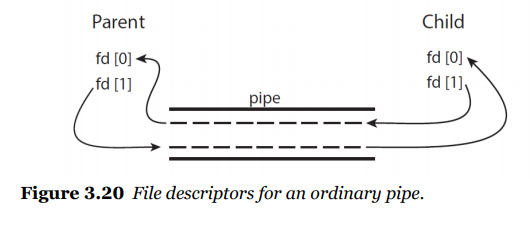
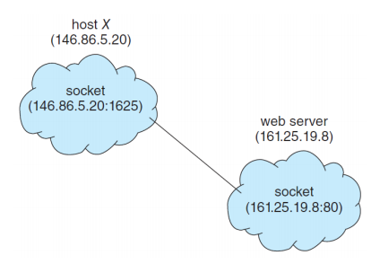

# 3 - 4 프로세스간 통신의 실제

- IPC 시스템의 예

  - shared memory: POSIX shared memory

    - POSIX: portable operating system interface (for uniX)

      - memory-mapped 파일로 이루어져있다

      - 1. shared memory object를 만든다

        2. 오브젝트의 크기를 정의한다

        3. memory mapped 파일을 만든다

           ```c
           #include <stdio.h>
           #include <stdlib.h>
           #include <string.h>
           #include <fctl.h>
           #include <sys/shm.h>
           #include <sys/stat.h>
           #include <sys/mman.h>
           
           int main()
           {
               const int SIZE = 4096;   // the size of shared memory
               const char *name = "OS"; // the name of shared memory
               const char *message_0 = "Hello, ";
               const char *message_1 = "Shared Memory!\n";
               
               int shm_fd;	// the file descriptor of shared memory
               char *ptr;  // pointer to shared memory
               
               /* create the shared memory object */
               shm_fd = shm_open(name, O_CREAT | O_RDWR, 0666);
               
               /* configure the size of the shared memory */
               ftruncate(shm_fd, SIZE);
               
               /* map the shared memory object */
               ptr = (char *)mmap(0, SIZE PROT_READ | PROT_WRITE, MAP_SHARED, shm_fd, 0);
               
               /* write to the shared memory */
               sprintf(ptr, "%s", message_0);
               ptr += strlen(message_0);
               sprintf(ptr, "%s", message_1);
               ptr += strlen(message_1);
               
               return 0;
           }
           ```

           ```c
           #include <stdio.h>
           #include <stdlib.h>
           #include <string.h>
           #include <fctl.h>
           #include <sys/shm.h>
           #include <sys/stat.h>
           #include <sys/mman.h>
           
           int main()
           {
               const int SIZE = 4096;   // the size of shared memory
               const char *name = "OS"; // the name of shared memory
               
               int shm_fd;	// the file descriptor of shared memory
               char *ptr;  // pointer to shared memory
               
               /* create the shared memory object */
               shm_fd = shm_open(name, O_CREAT | O_RDWR, 0666);
               
               /* map the shared memory object */
               ptr = (char *)mmap(0, SIZE PROT_READ, MAP_SHARED, shm_fd, 0);
               
               /* read from the shared memory object */
               printf("%s", (char *)ptr);
               
               /* remove the shared memory */
               shm_unlink(name);
               
               return 0;
           }
           ```

  - Message Passing: Pipes

    - One of the earliest IPC mechanisms on UNIX systems

    - Pipes

      - 두 프로세서가 대화하는데 이용되는 도구라고 생각하면 된다

    - 4가지 이슈

      - 단방향? 양방향? 선택 이슈
      - half-duplex vs full-duplex
      - 커뮤케이팅하는 프로세스간의 관계를 가져야 한다
      - 네트워크에서 작동을 할 수 있는가?

    - 파이프의 타입

      - ordinary pipes
        - 명시적으로 parent 프로세서가 파이프를 만들고 child 프로세서는 통신하기만 해야함
        - 파이프 하나당 방향이 하나라고 생각하자
        - 
      - named pipes
        - 이름을 붙여서 파이프를 이용할 수 있게 하는 파이프

    - 사용 예

      ```c
      #include <stdio.h>
      #include <string.h>
      #include <unistd.h>
      #include <sys/types.h>
      
      #define BUFFER_SIZE 25
      #define READ_END 0
      #define WRITE_END 1
      
      int main()
      {
          char write_msg[BUFFER_SIZE] = "Greetings";
          char read_msg[BUFFER_SIZE];
          int fd[2];
          pid_t pid;
          
          /* create the pipe */
          pipe(fd);
          
          pid = fork(); // fork a new process
          
          if (pid > 0) { // parent process
              close(fd[READ_END]);
              /* write to the pipe */
              write(fd[WRITE_END], write_msg, strlen(write_msg) + 1);
              close(fd[WRITE_END]);
          }
          else if (pid == 0) { // child process
              close(fd[WRITE_ENd]);
              /* read to the pipe */
              read(fd[READ_END], read_msg, BUFFER_SIZE);
              printf("read %s\n", read_msg);
              close(fd[READ_END]);
          }
          
          return 0;
      }
      ```

- 웹으로 넘어와보자. 네트워크 통신을 위해서는 파이프나 쉐어드 메모리로는 힘들어진다. 그래서 아래 두가지 개념이 등장한다

  - Sockets

    - 커뮤니케이션을 위한 끝점이 정의 되어있는 것

    - ip주소와 port넘버를 묶어서 특징화 시키는 것

    - 

    - 자바에서 소켓을 쉽게 할 수 있도록 제공한다

      - 3개의 소켓이 존재한다

      - socket class: tcp를 의미

      - datagramsocket: udp를 의미

      - multicastsocket: 특정 다수에게 연결

      - ```java
        import java.net.*;
        import java.io.*;
        
        public class DateServer {
            
            public static void main(String[] args) throws Exception {
                ServerSocket server = new ServerSocket(6013);
                
                /* Now listen for connections */
                while (true) {
                    Socket client = server.accept();
                    PrintWriter pout = new PrintWriter(client.getOutputStream(), true);
                    
                    /* write the Date to the socket */
                    pout.println(new java.util.Date().toString());
                    
                    /* close the socket and resume listening for connections */
                    client.close();
                }
            }
        }
        ```

        ```java
        import java.net.*;
        import java.io.*;
        
        public class DateClient {
            
            public static void main(String[] args) throws Exception {
                /* make connection to server socket */
                Socket socket = new Socket("127.0.0.1",6013);
                
                InputStream in = socket.getInputStream();
                BufferedReader br = new BufferedReader(new InputStreamReader(in));
                
                /* read date from the socket */
                String line = null;
                while ((line = br.readLine()) != null)
                    System.out.println(line);
                
                /* close the socket connections */
                socket.close();
            }
        }
        ```

  - RPCs (Remote Procedure Calls)

    - 네트워크 시스템 상에서 프로세스간 콜링을 추상화하는 것
    - 리모트 서비스의 일반적인 형태중 하나
    - 자바에서는 RMI라고 부름
    - 클라이언트가 stub을 제공해야함
      - stub? 상대편의 함수를 실행시켜야하는데 모르는 상황 또는 그 함수가 없는 경우가 있을 수가 있다. 따라서 어떠한 함수가 있다고 제공을 해야한다.