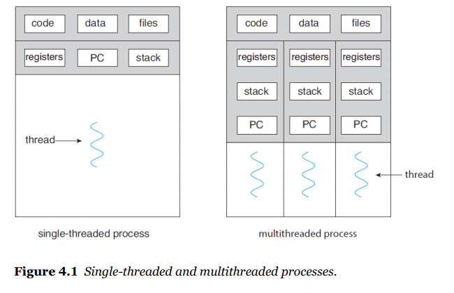
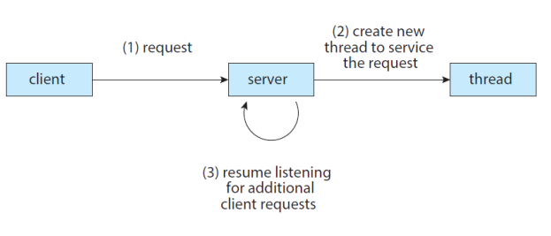
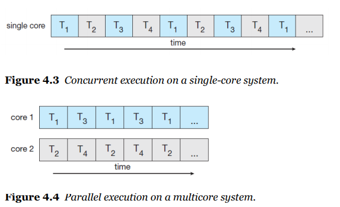

# 4 - 1 쓰레드의 이해

- cpu의 프로그램 카운트가 일을 잘해서 컨텍스트 스위칭을 잘하면 멀티 프로세싱이 가능하다

  - 하지만 여전히 복잡하긴 하다
  - 하지만 씨피유가 더 일하게 해서 더 빨리 끝내게 하고 싶은걸?
  - 쓰레드를 이용하자!

- 쓰레드란?

  - 

- 멀티 스레드를 할려는 이유

  - 클라이언트 서버 시스템의 상황을 한번 생각해봐라
    - 

- 멀티 스레드의 장점

  - 반응성: 유저의 인터페이스에 따라 굳이 블락킹될 필요가 없다
  - 자원 공유: 멀티 프로세싱을 할 때는 중간에 직접 공유하거나 메시지를 이용했어야 한다. 하지만 프로세스 내에 있는 스레드간의 통신과 메모리 공유는 이보다 쉽다
  - 경제성: 일정 프로세스 안에 있기 때문에 자원을 더 이용하지 않는다
  - 확장성: 멀티 프로세스는 아키텍처에 중요한 구성요소지만 멀티 스레드는 그렇게 크지 않다.

- 자바에서?

  - fundamental model of program execution

  - java provides a rich set of features

    - 스레드를 위한 많은 기능이 존재하는 것이 자바다

  - 세가지 방법이 존재

    - Inheritance from the Thread class

      - 스레드 클레스를 만든다

      - public void run()을 오버라이드 한다

      - ```java
        class MyThread1 extends Thread {
            public void run() {
                try {
                    while (true) {
                        System.out.println("Hello, Thread!");
                        Thread.sleep(500);
                    }
                }
                catch (InterruptedException ie) {
                    System.out.println("interrupted");
                }
            }
        }
        
        public class ThreadExample1 {
            
            public static final void main(String[] args) {
                MyThread1 thread = new MyThread1();
                thread.start();
                System.out.println("Hello, My Child!");
            }
        }
        ```

    - Implementing the Runnable interface

      - 위와 같은 인터페이스를 임플리먼트 하고

      - public void run()을 오버라이드 한다

      - ```java
        class MyThread2 implements Runnable {
            public void run() {
                try {
                    while (true) {
                        System.out.println("Hello, Thread!");
                        Thread.sleep(500);
                    }
                }
                catch (InterruptedException ie) {
                    System.out.println("interrupted");
                }
            }
        }
        
        public class ThreadExample2 {
            
            public static final void main(String[] args) {
                MyThread1 thread = new Thread(new MyThread2());
                thread.start();
                System.out.println("Hello, My Child!");
            }
        }
        ```

    - Lambda expression (익명 스레드라고도 한다)

      - 클래스를 만들지 말고

      - 람다 표현식을 사용해보자

      - ```java
        public class ThreadExample3 {
            public static final void main(String[] args) {
                Runnable task = () -> {
                    try {
                        while (true) {
                        	System.out.println("Hello, Thread!");
                        	Thread.sleep(500);
                    	}
                	}
                	catch (InterruptedException ie) {
                    	System.out.println("interrupted");
                	}
                };
                Thread thread = new Thread(task);
                thread.start();
                System.out.println("Hello, My Lambda Child!")
            }
        }
        ```

    - 부모 쓰레드의 대기: join을 이용한다 (프로세스는 wait이었던 것과는 약간 차이)

      ```java
      public class ThreadExample4 {
          public static final void main(String[] args) {
              Runnable task = () -> {
                  for (int i=0; i<5; i++) {
                      System.out.println(i);
                  }
              };
              Thread thread = new Thread(task);
              thread.start();
              try {
                  thread.join();
              }
              catch (InterruptException ie {
                  System.out.println("Parent thread is interrupted");
              })
                  System.out.println("joined child")
          }
      }
      ```

    - 쓰레드의 종료: interrupt를 이용한다 (stop이 있기는 한데 추천은 안한다)

      ```java
      public class ThreadExample5 {
          public static final void main(String[] args) throws InterruptedException {
              Runnable task = () -> {
                  try {
                      while (true) {
                      	System.out.println("Hello, Thread!");
                      	Thread.sleep(100);
                  	}
              	}
              	catch (InterruptedException ie) {
                  	System.out.println("interrupted");
              	}
              };
              Thread thread = new Thread(task);
              thread.start();
              Thread.sleep(500);
              thread.interrupt();
              System.out.println("'interrupt'")
          }
      }
      ```

- 멀티코어에서의 멀티스레드는?

  - 향상된 컨커런시를 위한 멀티 코어들이 효과적으로 사용되고 있다
  - 네개의 쓰레드가 있는 걸 고려해보자
    - 싱글 코어: 쓰레드는 시간에 따라 끼어넣어질 것이다
    - 멀티 코어: 병렬적으로 실행될 것이다
    - 
  - 위와 같이 되니까 문제가 다양하게 생겼다
    - identifying task: 어떤 부분들이 세퍼레이트하게 실행되는지 찾는 능력이 필요하다
    - balance: 같은 가치를 가진 일은 같은 밸런싱을 가지게 해야함
    - Data splitting: 코어를 잘 나누는 것이 좋다
    - Data dependency: 싱크로 나이징과 의존성에 관한 문제
    - 테스트와 디버깅이 어려움