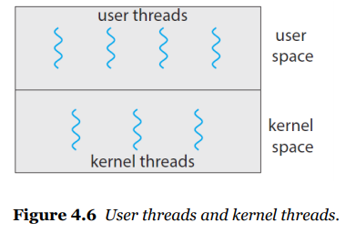

# 4 - 2 멀티쓰레딩

- 쓰레드는 두가지의 타입이 있다
  - **유저 쓰레드**와 **커널 쓰레드**
    - 유저 스레드: 운영체제쪽은 넘볼 수 없이 유저가 조절하는 스레드
    - 커널 스레드: 운영체제가 관리하는 스레드
    - 
    - 서로의 관계는 (유저:커널) 1:1, N:1, N:M 이렇게 세가지가 있다
- 쓰레드 라이브러리가 제공하는 것
  - 쓰레드를 메니징하고 생성하는 api가 있다
  - 요즘 사용되는 라이브러리는 아래와 같다
    - POSIX Pthreads
    - Windows thread
    - Java thread
- The Strategy of Implicit Threading
  - the design of concurrent and parallel application
    - 개 어려움
  - 이 어려움을 컴파일러와 라이브러리가 알아서 해줘
    - 네가지 접근법
      - Thread Pools
        - 쓰레드를 미리 만들어두고 만드는 명령어를 받을때 미리 만들어둔 곳 중 빈자리에 할당시켜주는 방식
      - Fork & Join
        - 이 방법으로도 가능하다 책에 설명 잘 되어 있다
      - OpenMP
        - 컴파일러 지시어를 줘서 C/C++에서 병렬 처리할 수 있도록 지원
      - Grand Central Dispatch
        - apple의 maxOS와 ios시스템에서 하는 것