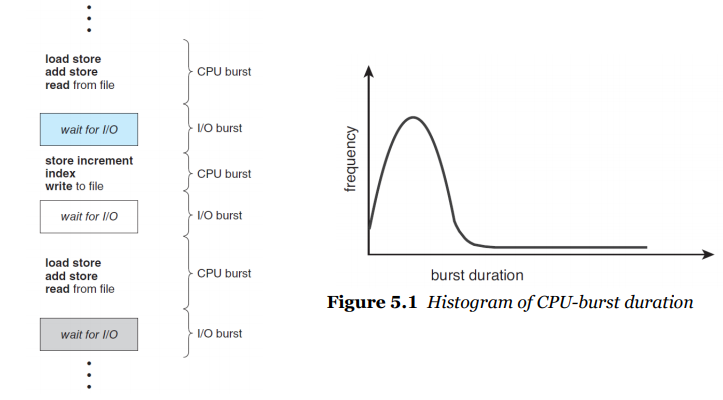
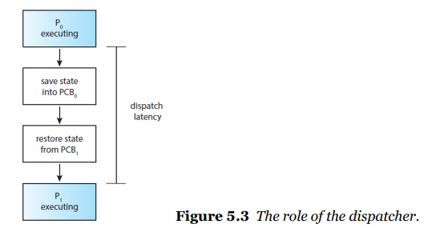
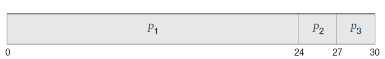
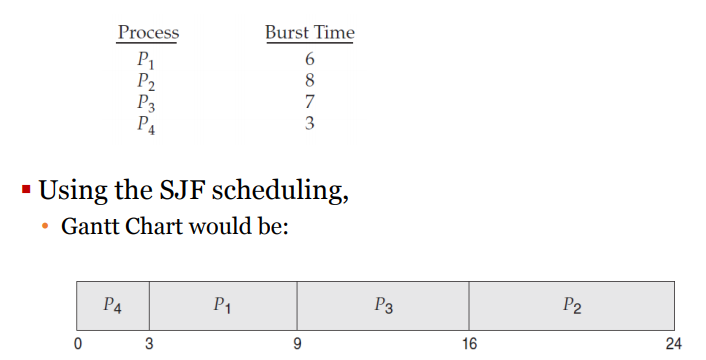
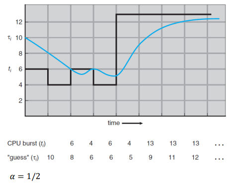

# 5 - 1 CPU스케줄링

- cpu 스케줄링은

  - 멀티프로그래밍된 os에서는 필수이다
  - 여러 프로세스가 동시에 돌아가게 하여 cpu의 능력을 최대한 이용하자
  - 

- CPU 스케줄러

  - ready상태의 프로세스 중에 어떤 것을 cpu를 할당시킬지 선택하는 자식
  - 다음 프로세스를 어떻게 선택할까?
    - 링크드 리스트? 바이너리 트리?
    - FIFO Queue: 선입선출 큐
    - Priority Queue: 우선순위 큐. 그렇다면 우선순위를 어떻게 정할 것인가?

- Preemptive(선점형) vs Non-preemptive(비선점형)

  - Non-preemptive 스케줄링

    - 선점된 프로세스가 자발적으로 나올때까지 일단 기다리는 것이 전재이다

  - Preemptive

    - 선점되어있는 프로세스를 쫓아낼 수가 있음

  - cpu스케줄링을 만드는 결정

    1. running 상태에서 waiting상태를 어떻게 바꿀 것인가
    2. running에서 ready상태로 어떻게 바꿀 것인가
    3. waiting상태에서 ready로 어떻게 바꿀 것인가
    4. 어떻게 파괴 할 것인가

    - 1,4: no choice - non-preemptive
    - 2,4: choice - preemptive or non preemptive

- dispatcher

  - cpu의 컨트롤을 넘겨주는 모듈
  - 기능
    - 컨텍스트를 프로세스에서 다른 프로세스로 바꾸고
    - 유저모드로 스위칭 하고
    - 새로운 프로그램을 적당한 위치로 점핑시키기
  - 디스패처는 엄청 빨라야함
    - 컨택스트 스위치가 일어날때마다 일을 할텐데
    - 디스패치 레이턴시가 길어질 것이다
    - 
    - 컨텍스트 스위칭은 엄청 자주 일어난다. 그러니 당연히 디스패처는 엄청빨라야할 것이다

- cpu 스케줄러의 목표

  - cpu를 최대한 활용하기 위해
  - 일정 단위 시간내에 최대한 많은 프로세스를 완료 시키기 위해
  - Turnaround time(실행에서 종료까지의 시간)을 최소화 시키기 위해
  - **waiting time(ready 큐에서 대기하고 있는 시간)을 최소화 시키기 위해**
  - response time을 위해

- cpu 스케줄링의 목적

  - 레디큐에 있는 어떤 프로세스를 정할지
  - 어떤 프로세스를 cpu코어에 오를 것인지

- 솔루션들

  - FCFS - 먼저 오면 먼저 할당시킨다
    - 하나씩 실행시키고 먼저 오면 먼저 할당시키기에 어렵지 않게 만들 수가 있다
    -  세프로세스가 0초에 다같이 동시에 왔다고 하자
    - 위 경우를 보자 그럼 전체 웨이팅 타임은 (0+24+27)
    - 평균은 27이다. P1이 제일 늦게 도착했다면 waiting time의 통합과 평균이 엄청 줄어든다!
    - 종료하는 시간으로 하면 더 가관이다
    - cpu버스트 타임에 의해 waiting 시간이 길어진다는 문제가 있다.
    - non-preemptive
    - convoy effect 호송 효과
      - 대충 날로 설명하면 똥차 하나가 교통 정체를 만드는 상황
      - 즉, 거대한 프로세스 하나가 있으면 다른 모든 프로세스가 이걸 기다리게 한다
      - waiting시간에 매우 불리할 가능성이 있다
  - SJF - Shortes Job First 짧은 프로세스를 먼저 할당 시켜주자
    - fcfs가 문제가 있음을 깨달았으니 그럼 반대로 짧은애부터 일을 한번 줘봐
    - 짧은 것을 먼저 할당하고 같은 타임을 가진 프로세스가 있다면 그 부분에서는 fcfs를 적용시킨다
    - 
    - 좀 짧아보이긴 한다
    - 꽤 합리적으로 보이긴 한다
    - 그럼 짧은 프로세스가 긴 프로세스가 실행되는 도중에 왔다고 가정해보자
      - 짧은 프로세스가 바로 할당이 될 것이다.
      - 즉, 긴 프로세스는 중간에 갑자기 끊기게 된다. 긴프로세스 입장에서는 웨이팅 타입이 계속 늘어날 수가 있다.
    - 또다른 문제는 구현이 불가능 하다는 점이다.
      - 다음 프로세스의 시간을 우리가 알 수 있는가? 알 수가 없다!
      - 즉, 엄격히 정할 수가 없다. 예측해서 하는 방식이 있다.
        - 예측하는 방식은? 과거를 보고 미래를 예측하는 방식
          - 과거에 cpu를 많이 썼던 기록이 있으면 많은 시간을 쓴다고 예측한다. [지수적 평균](https://wooono.tistory.com/225)을 낸다
          - 
    - preemptive or non-preemptive
  - RR - Round-Robin 정해진 시간만큼만 프로세스를 할당시켜주면 전체를 돌린다
  - Priority-based
  - MLQ - Multi Level Queue 다양한 방식을 이용
  - MLFQ - Multi Level Feedback Queue 다양한 방식을 이용하면서 피드백을 남겨 다음에 다양한 기법을 이용하게 하는 방법