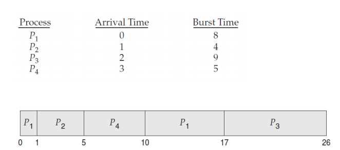
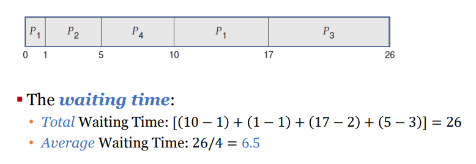

# 5 - 2 스케줄링 알고리즘

- SRTF

  - preemptive한 SJF 스케줄링이다.
  - non-preemptive 한 sjf와는 다르게 도착한 프로세스의 버스트 타임이 짧으면 먼저 할당하게 하는 알고리즘이다.
  - 
  - 
    - 위 그림을 보면 실행되는 중간에 남은 시간보다 짧은게 오면 cpu에서 나오게 된다

- RR Scheduling

  - preemptive한 fcfs에 타임 퀀텀을 도입 시켰다고 생각하면 된다

    - 타임퀀텀?
      - 타임 슬라이스로고도 한다
      - 시간을 작은 유닛대로 두고 그걸로 나눠서 그만큼만 실행시키도록 하는 방식

  - 레디큐는 원형큐로 되어있어서 실행을 계속 돌린다

  - 이 경우는 두가지 경우가 일어날 수가 있다

    - 퀀텀 단위보다 짧은 씨피유버스트를 가진 프로세스
      - 이 경우는 알아서 cpu에서 자발적으로 나오게 해야한다
    - 퀀텀 단위보다 긴 프로세스가 오면
      - 퀀텀단위만큼 실행시키고
      - 서클 큐에 다시 넣어야 한다

  - 

    

  - preemptive일 수밖에 없다

  - 얼마나 잘 시간을 슬라이스할 수 있느냐가 시간 단축의 중점이다. 그리고 프로세스 바꾸는 사이에 컨택스트 스위칭이 일어날 것이고 현실에서는 이것에서도 시간이 조금씩 걸리게 된다.

    - 

- Priority-base Scheduling

  - 우선순위로 스케쥴링하는 방식. 우선순위가 높은 우선순위에 cpu를 할당하고 동일한 우선순위에 대해서는 fcfs를 이용한다

  - 어떻게 생각해보면 sjf도 priority-base scheduling의 하나이다

  - 

  - preemptive or non-preemptive

  - starvation problem(기아 문제)

    - blocked process: 레디큐에서 영원히 벗어나질 못하는 문제
    - 해결법: aging
      - 시간이 지날 수록 오래 있는 큐의 프로세스들의 우선순위를 높여주는 것이다

  - RR과 이 방식을 섞는 경우가 많다

    

- Multi-Level Queue

  - 
  - 우선순위 별로 큐를 다르게 만드는 방식
  - 문제는 최중요 우선순위 큐만 계속 cpu가 할당되고 우선순위가 뒤에 있는 것은 할당이 제대로 안될 수가 있다
  - 그 해결법으로 아래 스케줄링이 나옴

- Multi-Level Feedback Queue

  - 

- 현대 os에서는 스레드 스케줄링을 이용하기도 한다

  - 커널 스레드는 스케줄링이 되고
  - 유저 스레드는 스레드 라이브러리에 의해 관리가 된다
    - 커널은 유저스레드와 관련이 없어야 하기 때문이고 반대도 마찬가지 이기 때문이다

