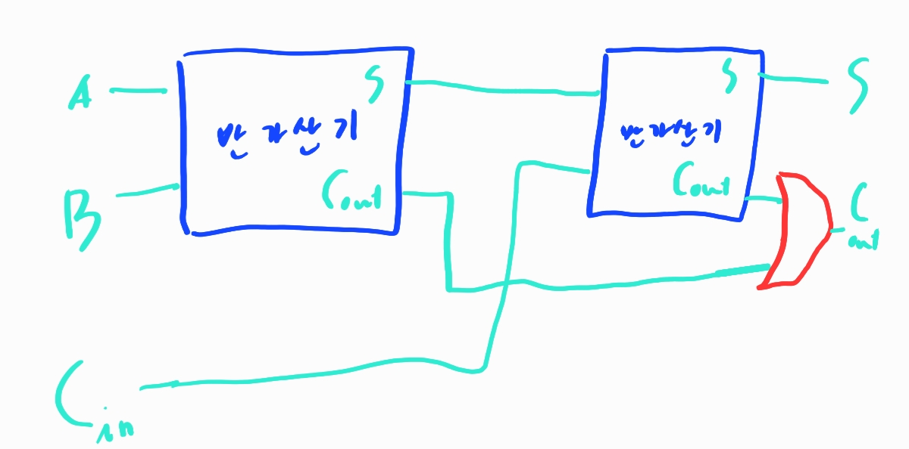
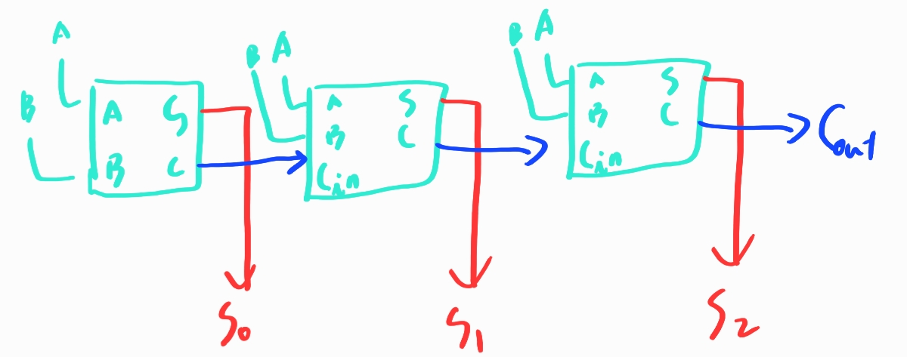
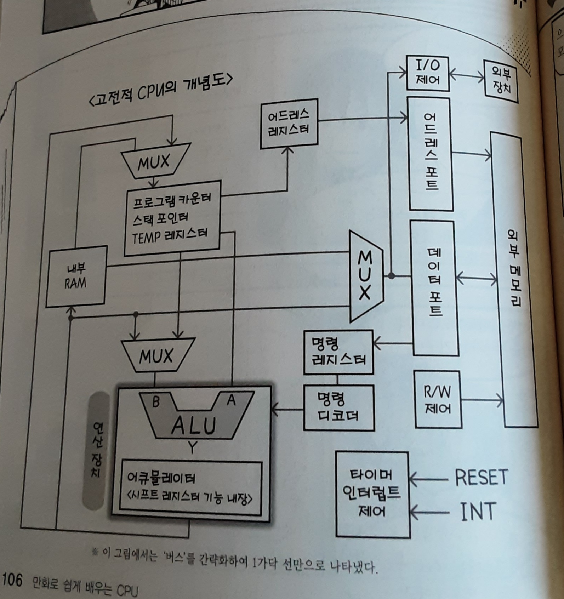
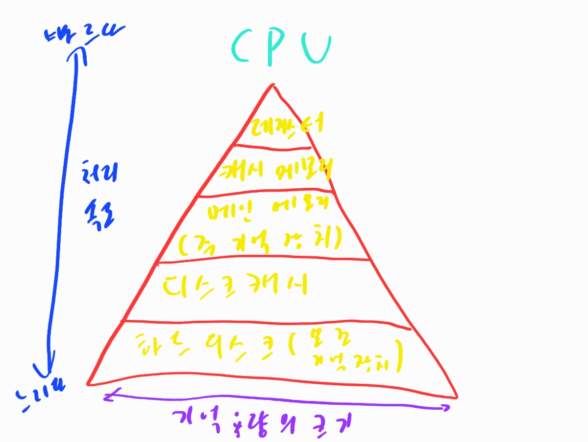

# CPU

## ALU

cpu의 중심에서 연산을 하고 있는 장치이다. **입력** **A**,**B**를 받고 **명령어 F**를 받으면 **스테이터스 S**와 **결과 Y**를 출력한다

## 순차 자리 올림 가산기

알기 위해서는 먼저 계산을 어떻게 하는지 생각해보자. 1+1을 2진법 계산을 할경우 2의 자리는 and가 들어가고 1의 자리에는 exor가 들어가는 것을 확인할 수가 있다. 그렇다면 합의 논리 연산(반가산기)은 다음과 같을 것이다.

그렇다면 인풋이 3개라면? 조금만 머리를 굴리면 다음과 같이 진행될 것이란 것을 알 수가 있다.

그렇다면 이것을 계속 엮어가면 자릿수가 많아도 계산 가능한 가산기를 만들수가 있을 것이다. 그것이 순차 자리 올림 가산기이고 다음과 같다고 생각할 수가 있다.

하지만 위 구조는 아쉽게도 단점이 있다. 다음 자리는 꼭 전 기계의 신호를 받아야 작동이 가능하다는 것이다. 이것을 해결하는 것이다 **자리 올림 선견 가산기**이다.

자리 올림 선견 가산기는 따로 준비된 논리 회로로 계산하고 그 결과를 각 자리의 가산기로 전하는 구조이다.

## 메모리

메모리는 어드레스가 할당되어 있고 cpu는 메모리에 해당 데이터 주소를 요청한다. 이것은 버스를 통해서 연결이 됟나. cpu와 외부 장치가 연결되면 외부 버스, cpu내에서 연결하는 것은 내부 버스라고 한다. 여기서 특정 bit cpu의 의미는 버스로 그만큼의 비트를 가져온다는 소리이다. 즉, **64bit cpu**는 **64비트만큼 버스폭이 넓다!**

메모리에는 ROM(리드 온리), RWM(리드 라이트) 가 있고 RWM은 RAM(랜덤 액새스), SAM(시쿠언셜 액세스)으로 나뉜다.

## cpu 개념도

- 프로그램 카운터

  다음에 실행할 명령의 어드레스를 기억하는 장치

- 명령 디코더

  메모리는 어드레스가 지정된 명령을 cpu로 건내주고 명령 레지스터에 저장되며 그것을 명령디코더로 해독한다

- 어큐뮬레이터

  ALU의 연산 결과를 기억하는 레지스터다. 연산 결과를 그 다음 연산에 바로 이용할 수 있는 구조로 되어 있다.

- 스테이터스 레지스터

  CPU는 연산 결과의 내용에 따라 프로그램의 순서를 바꾸거나 입출력을 제어한ㄴ다. 이때 판단 기준으로 사용하는 것이 플래그다.

- 수식 레지스터

  특정 어드레싱 모드에서 필요한 레지스터다. 베이스 레지스터는 명령에 따라 지정된는 오퍼랜드가 어떤 기준값에 대하여 설정될 때 그 기준값을 결정한다.

  인덱스 레지스터는 현재의 프로그램 카운터에 특정한 값을 추가할 때 오퍼랜드에 영향을 미치는 정수를 넣어두는 기능이 있다.

- TEMP 레지스터

  CPU의 다양한 작업 도중에 일시적으로 데이터를 피난 기억 시키기 위한 레지스터다. CPU에 따라 몇 개의 블록별로 여러 개가 준비되어있다.

흐름은 다음과 같다 명령 읽기(패치) -> 명령 해독(디코드) -> 명령 실행 -> 결과 쓰기 -> 다음 명령 착수

## 하드디스크

메모리는 두 종류가 있다. 주 기억 장치와 보조 기억 장치이고 보조 기억 장치를 하드디스크라고 부른다. 속도에선는 메모리와 하드디슼크와 비교시 메모리쪽이 확실히 빠르다 다음과 같은 그림을 인지하자.

## 인터럽트

작업이 끝난 후 다시 원래 작업으로 돌아가기 위한 기능이다. **스택**을 자주 이용한다.

우선도 또한 존재한다. 없다면 일처리가 제대로 되지 않을 것이기 때문이다. **인터럽트 마스크**라는 기능을 이용하게 된다. 이걸 사용하면 인터럽트를 받아들이지 않게 된다! 하지만 반대로 마스크를 하고 있어도 강제로 인터럽트를 해오는 것도 있다. **리셋(프로그램 초기화)**이라고 불린다. 이 리셋은 우선순위가 가장 높게 되어있다.

## 명령

명령은 크게 두가지로 나눌 수가 있다

1. 연산에 관한 명령

   1. 산술 연산 명령

      plus,minus ㅇㅇ

   2. 논리 연산 명령

      and, or, not 등등

   3. 시프트 연산 명령

      말 그대로 비트를 옮기는 명령어 이다.

   음수를 어떻게 나타내냐고 묻는 사람들이 있는데 그것은 부호비트를 이용한다. 011은 +3이고 111은 -3인 방식이다

2. 연산 이외의 명령

   1. 데이터 전송 명령

      데이터 주고받기에 관한 명령

   2. 입출력 명령

      cpu가 외부 장치와 데이터를 주고받기 위한 명령

   3. 분기 명령

      점프 명령을 가르킨다. 즉, 지금 실행하고 있는 어드레스가 7번이라고 하면 여기서 다음에는 어디로 가야할 지 해주는 명령이 분기 명령이다.

   4. 조건 판단

      조건에 맞는지 여부를 판단하는 것이다. 그리고 이때 조건에 맞는지 판단할때 활용하는 것이 ALU에서 **스테이터스 플래그**이다.

## 어드레싱 모드

어드레스 등의 지정 방법을 뜻한다. 다음과 같은 몇가지 종류가 있다.

1. 직접 어드레스 지정

   오퍼랜드의 값이 그대로 직접 실효 어드레스로 되어 있는 방식

2. 상대 어드레스 지정

   오퍼랜드의 값과 프로그램 카운터의 값을 가산한 값이 실효 어드레스로 되어 있는 방식

3. 간접 어드레스 지정

   오퍼랜드의 장소가 어떤 레지스터를 가리키고 있을 때 그 레지스터의 내용을 실효 어드레스로서 데이터를 참조하는 방식 (데이터가 들어있는 주소가 들어있다고 생각하면 된다.)

4. 어드레스 수식

   수식 레지스터에 들어 있는 값을 수식하는 숫자로 이용하는 방식. 원래 값과 수식 레지스터의 값을 가산 함으로써 실효 어드레스를 얻는다

