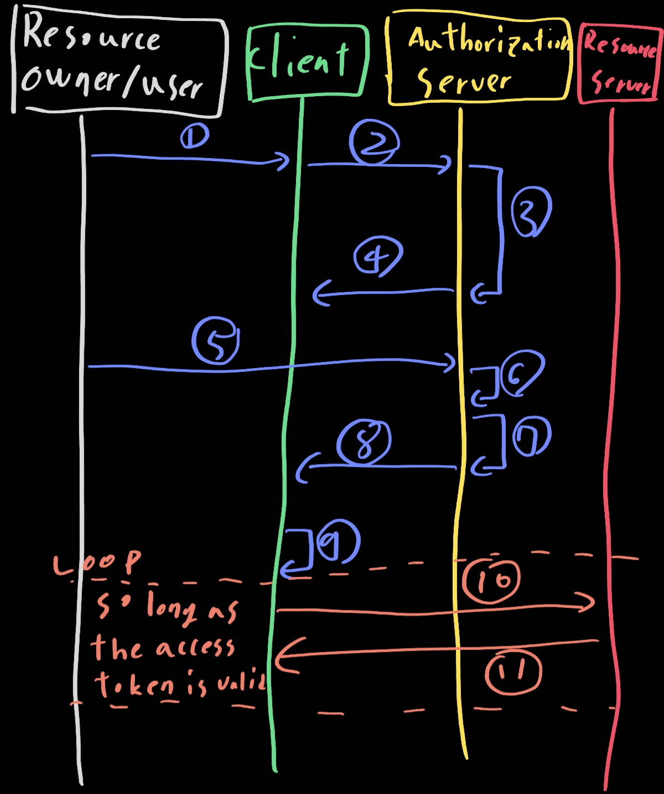

# OAuth

일단 [구글](https://developers.google.com/identity/protocols/oauth2/web-server)과 [범용성](https://velog.io/@kimyh03/OAuth-%EC%82%AC%EC%9A%A9%EC%9E%90-%EA%B3%84%EC%A0%95-%EA%B4%80%EB%A6%AC-%ED%94%84%EB%A1%9C%EC%84%B8%EC%8A%A4frontend-backend)있게 조금 다루겠다. [다른 링크](https://woodcock.tistory.com/17)

- 1: user가 클라이언트의 로그인이 필요한 자원에 접근한다
- 2~3: client_id, redirect_url, response_type, scope를 포함하여 사용자의 브라우저를 Authorization Server에 리다이렉션 시킵니다. 이때 Authorization Server는 파라미터로 받은 client_id와 redirect_url이 사전에 등록된 정보와 일치하는지 검증합니다. 민감한 정보가 포함되니 일치하지 않는다면(검증 실패) 요청이 거절됩니다
- 4~5: 로그인 페이지를 열고 User에게 Client가 등록한 scope에 대한 정보 제공 동의 허용 여부를 나타냅니다. ex) ~에서 사용자의 프로필 이미지, 사용자 이름에 접근하려고 합니다
- 6~12: User가 동의하고 로그에 성공하면 Authorization Server는 Client에게 "Authorization code"를 발급합니다. 그리고 클라이언트는 Authorization code, client id, secret을 Authorization Server에 다시 전송합니다.

## Front-end

- 프론트 엔드에서는 작업을 진행하고 받은 access token을 백엔드에 전달

## Back-end

- 프론트엔드에서 전달받은 access token을 이용하여 Resource Server에 등록된 사용자의 unique index을 가져옵니다
- 위에서 언급한 unique index와 인증을 진행한 Resource Server의 종류를 user table에 저장하여 사용자를 생성하고 식별합니다.

