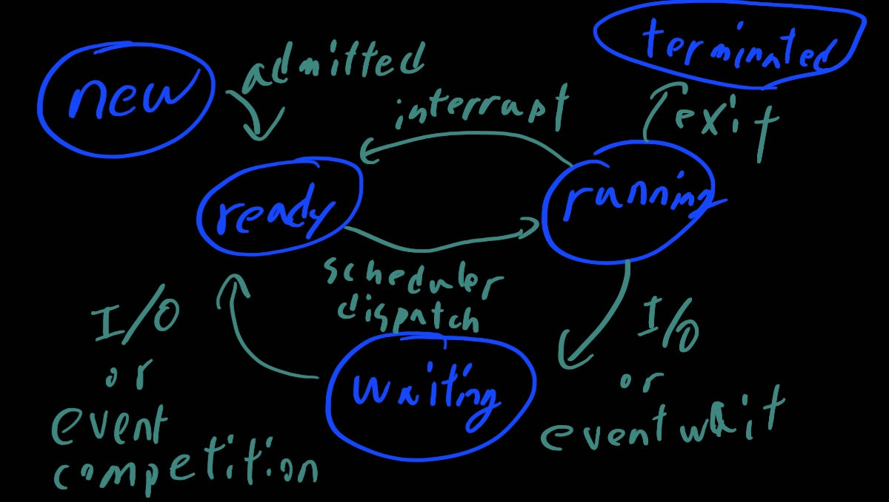

# OS 예상 문제

> 1. system call에 대해 설명해보자
> 2. system call을 사용할 때 라이브러리
> 3. context switch
> 4. process간 통신 방법
> 5. preemptive하게 스케줄링 vs nonpreemptive 스케줄링
> 6. 멀티프로세서와 스케줄링
> 7. race condition? 해결법?
> 8. semaphore
> 9. 메모리 관리 전략
> 10. swapping
> 11. page fault를 최소화
> 12. 쓰레싱
> 13. RAID구조에서 데이터가 날라갈 것을 대비
> 14. small write problem
> 15. process state

1. system call

   - application program에서 os로 서비스를 요청하고 싶을 때 쓰는 메카니즘

2. 왜 라이브러리를 쓰는가?

   - 확장성의 이유다. 커널을 직접 부를 수는 있지만 모든 os마다 커널 명령어가 다르다. 그러니 api라이브러리를 이용한다면 확장성에 이득을 볼 수가 있다.

3. context switching

   - cpu에서 process를 switch할때 일어나는 일련의 과정
   - 지금 실행중인 process의 상태를 저장하고 종료해서 새로운 process의 상태를 가져와서 실행시켜야 한다
   - 오버헤드가 많이 발생함

4. process간의 통신(IPC)

   1. Message Passing: receive, ksend System Call을 이용하여 메세지를 전달하게 된다. 직접 전달과 간접 전달 방법을 갖게 된다. os의 간섭이 지속적으로 필요하게 된다. 시간이 오래걸림
   2. shared memory: 각 프로세스간 공유하는 공간을 만들어 사용하면 attach가 일어날 것이다. 첫생성시 그리고 attach 발생시 system call을 사용하지만 이후에는 커널 영역에서 작업이 이루어지지 않아 지속적으로 교류가 많을 때 사용하면 유리하다

5. preemptive vs nonpreemptive

   1. nonpreemptive한 것은 프로세스가 자발적으로 cpu를 포기할 때까지 기다림. 인터럽트도 nnpreemptive하다
   2. preemptive는 당장 그 시점에서 우선순위가 높은 것을 찾게된다

6. 멀티 프로세스와 스케줄링

   - process affinity라는 게 영향을 미치게 된다. 이건 이전에 이 프로세스를 이 cpu에서 실행한 적이 있는가를 의미하게 되는데 이 경우 해당 코드의 일부가 캐시에 담겨져 있을 가능성이 높으니 이전에 실행했던 cpu를 선택하게 된다.
   - Load balancing: cpu마다 utilization을 체크하여 바쁜 쪽의 일을 덜 바쁜 쪽으로 가지고 와 수행하게 된다

7. race condition

   - 같은 데이터에 동시 접근이 가능하게 되어 결과값이 특정 순서에 따라 달라질 수 있게된 환경
   - 해결법은 3가지를 만족해야한다
     - Mutual Exclusion: Critical Section에 어떤 프로세스가 일을 하고 있다면 다른 thread는 block
     - Progress: CPU가 일을 안하고 있다면 바로 기다리는 일을 진행
     - Bounded waiting: 기다리는 일이 진입할 수 있다는 보장

8. semaphore

   - 공유 자원 제한 접근을 위해 사용하는 변수. 주로 binary로 사용을 하고 두가지 함수가 있습니다. 함수로 변수의 값을 증감시키고 비교합니다. wait상태에 semaphore값이 0이거나 0보다 작을 경우 그 자리에서 대기. 이후 일을 종료하고 나가는 함수가 signal을 하게되면 세마포어 값이 증가 => critical section에 진입할 수 있다
   - binary semaphore === mutex

9. 메모리 관리전략

   - 주로 Address translation은 실행 시간에 수행된다. 실행시간에 수행되기 때문에 빠르게 이뤄져야해서 H/W의 도움을 받는다

   1. Contiguous Allocation: 연속적으로 저장이 되어있을 때 프로세스에 메모리 시작위치가 저장되어 있는 것을 이용합니다. 그리고 limit을 구하여 시작주소에 limit을 더해 Physical Address를 구합니다. 만약 시작 주소가 범위를 넘어가면 잘못된 주소로 인식
      - 연속적으로 저장을 하면 Fragmentation(단편화)이 발생
        - External Fragmentaion: 연속적으로 저장해야하고 그 용량이 남아있는 용량보단 적지만 메모리에 데이터들이 파편화 되어 있어 할당할 수 없는 상태
        - Internal Fragmentation: paging 단위로 나누어져 있을 때 그 공간에 할당이 될 경우 딱 나누어 떨어지지 않는 메모리 공간은 사용할 수 없는 현상. paging 단위가 4kb인데 필요공간이 2kb일때 나머지 2kb는 사용불가능해지는 상황
   2. Paging: Contiguous하게 저장을 하지 않아도 괜찮아 집니다. 주로 paging단위는 4kb로 두고 물리 메모리 단위인 frame또한 동일하게 두고 사용하게 된다.
   3. segmentation: 논리적으로 구분된 단위인 segment를 기반으로 연속적으로 저장

10. swapping의 과정

    1. 먼저 os가 pcb의 테이블을 보고 valid한지 invalid한지 메모리에 있는지를 판단하고 없다면 `page fault`입니다
    2. free frame을 가져온다
    3. swapping을 하고 valid bit를 valid로 바꾼다. valid는 메모리에 있다는 것을 의미
    4. 그리고 프로세스 수행
    5. free frame이 없다?
       - victim, 즉 교체될 프레임을 찾아야한다

11. page fault

    - frame이 증가한다면 page fault도 감소하지 않을까 하는데 오히려 증가하는 경우도 있다. balady's anomaly라고 한다
    - 아무튼 다음 방법들이 page fault를  최소화 시키는데 도움을 준다
      - FIFO 먼저 온 순서대로 일처리
      - optimal algorithm: 가장 나중에 쓰일 것을 victim으로 삼는다. 하지만 미래에 그게 가장 안쓰일지 어떻게 알까? LRU캐싱 알고리즘이 해결!

12. 쓰레싱

    - 멀티프로그래밍이 증가하면 cpu utilization이 증가하는건 어느 지점까진 맞다. 하지만 계속해서 증가시키면 메모리에 한계가 있고 paging in, out이 지속적으로 많이 증가해 오버헤드가 엄청나진다.
    - 이 경우 locality를 고려하여 working set model을 사용하여 thrashing이 발생하는지 판단

13. raid 구조에서 데이터가 날라갈 것을 대비

    - mirroring: 중복해서 저장. 용량이 두배!
    - parity: parity block을 두어 복구. XOR연산을 통해 복구가 가능해진다. 추가적인 메모리가 필요하지만 미러링 기법에 비해 적은 용량이 필요하다.

14. small write problem?

    - 작은 양의 write가 계속 될 때 parity를 매번 다시 계산해줘야해서 오버헤드 발생

15. Process state

    

    - new: 프로세스가 막 생성된 상태
    - ready: 프로세스가 cpu에 의해 시작되기를 대기하는 상태
    - running: 프로세스에 포함된 명령어가 실행되는 상태
    - waiting: 프로세스가 특정 이벤트를 기다리는 상태
    - terminated: 프로세스가 실행을 완료

