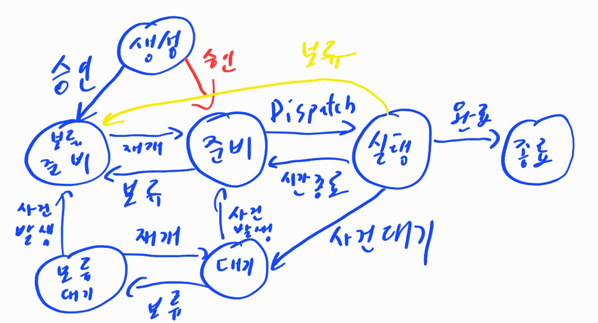
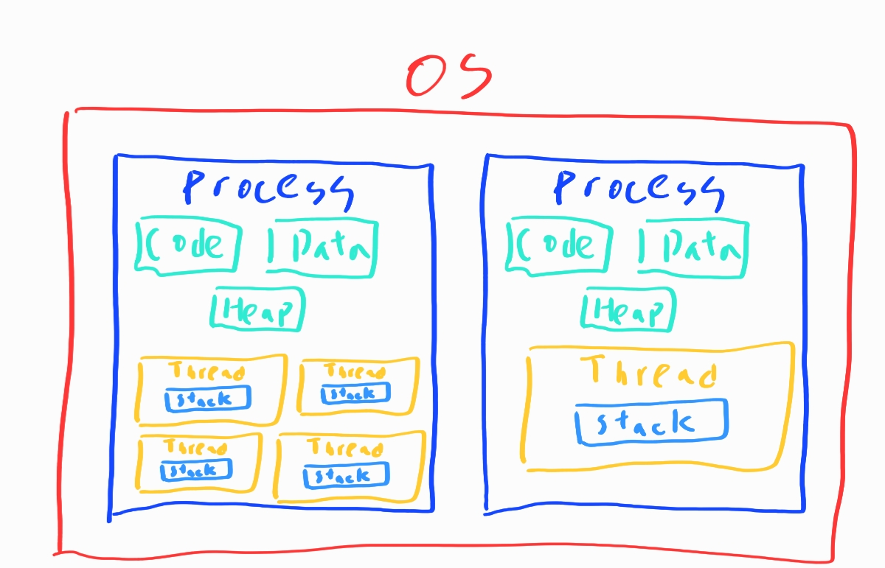
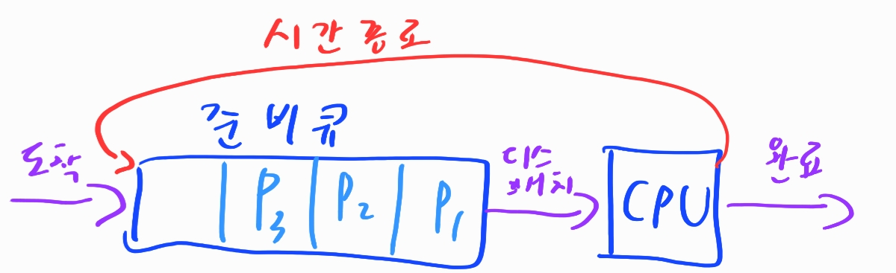
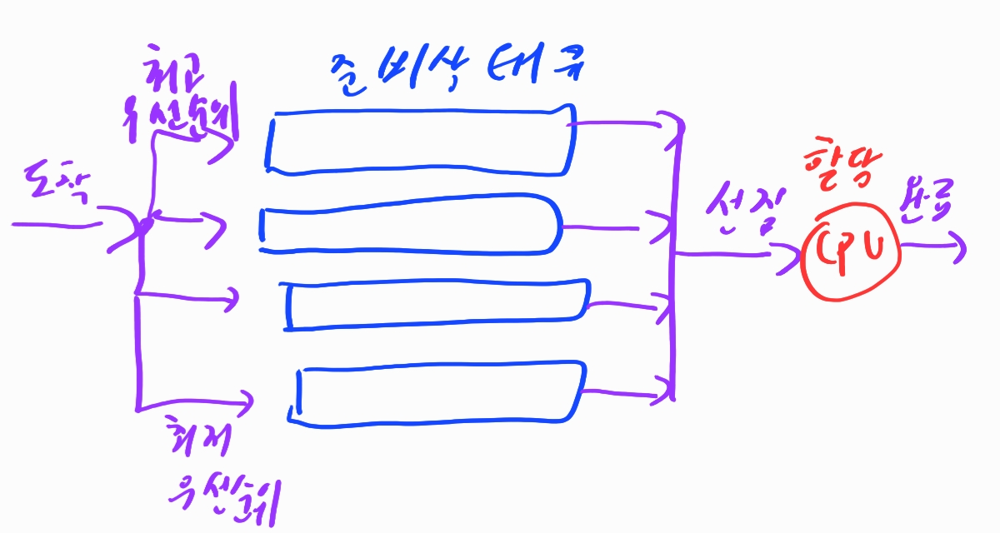
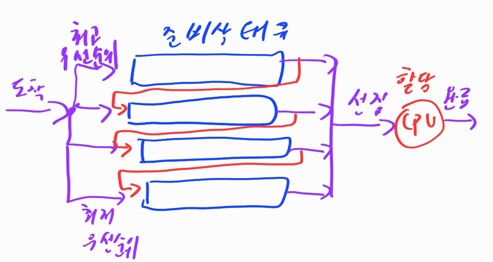

# OS

> 1. 프로세스와 스레드
> 2. 동기화 비동기화
> 3. 인터럽트
> 4. 시스템 콜
> 5. 스케줄링

# 1. 프로세스와 스레드

## 프로세스?

실행중인 프로그램으로 디스크로부터 메모리에 적재되어 cpu에 할당을 받는 작업의 단위. os에게 시스템 자원을 할당 받는다. 

할당받는 자원

- CPU시간
- 운영되기 위한 메모리 주소 공간
- Code(프로그램 소스 코드), Data(전역 변수 저장), Stack(함수, 지역 변수 저장), Heap의 구조로 되어 있는 독립된 메모리 영역

기본적으로 프로세스는 최소 한개의 스레드를 갖는다. 메인 스레드를 최소한 가져야하기 때문이다. 프로세스끼리는 보통 서로 접근하기 어렵지만 **IPC 통신**을 이용한다면 가능한다.

### 프로세스 제어 블록 (PCB)

특정 프로세스에 대한 중요한 정보를 저장하고 있는 커널 내의 자료구조 이다. OS는 프로세스를 관리하기 위해 프로세스의 생성과 동시에 고유한 PCB를 생성한다. 

프로세스 전환이 발생하면 진행하던 작업을 저장하고 cpu를 반환해야한다. 이때 **진행 상황을 모두 PCB에 저장**한다. 다시 cpu를 할당 받으면 pcb에 저장되어 있던 것을 불러온다.

pcb에 저장되는 정보

- 프로세스 식별자: 프로세스 식별번ㄴ호
- 프로세스 상태
- 프로그램 카운터: 프로세스가 다음에 실행할 명령어의 주소를 가리킨다
- CPU레지스터
- CPU 스케줄링 정보
- 메모리 관리 정보
- 입출력 상태 정보
- 어카운팅 정보

### 프로세스의 상태와 변화



- 준비 상태
  - CPU를 할당 받기위해 기다리고 있는 상태
  - 준비상태의 여러 프로세스들은 메모리에 적재되어 있다
  - 순서에 따라 cpu를 할당받고 실행상태가 되면 이때 cpu를 할당받은 순서를 정한다. == `cpu 스케줄링`
- 실행 상태
  - cpu를 할당 받아 실행중인 상태
  - cpu를 할당하는 것을 `Dispatch`라고 한다
- 대기 상태
  - 프로세스가 실행되거나 입출력 처리를 요청하거나, 바로 확보될 수 없는 자원을 요청하면 CPU를 양도하고 요청한 일이 완료되기를 기다리며 대기하는 상태
- 종료 상태
  - 프로세스가 종료될 때 아주 잠시 거치는 상태
  - 프로세스의 모든 자원들이 회수되고 PCB만 커널에 남는다
  - 운영체제가 프로세스의 흔적과 PCB를 삭제하면 프로세스는 완전히 삭제된다
- 보류 상태
  - 프로세스가 메모리를 빼앗기고 디스크로 나감
  - 프로세스가 메모리로 복귀됨
  - 프로세스가 메모리로 복귀했다가 나가고 하는 일련의 과정을 Swapping이라고 함
- 보류 준비 상태
  - 생성된 프로세스가 바로 메모리를 받지 못할 때
  - 준비, 실행 상태에서 메모리를 잃게 될 때
- 보류 대기 상태
  - 대기 상태일 때 메모리 공간을 잃은 상태

### 멀티 프로세스

> 하나의 컴퓨터에 여러 CPU 장착 -> 하나 이상의 프로세스들을 동시에 처리
>
> 하나의 응용프로그램을 여러 개의 프로세스로 구성하여 각 프로세스가 하나의 작업을 처리하도록 하는 것.

장점: 안정성

단점: 각각 독립된 메모리 영역을 갖고 있어, 작업량 많을 수록 오버헤드 발생. Context Switching으로 인한 성능 저하

> context switching이란?
>
> 프로세스의 상태 정보를 저장하고 복원하는 일련의 과정. 즉, 동작 중인 프로세스가 대기하면서 해당 프로세스의 상태를 보관하고, 대기하고 있던 다음 순번의 프로세스가 동작하면서 이전에 보관했던 프로세스 상태를 복구하는 과정
>
> 1. Task의 대부분 정보는 Register에 저장되고 PCB로 관리
> 2. 현재 실행하고 있는 Task의 PCB 정보를 저장
> 3. 다음 실행할 Task의 PCB정보를 읽어 Register에 적재
> 4. CPU가 이전에 진행했던 과정을 연속적으로 수행
>
> 많은 비용이 소모된다. **Cache 초기화**, **Memory mapping 초기화**, **커널은 항상 실행되어야 함**

## 스레드

프로세스 아래에서 프로세스가 메모리를 할당시켜서 작업을 실행시킬 수 있는 메모리 공간. 그려지는 상황을 추상화해서 그려보면 아래와 같다



- 스레드는 프로세스 내에서 서로 code, data, heap을 공유하고 stack영역을 따로 할당 받는다
- 스레드는 한 프로세스 내에서 code, data, heap은 접근이 가능하지만 프로세스 간의 메모리는 접근이 불가능하다
- 스레드는 별도의 레지스터와 스택을 갖고 있으며, 다른 영역을 공유한다.

### 동기화

자원을 공유하기 때문에 오류를 야기할 수 있는 상호간의 간섭이나, 데이터의 파괴등을 방지하기위한 스레드의 동기화가 필요

### 종류

1. 사용자 레벨 스레드
   - 스레드 라이브러리에 의해 관리
   - 커널은 스레드의 존재를 모른다
   - 특정 스레드의 대기가 프로세스 내의 모든 스레드의 대기를 초래
   - cpu가 프로세스 단위로 할당되어 다중처리 환경이 주어져도 스레드 단위의 다중처리가 불가능
2. 커널 레벨 스레드
   - 모든 스레드의 관리를 커널이 관리
   - 다중처리 환경에서 한 프로세스 내의 다수의 스레드는 병렬처리가 가능함
   - 같은 프로세스에 속한 스레드간 스위칭도 커널개입이 필요하다

### 멀티스레드

> 하나의 프로세스(응용 프로그램)에서 여러 스레드를 구성해 각 스레드가 하나의 작업을 처리

스레드가 공유 메모리를 통해 다수의 작업을 동시 처리

장점: 각각의 프로세스가 공유 메모리만큼의 시간, 자원 손실이 감소 전역 변수와 정적 변수에 대한 자료 공유 가능

단점: 안정성 문제, 코딩의 어려움

## 자주 나오는 질문

1. 스택을 스레드마다 독립적으로 할당하는 이유는 뭘까?

   스택: 함수 호출시 전달되는 인자, 복귀 주소값 및 함수 내에서 선언하는 변수 등을 저장하기 위해 사용되는 메모리 공간

   스택 메모리 공간이 독립적이라는 것은 독립적인 함수 호출이 가능함을 의미하고 이는 독립적인 실행 흐름이 추가된다는 것이다. 따라서 스레드의 정의에 따라 독립적인 실행 흐름을 추가하기 위한 최소 조건으로 독립된 스택을 할당하는 것이다.

2. pc 레지스터를 스레드마다 독립적으로 할당하는 이유는 뭘까?

   pc 값은 스레드가 명령어의 어디까지 수행했는지를 나타내게 된다. 어느 부분까지 수행했는지 기억할 필요가 있기 때문에 독립적으로 할당한다.

3. 멀티 프로세스 대신 멀티 스레드를 사용하는 이유

   - 프로그램을 다중으로 키는 것 보다는 하나에서 여러 작업을 처리 하는 것이 효율적
   - **프로세스를 생성하여 자원을 할당하는 시스템 콜이 감소한다** => 자원을 효율적으로 관리 가능
   - Context Switching시, 캐시 메모리를 비울 필요가 없기 때문에 비용이 적고 빠름. **스레드는 스택 영역만 초기화하면 된다!**
   - 스레드는 프로세스 내의 메모리를 공유하기 때문에 서로 데이터 전달이 간단.

# 2. 동기화 비동기화

- 동기화: 한정적인 시스템 자원에 여러 스레드가 동시에 접근해서 사용하면 문제가 일어날 수가 있다. 이 문제를 방지하기 위해 여러 스레드에게 하나의 자원에 대한 처리 권한을 주거나 순서를 조정하는 기법

## 스레드 동기화

1. 실행 순서의 동기화: 스레드의 실행 순서를 정의 => 이 순서를 반드시 따르도록 하는 것
2. 메모리 접근에 대한 동기화: 메모리 접근에 동시 접근을 막아야함(데드락), 실행 순서가 중요한 것이 아니라 한 순간에 하나의 스레드만 해당 자원에 접근하도록 해야함

## 동기화 기법

- 유저 모드의 동기화

  - 커널의 힘을 빌리지 않는 동기화 기법
  - 성능상 이점이 있으나 기능상 구현 제한이 있음
  - 임계 구역 기반의 동기화, 인터락 함수 기반의 동기화
    1. 임계 구역 기반의 동기화
       - 열쇠를 얻은 프로세스만 임계 구역에 들어갈 수 있다. 즉, 한번에 하나의 스레드만이 접근 가능
       - 임계 구역 진입을 위해 크리티컬 섹션 오브젝트 획득
       - 다른 스레드가 열쇠를 가지고 있을 시에는 반환할 때까지 블로킹
    2. 인터락 함수 기반의 동기화
       - 함수 내부적으로 한 순간에 하나의 스레드에 의해서만 실행되도록 동기화

- 커널 모드의 동기화

  - 커널에서 제공하는 동기화 기능을 이용하는 방법

  - 커널 모드로의 변경이 필요하고 이는 성능 저하로 이어진다. 그러나 다양한 기능을 활용할 수 있다.

  - 세마포어, 뮤텍스, 모니터 등등

    1. 모니터

       - 상호 배제 자물쇠로 보호되는 루틴의 집합을 모니터라고 부른다. 스레드는 자물쇠를 얻기 전까지 모니터의 루틴을 실행이 불가능. 즉, 한 모니터 내에서 한 스레드씩 실행.
       - 다른 스레드들은 모니터에 있는 스레드가 끝날때까지 대기. 

    2. 세마 포어

       - 공유 자원을 보호하기 위한 자물쇠만 존재. 공유 자원을 사용하려면 자물쇠를 획득해야 한다.

       - 자물쇠를 쥐고 있는 스레드에서 놓아주기 전까지는 그 자원을 획득하려는 다른 스레드는 막힌다. 

       - 자물쇠를 놓아주는 순간 기다리는 스레드가 바로 획득

       - 허용 가능한 갯수를 가지고 있는 카운터가 있다.

       - 구현 방법

         ```
         Procedure P(s)
         	while S-0 do wait
         	S := S-1
         end P
         
         -- 임계 구역 --
         
         Procedure V(s)
         	S := S+1
         end V
         ```

         p는 s가 1이 될 때까지 기다리고 1외 되면 s를 0으로 만든다. v는 S를 1로 원위치 시켜서 해제하는 과정

    3. 뮤텍스

       - 두 스레드가 동시에 사용 불가능

       - 구현 알고리즘

         1. 데커 알고리즘

            flag와 turn 변수를 통해 임계 구역에 들어갈 프로세스/스레드 를 결정하는 방식

            - flag: 프로세스 중 누가 임계 영역에 진입할 것인지 나타내는 변수
            - turn: 누가 임계 구역에 들어갈 차례인지 나타내는 변수

         2. 피터슨 알고리즘

            데커와 유사하지만 상대방 프로세스/스레드에게 양보하는 것에 차이가 있다.

         3. 제과점 알고리즘

            여러 프로세스/스레드에 대한 처리가 가능한 알고리즘. 가장 작은 수의 번호표를 가지고 있는 프로세스가 임계 구역에 진입한다.

    - 쉽게 비교하는 방법은 화장실을 생각해보자 (화장실: 공유자원, 열쇠: 공유 자원에 접근하기 위한 오브젝트, 사람: 프로세스 혹은 스레드)

      1. 뮤텍스 

         화장실이 한개 열쇠가 한개인 장소

         화장실에 사람이 있으면 대기하는 사람들은 열쇠를 받기 위해 카운터에서 대기한다

         화장실에 있는 사람은 나와서 카운터에 열쇠를 두고 가면 대기하는 사람이 순서대로 열쇠를 받아간다

      2. 세마포어

         화장실이 다수이고 빈 화장실이 몇개인지 보여주는 장소

         빈화장실에 사람들이 접근한다.

         화장실에 꽉차있다고 표시되면 사람은 대기하고사람이 나오면 바로 접근한다

## 데드락

스레드끼리 공유자원을 참고하다가 서로 같은 것을 참고하기 위해 멈춰서 작동을 못하는 경우가 데드락이다. 다음과 같은 비슷한 현상이 일어나면 대부분 데드락이 일어난다. 처리 과정에서 두개 이상의 자원이 필요한데 다음과 같은 상황이면 둘 다 해당 자원을 이용못해서 뻗게된다


다음과 같은 조건이 일어나면 데드락이 발생한다

1. 상호 배제: 자원은 한 번에 한 프로세스만 사용 가능
2. 점유 대기: 최소한 하나의 자원을 점유하고 있으면서 다른 프로세스에 할당되어 사용하고 있는 자원을 추가로 점유하기 위해 대기하는 프로세스가 존재
3. 비선점: 다른 프로세스에 할당된 자원은 사용이 끝날 때까지 강제로 빼앗을 수 없음
4. 순환대기: 프로세스 집합에서 순환 형태로 자원을 대기하고 있어야함

해결 방법은 다음과 같다

1. 예방

   교착 상태가 아예 발생하지 않도록 할 수 있으나 자원 낭비와 특정 프로세스 무한 대기 가능성이 존재

   1. 상호 배제 부정: 여러 프로세스가 공유 자원 사용
   2. 점유 대기 부정: 프로세스 실행 전 모든 자원을 할당
   3. 비선점 부정: 자원 점유 중인 프로세스가 다른 자원을 요구할 때 가진 자원 반납
   4. 순환대기 부정: 자원에 고유번호 할당 후 순서대로 자원 요구

2. 회피

   교착 상태 발생시 피해나가는 방법

   은행원 알고리즘

   - 은행에서 모든 고객의 요구가 충족되도록 현금을 할당하는데서 유래
   - 프로세스가 자원을 요구할 때, 시스템은 자원을 할당한 후에도 안정 상태로 남아있게 되는지 사전에 검사하여 교착 상태 회피
   - 안정 상태면 자원 할당, 아니면 다른 프로세스들이 자원 해지까지 대기

3. 탐지

   자원 할당 그래프를 통해 교착 상태를 탐지함

   자원 요청 시, 탐지 알고리즘을 실행시켜 그에 대한 오버헤드 발생함

4. 회복

   교착 상태 일으킨 프로세스 종료 or 할당된 자원을 해제시켜 회복

데드락을 처리

관련 문제는 [동시성 스레드를 참고하자](동시성 스레드.md)

# 3. 인터럽트

프로그램을 실행하는 도중에 예기치 않은 상황이 발생할 경우 현재 실행 중인 작업을 즉시 중단하고, 발생된 상황을 우선 처리한 후 실행 중이던 작업으로 복귀하여 계속 처리하는 것. **스택**을 자주 이용한다.

우선도 또한 존재한다. 없다면 일처리가 제대로 되지 않을 것이기 때문이다. **인터럽트 마스크**라는 기능을 이용하게 된다. 이걸 사용하면 인터럽트를 받아들이지 않게 된다! 하지만 반대로 마스크를 하고 있어도 강제로 인터럽트를 해오는 것도 있다. **리셋(프로그램 초기화)**이라고 불린다. 이 리셋은 우선순위가 가장 높게 되어있다.

인터럽트의 종류는 다음과 같다

1. 외부 인터럽트

   입출력 장치, 타이밍 장치, 전원 등 외부적인 요인으로 발생

2. 내부 인터럽트

   `Trap`이라고 부르며, 잘못된 명령이나 데이터를 사용할 때 발생

3. 소프트웨어 인터럽트

   프로그램 처리 중 명령의 요청에 의해 발생한 것

처리 과정

1. 폴링 방식

   사용자가 명령어를 사용해 입력 핀의 값을 계속 읽어 변화를 알아내는 방식

2. 인터럽트 방식

   MCU 자체가 하드웨어적으로 변화를 체크하여 변화 시에만 일정한 동작을 하는 방식

# 4. 시스템 콜

1. 커널 모드

   프로그램 카운터가 운영체제가 존재하는 부분을 가리키고 있따면, 현재 운영체제의 코드를 수행중이며 CPU가 커널 모드에서 수행중이라고 한다.

2. 사용자 모드

   프로그램 카운터가 사용자 프로그램이 존재하는 메모리 위치를 가리킬 경우, 사용자 프로그램을 수행 중이며 CPU가 사용자 모드에서 수행중이라고 한다.

디스크에서 자료를 읽어오는 것을 시스템 콜이라고 가정

1. 사용자 프로그램이 시스템 콜을 하게 되면 운영체제는 자신의 커널 영역에 정의된 시스템 콜 처리 코드를 수행한다.
2. CPU가 컨트롤 레지스터를 세팅해 디스크 컨트롤러에게 데이터를 읽어오라고 명령한다.
3. 디스크 컨트롤러는 디스크로부터 데이터를 읽어와서 자신의 로컬 버퍼에 저장한다.
4. 작업이 완료되면 디스크 컨트롤러가 cpu에게 인터럽트를 발생시켜 입출력 작업이 완료되었음을 통지한다.

C를 생각해보자. `fork()`,`exec()`,`wait()`와 같은 것들은 Process생성과 제어를 위한 system call이다. [참고자료 이거 보면서 다시 정리해보자](https://github.com/gyoogle/tech-interview-for-developer/blob/master/Computer%20Science/Operating%20System/%5BOS%5D%20System%20Call%20(Fork%20Wait%20Exec).md)

# 5. 스케줄링

1. 선점형 스케줄링

   1. SRT 스케줄링

      - 짧은 시간 순서대로 프로세스 수행

      - cpu에서 실행중인 프로세스의 남은 cpu 버스트 시간보다 더 짧은 시간을 가지는 프로세스가 도착하면 cpu가 선점당함

      - 응답시간 계산

        | 프로세스 | 도착 시간 | CPU 요구량 |
        | -------- | --------- | ---------- |
        | P1       | 0         | 10         |
        | P2       | 0.5       | 5          |
        | P3       | 1         | 2          |

        P1 => P2 => P3 => P2 => P1 순서대로 처리. (CPU를 할당안하고 P3를 기다리는 것이 더 빠를 수도 있다)

   2. Round Robin 스케줄링

      - 시분할 시스템의 성질을 활용한 방법
      - 일정 시간을 정하여 하나의 프로세스가 이 시간동안 수행하고 다시 대기 상태로 돌아간다
      - 그리고 다음 프로세스 역시 같은 시간동안 수행한 후, 대기한다. 이러한 작업을 모든 프로세스가 돌아가면서 진행하며, 마지막 프로세스가 끝나면 다시 처음 프로세스로 돌아감
      - FCFS 스케줄링 기반이고 FCFS에서 프로세스 하나가 cpu를 독점하는 단점을 방지, but Context Switch의 오버헤드를 감수해야 함
      - 

   3. Multi-level Queue 스케줄링

      - 프로세스를 그룹으로 나누어, 각 그룹에 따라 준비 큐를 여러개 두고 각 큐마다 다른 규칙을 지정해도 괜찮다
      - 즉, 준비큐가 여러개고 분할로 스케줄링 한다
      - 프로세스들이 cpu를 기다리기 위해 한줄로 서는 것이 아니라 여러 줄로 선다.
      - 

   4. Multu-level feedback Queue 스케줄링

      - 기본 개념은 Multi-level Queue와 동일
      - 프로세스가 하나의 큐에서 다른 큐로 이동이 가능
      - 
      - 우선순위 높은 것이 먼저 선점하지만 **너무 오래 걸린다면 아래의 큐로 프로세스를 옮긴다**
      - 아래쪽이 기아 현상을 겪는다면 위로 옮길 수도 있다

2. 비선점형 스케줄링

   1. FCFS
      - 큐와 같은 방식의 스케줄링이다. 먼저 오면 먼저 처리한다.
      - 이 문제는 먼저 온 프로세스가 길게 사용된다면 평균 대기 시간이 길어진다는 단점이 있다
   2. SJF
      - 다른 프로세스가 먼저 도착했더라도 CPU버스트가 짧은 프로세스에게 CPU를 먼저 할당한다
      - 일단 비현실 적인 것이 너무 크다. cpu버스트 시간을 알 수 없는 것이 문제.
   3. Priority
      - 우선 순위가 높은 프로세스 먼저 선택되는 스케줄링
      - 우선순위가 낮은 놈이 무한대기탈 가능성이 있는 단점이 있음

나머지는 옛날에 종이에 정리해둔거 보자...... 이거 더 정리할라믄 난리난다ㅠㅜ