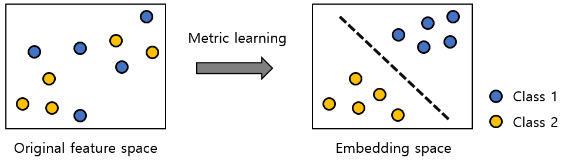

# 머신러닝

- Cross Validation
  - 교차검증이란 보통 데이터 학습에 있어서 데이터를 Train set와 Test set으로 나눈다. 그런데 이것을 한번만 했는데 train set이 적절치 않아서 과하게 좋게 나오거나 과하게 나쁘게 나올 수도 있다. 그래서 train set와 test set을 계속해서 섞은다음 다시 학습을 시켜 테스트해보는 것이 교차 검증이다
  - 모든 데이터 셋을 평가에 사용할 수 있고 모든 데이터 셋을 훈련에 사용할 수가 있다
  - 하지만 그만큼 학습횟수가 많아지기 때문에 훈련/테스트에 시간이 오래 걸린다
  - [다양한 교차 검증 방법들](https://m.blog.naver.com/ckdgus1433/221599517834)
  
- metric

  1. 거리 함수

     통계, 데이터 마이닝, 머신 러닝 등에서는 데이터 간의 유사도를 수치화하기 위해 일반적으로 거리 함수 (metric function)을 이용한다. 가장 대표적인 거리 함수로는 Euclidean 거리가 있으며 다음과 같이 정의 한다.
     $$
     d_E(x1,x2)=\sqrt{\sum_{i=1}^d(x_{1,i}−x_{2,i})^2}
     $$
     또 다른 대표적인 거리 함수로는 각 축 방향으로의 분산까지 고려한 **Mahalanobis**거리가 있으며, 두 점의 거리는 아래와 같이 정의된다
     $$
     d_M(x_1,x_2) = \sqrt{(x_1-x_2)^TS^{-1}(x_1-x_2)}
     $$
     S는 공분산 행렬(covariance matrix)이다. 이와에도 cosine similarity나 Wasserstein 거리와 같은 다양한 거리 함수가 있다.

  2. Deep Metric Learning

     데이터에 적합한 거리 함수라는 표현을 머신 러닝의 관점에서 다시 말하면, 데이터의 각 목표값에 대해 데이터를 구분하기 쉽게 만들어주는 거리 함수를 의미한다. 그림 1은 이러한 관점에서 metric learning의 목적을 시각적으로 보여준다. 기존의 feature로는 분류가 쉽지 않았던 데이터에 대해 데이터를 class label별로 잘 구분할 수 있게 만드는metric을 학습함으로써 분류 모델을 만드는 문제가 매우 단순해졌다.

     

     metric leraning을 통해 학습된 거리 함수를 `f(x;theta)`라고 할 때, 두 데이터 x1, x2에 대한 새로운 거리함수는
     $$
     d_θ(x_1,x_2) = ||f(x_1)-f(x_2)||_2^2
     $$
     와 같이 정의된다. 따라서, metric learning 문제의 목적은 데이터를 각 목표값에 따라 잘 구분되도록 변환하는 emvedding함수 f를 학습하는 것이 된다. 이 때, f가 단순한 선형 변환이 아니라, deep neural network일 경우 앞에 deep을 붙여 deep metric learning이라고 한다. 대표적인 두 방법인 **contrastive embedding**과 **triplet embedding**, 그리고 회귀 적인 문제로 확정시킨 **log-ratio embedding**을 알아 둘 수 있도록 하자

  3. Contrastive Embedding

     이진 분류에 이용되는 metric learning이다. 각각의 tuple (xi,xj,yij)에 대해 contrastive loss는 다음과 같이 정의된다
     $$
     L_C = \frac{1}{N}\sum_{i=1}^{N/2}\sum_{j=1}^{N/2}y_{ij}d(x_i,x_j) + (1-y_{ij})(max(0,α-d(x_i,x_j)))
     $$
     위의 contrastive loss에서는 embedding network f에 대해 
     $$
     d(x_1,x_2) = ||f(x_1)-f(x_2)||_2^2
     $$
     로 정의 되며 yij는 xi와xj가 같은 class이면 1이고 아니면 0이다.  Contrastive embedding의 hyperparameter인 αα는 두 데이터가 서로 다른 class에 속할 경우, αα 이상의 거리를 갖도록 제한하는 역할을 한다. Contrastive embedding에서는 LC를 최소화하도록 ff의 model parameter를 학습시킴으로써 데이터를 잘 구분할 수 있는 새로운 embedding을 만들어낸다.

  4. Triplet Embedding

     Triplet embedding은 다중 분류에 이용되는 metric learning이다. embedding을 위한 triplet loss는 주어진 데이터셋에서 선택된 데이터인 anchor, 그리고 anchor와 동일한 class label을 갖는 positive sample, 다른 class label을 갖는 negative sample로 아래와 같이 정의 된다
     $$
     L_T = \frac{3}{2N}\sum_{i=1}^{M/3}max(0,d(x_i,x_{i,p})-d(x_i,x_{i,n})+α)
     $$
     이 식에서 xip와 xin은 각각 현재 선택된 anchoar xi의 positive sample과 negative sample이다.

  5. Log-Ratio Embedding

     기존의 contrative embedding과 triple embedding은 모두 분류 문제를 위해 고안되었다. 하지만 이 방법은 분류 문제를 일반화하여 회귀 문제에도 metric learning을 적용하기 위해 제안되었다. 즉, 기존의 이산 목표 변수가 아닌 연속 목표 변수에 대해 metric learning을 확장한 것이다. 아래와 같이 정의할 수가 있다
     $$
     L_{LR}=\frac{1}{N}\sum_{i=1}^N(log\frac{d(x_i,x_{i,p})}{d(x_i,x_{i,n})}-\frac{d(y_i,y_{i,p})}{d(y_i,y_{i,n})})^2
     $$
     Log-ratio embedding에서는 위 식의 log-ratio loss를 최소화함으로써 embedding 공간 상에서의 데이터 간의 거리 비율과 목표 변수간의 거리 비율이 일치하도록 f의 model parameter를 최적화 한다.
  
- 정규화

  - 정규화는 값의 범위를 [0,1]로 옮기는 것이다. 두학생의 점수를 비교한다고 해보자 한 학생의 점수는 1000점만점에 90점이고 다른 학생은 100점만점에 80점이다. 이런 경우 당연히 80점 학생이 더 성적이 좋다. 그 비교의 근거는 비율로 볼 수가 있다. 그러니 이런식으로 표준을 같게 만들어 주는 것이다
    $$
    X^` = \frac{X-μ}{σ}
    $$
    μ는 한 특성의 평균값, σ은 표준편차이다. 이것은 정규분포의 표준화 공식과 같다

- Local minima, Global minima

- 차원의 저주

  - 데이터 학습을 위해 차원이 증가하면서 학습데이터 수가 차원의 수보다 적어져 성능이 떨어지는 현상
  - KNN(최근접이웃)알고리즘에서 치명적이다.

- dimensionality reduction

  - 데이터 양을 줄이는 여러가지 방법이다

    - 데이터 양을 줄여 시간복잡도와 공간 복잡도를 줄이는 것이 목표
    - 입력 데이터의 차원을 줄여서 안정적인 결과를 얻게 하기 위해서
    - 간단한 모델일수록 내부 구조를 인간이 이해하기가 쉬워진다

  - 기법

    1. feature selection

       총 5개의 열 중에서, 어떤 feature들을 쏙쏙 골라 뽑아서 데이터 테이블을 구성해야 학습 결과는 (거의) 그대로 보존하면서 데이터 양을 줄일 수 있을까 에 대한 고민이다

       1. Forward search
          1. F를 비어있는 공집합으로 둔다
          2. 에러 E를 구하는데 xj를 F에다가 (임시로) 넣은 후에(합집합), 머신러닝 모델을 돌려서 에러 E를 확인합니다. 이때 x0부터 x4까지의 모든 열에 대해서 반복해서 머심러닝 모델을 돌린다. 그러면 그 중에 가장 성능이 좋은 (에러가 가장 작은) xj를 발견할 수 있다
          3. 2에서 찾은 결과를 F에 (영구적으로) 등록한다
          4. 2와 3을 반복해서 실행, 최정적으로 k개의 열로 이루어진 테이블을 원하므로 첫번째 반복에서는 d회의 머신 러닝 훈련, 두번째 반복에서는 d-1회의 훈련.... 이런식으로 진행된다
       2. Backword search
          1. F를 원래 데이터 전체로 놓습니다
          2. 마찬가지로 E를 구하는데, 이번에는 F로부터 열을 하나씩 빼 가면서 머신러닝 모델을 돌려 에러E를 확인합니다. 퇴출시켰더니 모델의 성능이 가장 좋게 나오는 xj열을 알아낼 수 있다
          3. 2에서 찾은 결과를 F로부터 퇴출
          4. 계속 반복한다. 여기서 훈련 횟수는 1번째에서 d회를 계산하고 이 이후에는 n번째 반복에서는 n+1만큼 계산한다

    2. feature extraction

       여러 무더기의 데이터 열을 뭉개는(압축하는) 방법을 제안

- 

