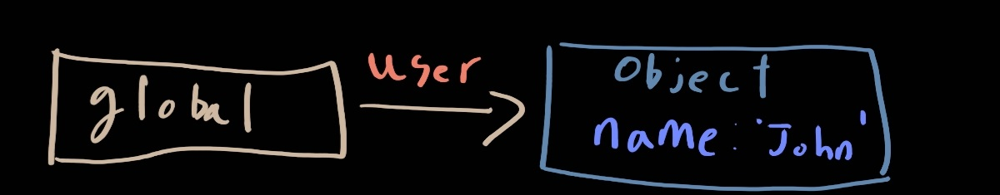
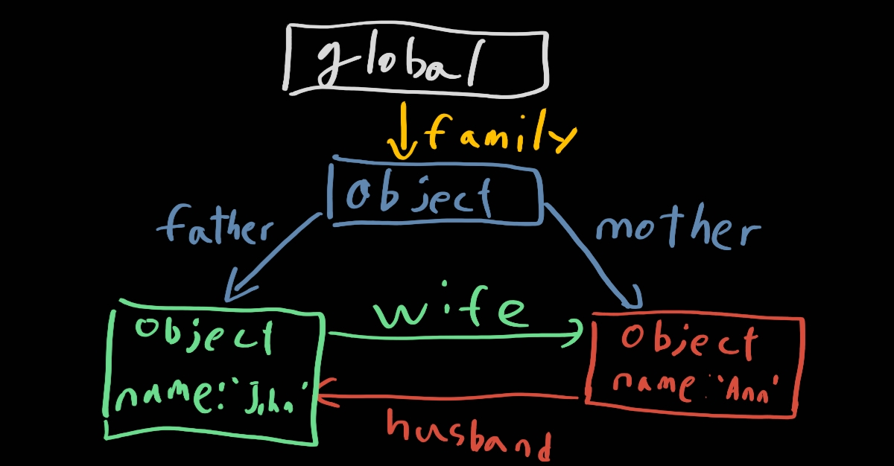

# Garbage Collector

가비지 컬렉터(이하 GC)의 중점은 `global에서 접근이 가능한가` 이다. 아래와 같은 코드가 있다고 해보자. 그러면 메모리 참조는 그 아래 그림처럼 진행이 될 것이다.

```javascript
let user = {
    name: 'John'
};
```



global에서는 user을 통해 해당 객체에 접근이 가능하다. 그런데 user에 null을 취할 경우 객체에 접근할 방법이 사라져 GC에 의해 해당 객체는 메모리에서 삭제가 될 것이다. 코드와 그림으로 확인하면 아래와 같다

```javascript
user = null;
```


그렇다면 아래와 같은 상황에서는 어떨까?

```javascript
let user = {
    name = 'John'
};
let admin = user;
user = null;
```

위 상황을 코드 순서대로 정리 해보자

1. user에 해당 객체를 참조하게 한다.
2. admin에 user와 같은 객체를 참조하게 한다.
3. user의 참조를 그만둔다.

그렇다면 global은 저 객체에 접근이 가능할까? 가능하다! admin은 아직 해당 객체를 참조하기 때문이다. 만약 메모리를 따로 관리해서 각자 다른 객체로 만들고 싶다면 객체를 복사해서 다른 객체를 만들고 각자 참조하게 해야한다.

그렇다면 객체가 객체를 연결해버리면 어떻게 될까? 아래와 같은 코드를 확인 해보자. 해당 코드의 객체 참조는 그 아래의 그림과 같이 진행될 것이다.

```javascript
function marry(man, woman) {
  woman.husband = man;
  man.wife = woman;

  return {
    father: man,
    mother: woman
  }
}

let family = marry({
  name: "John"
}, {
  name: "Ann"
});
```



위와 같은 참조가 이루어질 것이다. 아래와 같은 참조를 지워보자 (null값을 주지 않고 delete를 이용해 지울 수가 있다)

```javascript
delete family.father;
delete family.mother.husband;
```

이러면 `father`화살표와 `husband`화살표가 지워진다. 화살표를 따라가서 'john'이름의 객체에 접근이 불가능하다. 그래서 GC는 해당 객체를 메모리에서 지울 것이다.

위코드를 진행하지 않고 family를 없애보자

```javascript
family = null;
```

위와 같은 코드가 진행된다면 global에서 아래 객체들이 서로 참조하는 곳에 접근이 불가능하다. 그 결과로 아래 객체는 GC가 메모리에서 지울 것이다!

자바스크립트의 GC는 실행에 영향을 끼치지 않는다면 다음과 같은 최적화 기법들을 이용한다.

- generational collection(세대별 수집)
  - 객체를 두가지로 나눈다. '새로운 객체', '오래된 객체'
    - 객체의 특성을 생각해보자
    - 객체 상당수는 생성 이후 제 역할을 빠르게 수행해 금방 쓸모가 없어진다
  - 새로운 객체가 생성 이후 빠르게 쓸모가 없어지는지 GC가 공격적으로 제거하려는 시도를 한다
  - 일정 시간동안 살아남은 객체는 '오래된 객체'로 바뀌고 GC가 덜 감시한다
- incremental collection(점진적 수집)
  - GC는 방문해야할 객체가 많다면 모든 객체를 한번에 방문하고 mark하느라 시간이 걸릴것이다.
  - 그 말은 그만큼 리소스를 먹고 JS를 느리게 만들 것이다.
  - 이러한 부분을 막기위해 JS는 GC를 여러 부분으로 분리한 다음, 각 부분을 별도로 수행시킨다
    - 나누는 데에 리소스가 좀 먹힐 것이지만 분산시킬 수 있다는 것이 큰 장점이다
- idle-time collection(유휴 시간 수집)
  - cpu가 유휴 상태일 때만 가비지 컬렉션을 실행한다