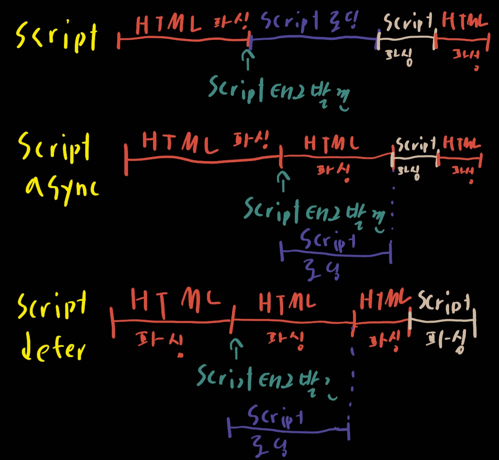

# HTML

1. `DOCTYPE`

   DOCTYPE은 **document type**의 약어입니다. DTD(Document Type Definition)과 관련이 있다

   DTD는 특정 문서가 어떻게 구성되어야 하는지 정의. 반면 **DOCTYPE**은 문서가 대략 존중할만한 DTD를 선언

   웹페이지의 DOCTYPE 선언이 필요합니다.

   HTML5에 대한 표준은 `<!DOCTYPE html>`입니다

2. 여러 언어로 되어 있는 콘텐츠의 페이지를 어떻게 제공하나?

   `<html lang='en'>`처럼 속성을 선언한다

3. `data-`속성

   DOM자체에 추가적인 데이터를 저장하기 위해 `data-`속성을 이용했다. 최근에는 이용하는 것을 권장하지 않는다. javascript에서 데이터를 운용할 수 있으며, `data-`속성으로 저장시 유저가 브라우저의 기능을 사용하여 쉽게 수정이 가능하다.

4. HTML5의 구성요소

   - 의미 - 콘텐츠를 보다 더 정확하게 설명할 수 있도록 허용
   - 연결 - 새롭고 혁신적인 방법으로 서버와 통신할 수 있도록 허용
   - 오프라인과 저장소 - 웹페이지가 클라이언트 측에서 데이터를 로컬로 저장하여, 오프라인에서보다 효율적으로 작동하도록 허용
   - 멀티미디어 - 개방형 웹에서 비디오와 오디오를 일급으로 만듭니다
   - 2D/3D효과 - 훨씬 다양한 프레젠테이션 옵션을 허용
   - 성능과 통합 - 컴ㅁ퓨터 하드웨어의 성능 최적화와 개선으로 더 나은 사용을 제공
   - 장치 접근 - 다양한 입출력 장치의 사용을 허용
   - 스타일링 - 사용자가 더 세련된 테마를 사용하게 합니다.

5. cookie, sessionStorage, locaalStorage

   |                                   | Cookie                                            | localStrage | sessionStorage |
   | --------------------------------- | ------------------------------------------------- | ----------- | -------------- |
   | 생성자                            | 클라이언트나 서버. 서버는 `Set-cookie`헤더로 사용 | 클라이언트  | 클라이언트     |
   | 만료                              | 수동으로 기간 설정                                | 영구적      | 탭닫을때       |
   | 브라우저 세션 전체에서 지속       | 만료 설정 여부                                    | O           | X              |
   | 모든 HTTP 요청과 함께 서버로 보냄 | 쿠키는 `Cookie`헤더를 통해 자동 전송              | X           | X              |
   | 용량                              | 4kb                                               | 5MB         | 5MB            |
   | 접근성                            | 모든 윈도우                                       | 모든 윈도우 | 같은 탭        |

6. script, script async, script defer 의 차이

   - 
   - 파싱과 스크립트를 만났을때 진행방식이 위와 같다

7. css `<link>` 태그가 head사이에 그리고 `<script>`를 `</body>`직전에 위치 시키는 이유

   - `<link>`

     웹 페이지 구성될 때를 생각해자. 웹페이지는 DOM트리와 CSS로 이루어진 CSSOM트리를 같이 만들고 둘다 완성 되었을 때 합치면서 웹페이지를 보여준다. 

     다른 곳에 위치해도 되지마 head에 있으면 dom트리가 완성될때 cssom트리를 바로 합체시킬 수가 있기에 유저입장에선 바로 로딩이 된 것처럼 보일 수가 있다. 

     하지만 link를 만약 다른 곳에 위치시킨다면 dom이 완성되어 그 상태를 먼저 보여주고 cssom트리를 나중에 합쳐 css가 적용되기 전 후를 유저가 봐서 유저 경험이 안좋아진다.

   - `<script>`

     이것은 다운로드 되는 동안 html파싱을 멈추게 한다 *(위를 보면 확인 가능)*

     유저 입장에서는 html파싱이 멈추면 로딩이 되는 것처럼 보이기 때문에 유저 경험에 안좋아질 수가 있다. `defer`속성을 이용한다면 좀 덜할 수가 있다.

8. 프로그레시브 렌더링

   콘텐츠를 가능한한 빠르게 표시하기 위해 사용되는 기술들로 최근 모바일데이터도 많이 이용하기 때문에 유저 경험을 증대시키기 위해 자주 사용한다

   예시

   - Lazy Loading - 페이지의 이미지를 한번에 로딩시키지 않고 Javascript를 이용해 이미지가 표시하는 페이지 부분으로 스크롤할때 이미지를 로딩함
   - 보이는 콘텐츠의 우선순위 설정
   - 비동기 HTML 프래그먼트 - 페이지의 백엔드에서 HTML페이지의 일부를 브라우저로 가져옵니다.[참고자료](https://tech.ebayinc.com/engineering/async-fragments-rediscovering-progressive-html-rendering-with-marko/)

9. `srcset`

   이미지 태그에 있는 속성으로 저해상도 기기에서는 굳이 고해상도 이미지를 제공할 필요가 없다. 그럴때 필요한 것으로 해상도의 상태별로 다른 이미지를 제공하도록 하는 태그인 것