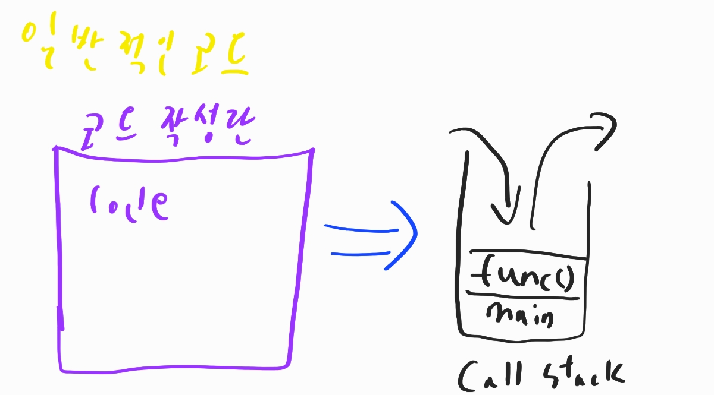
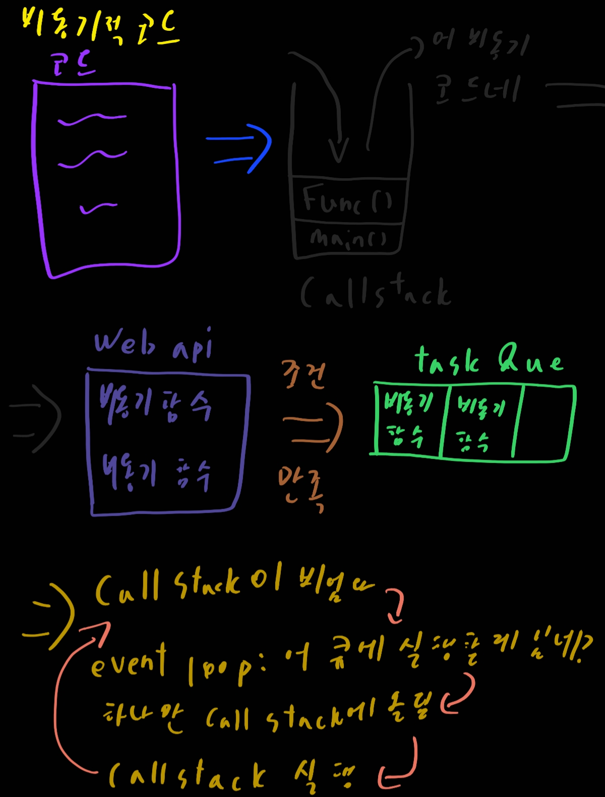

# JavaScript

1. 이벤트 위임

   상위 태그에 이벤트를 위임하는 방식의 코딩. 하위 요소 대신 상위 요소에 이벤트를 넣고 이벤트 버블링에 의해 하위요소에 이벤트가 발생할때 실행시키는 방법

   아래는 테이블에서 클릭되는 칸을 강조하는 코드이다

   ```html
   <table id="bagua-table">
     <tr>
       <th colspan="3"><em>Bagua</em> Chart: Direction, Element, Color, Meaning</th>
     </tr>
     <tr>
       <td class="nw"><strong>Northwest</strong>
         <br>Metal
         <br>Silver
         <br>Elders
       </td>
       ... More than 8 elements td
   ```

   ```javascript
   const table = document.getElementById('bagua-table');
   table.onclick = function (event) {
       const td = event.target.closest('td');
       
       if (!td) return; // td 하위 요소 or td 태그가 클릭된 것이 아닐 시 이벤트 종료
       
       if (!table.contains(td)) return; // table에 포함된 td가 아닐시
       // 사실 위의 방식은 에러가 날 가능성이 있다 table아래에는 thead부분도 있기 때문이다. 어떻게 해결할까?
       // while을 이용해서 body로 나가거나 (target != this) TD일 경우 highlight함수를 발동시키는 것을 하면 된다.
       highlight(td);
   }
   
   function highlight(td) {
       if (td.classList.contains('highlight')) {
           td.classList.remove('highlight')
       } else {
           td.classList.add('highlight')
       }
   }
   ```

   ```css
   #bagua-table .highlight {
     background: red;
   }
   ```

2. this

   좀 간단하게 설명하기는 힘들다

   [참고 자료 1](https://yuddomack.tistory.com/entry/%EC%9E%90%EB%B0%94%EC%8A%A4%ED%81%AC%EB%A6%BD%ED%8A%B8-this%EC%9D%98-4%EA%B0%80%EC%A7%80-%EB%8F%99%EC%9E%91-%EB%B0%A9%EC%8B%9D)

   [참고 자료 2](https://velog.io/@josworks27/%ED%95%A8%EC%88%98%ED%98%B8%EC%B6%9C-call-apply-bind-%EC%B0%A8%EC%9D%B4)

   1. function에서의 this

      그냥 함수를 선언해서 this를 호출시에는 윈도우 객체를 바라보게된다. 즉, 글로벌 변수를 찾게 된다.

      하지만 new로 function을 할당시에는 객체를 생성하는 것으로 해당 객체를 바라보게 된다.

   2. `obj.method()`

      이 경우에는 상황을 잘 봐야한다 아래와 같은 상황을 보자

      ```javascript
      const b = 100;
      function test() {
          console.log(this.b);
      }
      
      const obj = {
          a: 20;
          func1: test;
          func2: function() {
              console.log(this.b);
          }
      }
      ```

      위 경우에 `func1`은 this가 윈도우를 본다고 착각할 수 있지만 *obj안에서 명시해줬기 때문에* **obj내부 this들은 다 obj를 본다!!** 따라서 둘다 `undefined`가 출력이 될 것이다.

      여기서 신기한 점을 한번더 만들어보자

      ```javascript
      const gtest = obj.func1;
      gtest();
      ```

      이것의 결과값은 100이 나온다. 밖에서 지정해주면서 gtest에 대한 this가 다시 window로 바뀐것!

   3. `call`,`apply`,`bind`

      자바스크립트에 함수들은 위 세개의 메소드가 있고 이 메소드들은 this를 넘겨주는 객체로 바라보게 한다는 것이 아주 좋다. 쉽다!

      ```javascript
      const obj2 = {name:'asdf'}
      test.call(obj2)
      ```

      이러면 함수가 실행된 줄에서는 this가 obj2를 본다. 영구적인 것은 아니다

   4. 기타 등등 다양한 상황이 많다 잘 봐야한다

3. 프로토타입

   ```javascript
   "use strict";
   
   let animal = {
     eats: true,
     walk() {
       alert("동물이 걷습니다.");
     }
   };
   
   let rabbit = {
     jumps: true,
     __proto__: animal
   };
   
   let longEar = {
     earLength: 10,
     __proto__: rabbit
   };
   
   // 메서드 walk는 프로토타입 체인을 통해 상속받았습니다.
   longEar.walk(); // 동물이 걷습니다.
   alert(longEar.jumps); // true (rabbit에서 상속받음)
   ```

4. AMD vs CommonJS

   ~~A!M!D!~~ amd 는 asynchronous module definition의 약어로 비동기식을 의미하고 commonJS는 동기식 javascript를 의미한다. amd는 구문이 장황하지만 현대의 브라우저나 다양한 웹에서 많이 사용되지만 역시 구현에서의 어려움은 조금씩 있습니다.

5. void

   `void`는 실행시키고 리턴시키지 않게 해준다. 함수에 지정해줄 시에 그 줄에서 실행을 시키고 함수를 기억하지 않는다. 즉, 함수를 바로 실행시켜야한다!

6. Closer

   클로저는 함수와 그 함수가 선언된 렉시컬 환경의 조합이다. 렉시컬(어휘적 범위 지정 = Lexical scoping)은 렉시컬 범위 지정이 변수가 사용 가능한 위치를 결정하기 위해 소스 코드 내에서 변수가 선언된 위치를 사용한다는 사실을 나타냅니다. 클로저는 외부 함수가 반환된 후에도 외부 함수의 변수 범위 체인에 접근할 수 있는 함수입니다.

   사용하는 이유?

   - 클로저로 데이터 프라이버시 /private method를 모방. 일반적으로 모듈 패턴에 사용
   - 부분 적용

   아래 코드를 참고해보자

   ```javascript
   function makeFunc() {
     var name = "Mozilla";
     function displayName() {
       alert(name);
     }
     return displayName;
   }
   
   var myFunc = makeFunc();
   //myFunc변수에 displayName을 리턴함
   //유효범위의 어휘적 환경을 유지
   myFunc();
   //리턴된 displayName 함수를 실행(name 변수에 접근)
   ```

   실행을 시키면 alert가 실행되면서 name변수를 접근하고 name변수가 잘 뜨는 것을 확인 할 수가 있다.

   근데 코드를 보면 조금 신기하다. makeFunc가 실행되고 나면 name변수에 더 접근할 수 없게 될 것으로 예상하는게 일반적인데 myFunc의 경우 잘 접근한다. 리턴하는 함수가 클로저를 생성하기 때문이다.

7. foreach vs map

   - forEach

     - 배열의 요소를 반복
     - 각 요소에 대해 콜백을 실행
     - 값을 반환 X

     ```javascript
     const a = [1,2,3];
     const doubled = a.forEach((num,index) => {
         return num*2;
     })
     console.log(doubled); // undefined
     ```

   - map

     - 배열의 요소를 반복
     - 각 요소에서 함수를 호출하고 결과로 새 배열을 작성하여 각 요소를 새 요소에 매핑한다

     ```javascript
     const a = [1,2,3];
     const doubled = a.map((num) => {
         return num*2;
     })
     console.log(num); // [2,4,6]
     ```

   둘의 가장 큰 차이점은 반환값이 있느냐 없느냐이다

8. 익명함수

   간단하게 한번 사용되고 말 함수들은 익명함수를 쓰고 콜백으로 사용한다

9. 호스트 객체와 내장 객체

   호스트 객체는 window, XMLHTTPRequest 등과 같이 런타임 환경에 의해 제공

   내장 객체는 ECMAScript 사양에 정의된 javascript 언어의 일부인 객체들이다.

10. call apply 차이

    call은 첫 인수를 객체로 두번째 인수부터는 해당 함수의 인수로 받아들입니다

    apply는 첫 인수를 객체로 두번째 인수를 **배열**로 넣어서 인수를 전달해줘야 합니다

    ```javascript
    function multiple(a,b) {
        return a*b;
    }
    console.log(multiple.apply(null,[2,3]));
    console.log(multiple.call(null,2,3));
    ```

11. `document.write()`

    document.write를 쓰고 싶다면 그전에 `document.open()`로 문서를 열어둬야하고 `document.close()`를 이용해 닫아줘야한다.

    약간 하드 코딩이 필요한 작업이다

12. Feature detection, Feature inference, UA String

    1. Feature Detection

       해당 브라우저가 특정 코드 블록을 지원하는가에 따라 코드를 실행하도록 하여, 일부 브라우저에서 항상 오류 대신 무언가 작동하도록 한다

       ```javascript
       if ('geolocation' in navigator) {
           // navigator.geolocation 이 사용 가능함
       } else {
           // 부족한 기능 핸들링
       }
       ```

    2. Feature Interence

       1번 기능과 마찬가지로 기능을 확인하지만 다른 함수도 존재한다고 가정하고 사용

       ```javascript
       if (document.getElementsByTagName) {
           element = document.getElementById(id);
       }
       ```

       문제는 이것은 권장되지 않는다. 1번 기능이 더 확실하다

    3. UA String

       네트워크 프로토콜 피어가 요청하는 소프트웨어 유저 에이전트의 응용 프로그램 유형, 운영 체제, 소프트웨어 공급 업체 또는 소프트웨어 버전을 식별할 수 있도록 해주는 vrowser-roported String입니다.  `navigator.userAgent`를 통해 접근 할 수 있습니다. 하지만 문자열은 구문 분석하기 까다로우며 스푸핑될 수 있습니다. 예를들어) chrome은 chrome, safari 모두를 보고한다

13. JSONP?

    Ajax 요청이 허용되지 않는 상황 (보통 cross-origin)의 경우 cross-domain 정책을 우회하는데 일반적으로 사용된다.

    ```html
    <!-- https://mydomain.com -->
    <script>
      function printData(data) {
        console.log(`My name is ${data.name}!`);
      }
    </script>
    
    <script src="https://example.com?callback=printData"></script>
    ```

    이런식으로 작성하면 클라이언트는 전역 범위에 있는 printData를 가져와야만 하고, cross-origin domain으로부터 응답이 수신될 때 함수가 클라이언트에 의해 실행됩니다.

    보안관련 이슈가 있어서 안전하지 않을 수가 있다

    최근 권장 추세는 cors가 권장되며 jsonp는 해킹으로 간주된다

14. 호이스팅

    var선언과 function선언은 맨위로 올라가는 현상을 의미한다. 다음 코드로 이해를 해보자

    ```javascript
    console.log(foo); // undefined
    var foo = 1;
    console.log(foo); // 1
    
    console.log(bar); // Error
    const bar = 2; // let과 const는 호이스팅 되지 않는다
    console.log(bar); // 2
    
    console.log(asdf); // [Function: asdf]
    asdf(); // asdf함수 실행
    function asdf() {
        console.log('asdfasdf');
    };
    asdf(); // asdf함수 실행
    
    console.log(qwer) // undefined
    qwer(); // qwer is not function
    var qwer = function () {
        console.log('qwerqwer');
    };
    console.log(qwer); // [Function: qwer]
    qwer(); // qwer함수 실행
    ```

15. 이벤트 버블링과 캡쳐링

    이벤트가 document까지 퍼져나가는 것을 의미한다. 아래 코드를 확인해보자

    ```html
    <style>
      body * {
        margin: 10px;
        border: 1px solid blue;
      }
    </style>
    
    <form onclick="alert('form')">FORM
      <div onclick="alert('div')">DIV
        <p onclick="alert('p')">P</p>
      </div>
    </form>
    ```

    위 코드를 클릭하면 클릭한 곳 부터 바깥에 있는 클릭이벤트까지 점차적으로 진행이 될 것이다. 즉, p를 클릭시 `p 클릭 이벤트 발생 => div 클릭 이벤트 발생 => form 클릭 이벤트 발생` 이렇게 진행될 것이다.

    캡쳐링은 거꾸로 이벤트가 발생한 근원지를 찾는 것이다.

    그래서 만약 캡쳐링에도 이벤트를 달면 위 진행상황의 거꾸로 상황이 일어날 것이다.

    즉, 클릭 이벤트에 대해 위 경우를 순서로 두면

    1. HTML 클릭 캡쳐링
    2. body 클릭 캡쳐링
    3. form 클릭 캡쳐링
    4. div 클릭 캡쳐링
    5. p 클릭 캡쳐링
    6. p 클릭 이벤트
    7. div 클릭 이벤트
    8. form 클릭 이벤트
    9. body 클릭 이벤트
    10. html 클릭 이벤트

    여기서 우리는 1~5번과 9~10에 이벤트가 일어났을시 작동을 딱히 지정을 안했기에 아무것도 안한것처럼 보인다.

    이벤트에 대해 위와 같이 발생해서 우리는 이벤트 위임으로 이벤트를 관리하기도 한다. 버블링은 `거의` 대부분의 이벤트에서 발생하기에 주의를 요구해야한다.

    버블링을 중단하고 싶다면 중단 위치에서 `event.stopPropagation()` 을 이용할 수가 있다

16. attribute와 property

    attribute는 html마크업에 의해 정의, property는 DOM에 의해 정의된다. 다음과 같은 코드가 있고 input태그`<input type='text' value='hello'>`에 우리가 World를 입력했다고 해보자. 그러면 출력 결과값은 주석과 같아질 것이다

    ```javascript
    const input = document.querySelector('input');
    console.log(input.getAttribute('value')); // hello
    console.log(input.value); // helloWorld
    ```

17. document `load`, `DOMContentLoaded` 이벤트의 차이

    `DOMContentLoaded`이벤트는 스타일시트, 이미지, 서브프레임 로딩을 기다리지 않고 html문서가 파싱되고 난 후에 실행. 빠르게 반응할 수 있는 dom조작이 가능하지만 의도치 않은 조건에 의해 에러가 일어날 가능성도 있다

    `window`의 `load`는 DOM과 모든 종속 리소스, 에셋들이 로드된 후에 실행. 모든 것이 로딩된 이후에 실행이 되기에 안정적인 dom조작이 가능할 수 있지만 반대로 말하자면 좀 느리게 반응한다

18. `use strinct`

    전체 스크립트나 개별 함수에 대해 엄격모드를 적용하는데에 이용된다

    장점

    - 실수로 전역변수를 만드는 것이 불가
    - 암묵적으로 실패한 예외를 throw하지 못하는 할당을 만듭니다
    - 삭제할 수 없는 속성을 삭제하려고 시도
    - 함수의 매개변수 이름은 고유해야함
    - this는 전역 컨텍스트에서 undefined
    - 예외를 발생시키는 몇 가지 일반적인 코딩을 잡아낸다
    - 헷갈리거나 잘 모르는 기능을 사용할 수 없다

    단점

    - 일부 개발자는 익숙하지 않은 기능이 많다
    - [function.caller](https://developer.mozilla.org/en-US/docs/Web/JavaScript/Reference/Global_Objects/Function/caller)와 [function.arguments](https://developer.mozilla.org/ko/docs/Web/JavaScript/Reference/Global_Objects/Function/arguments)에 접근 불가 
    - 서로 다른 엄격 모드로 작성된 스크립트를 병합시 문제발생가능

19. callback 대신 promise의 장점

    장점

    - 가독성이 떨어지는 callback지옥 양산을 피할 수가 있다
    - `.then()`을 이용하여 가독성 좋은 연속적인 비동기 코드를 쉽게 작성할 수가 있다
    - `Promise.all()`을 사용하여 병렬 비동기 코드를 쉽게 작성할 수가 있다
    - 콜백만 사용하는 코딩방식에 의해 아래와 같은 상황이 발생하는 것을 예방할 수가 있다
      - 콜백을 너무 빨리 호출함
      - 콜백을 너무 늦게 호출하거나 안함
      - 콜백을 너무 적게 호출하거나 너무 많이 호출함
      - 필요한 환경/매개변수를 전달하는데 실패함
      - 발생가능한 오류/예외를 무시함

    단점

    - 약간 더 복잡한 소스코드
    - ES5를 지원하지 않는 이전 브라우저에서 사용 불가 (쓰지마)

20. 이벤트 루프

    어찌보면 자바스크립트의 핵심이라고 할 수가 있다. 자바스크립트는 비동기적인 언어이지만 싱글스레드이다. 그러면 우리는 여기서 은근히 잘 알지 못하는 것이 있따. 대표적인 `setTimeout()`을 생각해보자 싱글스레드이면 이함수로 지정한 시간만큼 클라이언트는 기다려야할 것이다.

    하지만 우리의 브라우저는 전혀 기다리지 않고 알아서 브라우저를 로딩한다 그렇다면 어떻게 되는것일까

    자바스크립트 (V8) 은 콜스택, webapi, 태스크 큐가 존재한다. 일반적인 실행을 해야하는 것들은 콜스택에서 실행을 끝낸다. 근데 몇 비동기적인 함수들(대표적으로 setTimeout, ajax로 만든 함수) 들은 해당을 처리하기 위해 webapi로 보내고 조건을 만족하면 태스크 큐로 가서 콜스택이 빌 때까지 기다린다. 그다음 태스크큐에서 순서대로 콜스택에 올라가게 된다. 아래 그림과 같은 상황이다

    

    

21. let,var,const

    var은 호이스팅이 된다는 가장 큰 특징이 있다. 그래서 if문을 작성시 편하게 변수를 생성할 수도 있다.

    ```javascript
    if (true) {
      var bar = 'bar';
      let baz = 'baz';
      const qux = 'qux';
    }
    // var로 선언된 변수는 함수 스코프의 어디에서나 접근할 수 있습니다.
    console.log(bar); // "bar"
    // let과 const로 정의된 변수는 정의된 블록 외부에서 접근할 수 없습니다.
    console.log(baz); // ReferenceError: baz is not defined
    console.log(qux); // ReferenceError: qux is not defined
    ```

    그리고 var는 재선언해도 에러가 일어나지 않지만 let,const는 에러를 반환한다.

    let은 mutable하지만 const는 immutable

22. 화살표 함수

    언뜻보기에 익명 함수를 편하게 호출하기 위함으로 보인다. 하지만 큰 다른 점이 있다. 바로 this에 대한 것이 크게 차이난다. 생성시 객체에 의해 결정되는 일반 함수와 다르게 화살표 함수는 주변 스코프에 묶이고 변경할 수 없다

    ```javascript
    class Person {
        constructor(name) {
            this.name = name;
        }
        sayname1 = function () {
            console.log(this.name);
        };
        sayname2 = () => {
            console.log(this.name);
        };
    }
    
    const asdf = new Person('asdf');
    const qwer = new Person('qwer');
    
    asdf.sayname1(); // 'asdf'
    asdf.sayname2(); // 'asdf'
    
    asdf.sayname1.call(qwer); // 'qwer'
    asdf.sayname2.call(qwer); // 'asdf'
    ```

    [참고 자료](https://machnicki.medium.com/handle-events-in-react-with-arrow-functions-ede88184bbb)

23. 디스트럭쳐링

    ```javascript
    const foo = [1,2,3];
    const [one,two,three] = foo;
    console.log(one); // 1
    console.log(two); // 2
    console.log(three); // 3
    ```

    ```javascript
    let a = 1;
    let b = 2;
    
    [a,b] = [b,a];
    console.log(a); // 2
    console.log(b); // 1
    ```

    ```javascript
    const o = {name:'ellie',age:25};
    const [name,age] = o;
    
    console.log(name); // 'ellie'
    console.log(age); // 25
    ```

    

