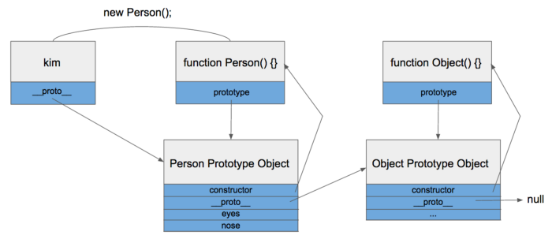

# prototype

자바스크립트에는 class가 사실 없다! 흉내낼 수는 있다. 다양하게 생성하는 방법이 있지만 함수로 실행하는 방법을 보자.

```javascript
function Person() {
    this.eyes = 2;
    this.nose = 1;
}

var kim = new Person();
var park = new Person();
```

위는 어렵지 않게 구현이 가능하다. 하지만 메모리에 문제가 발생한다. 메모리에는 eyes와 nose가 두개씩 총 4개가 할당되었고 할당할때마다 더 늘어난다는 문제가 있다. 이러한 메모리 문제를 **프로토타입**으로 해결할 수가 있다

```javascript
function Person() {}

Person.prototype.eyes = 2;
Person.prototype.nose = 1;

var kim = new Person();
var park = new Person();
```

간단하게 위를 설명하자면 Person.prototype이라는 빈 Object가 어딘가에 존재하고, Person 함수로부터 생성된 객체(kim,park)들은 어딘가에 존재하는 Object에 들어있는 값을 모두 갖다쓸 수 있습니다. 깊게 파면 복잡하지만 실제로 쓰는 부분은 이정도가 거의 끝이긴 하다. 왜? 아래를 좀더 살펴보자

## Prototype Link와 Prototype Object

객체는 언제나 함수로 생성된다. 즉, `function Person() {}` 로 객체 생성자를 만들고 `var obj = new Person();`으로 객체를 생성한다는 것이다. 일반적으로 쓰는 `{}`와 `new Object()`이것도 생성자로 생성하는 것이다! `obj`는 객체이며 new로 새롭게 생성할 수가 없다는 소리다!



더 생각해보면 위 그림처럼 Person.prototype객체는 Object 객체를 체이닝 하게 되는 것이다. 