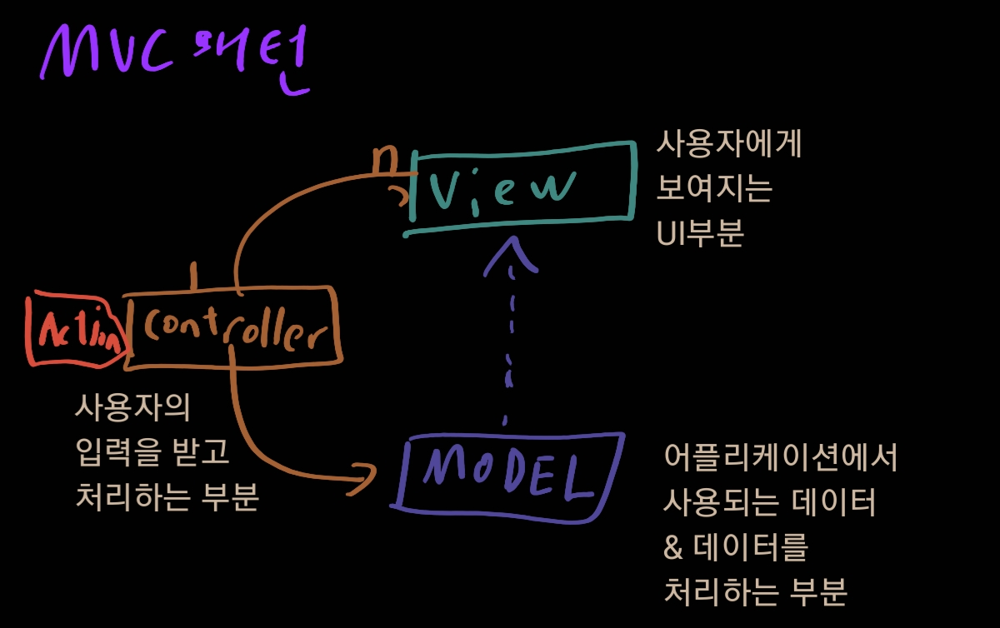
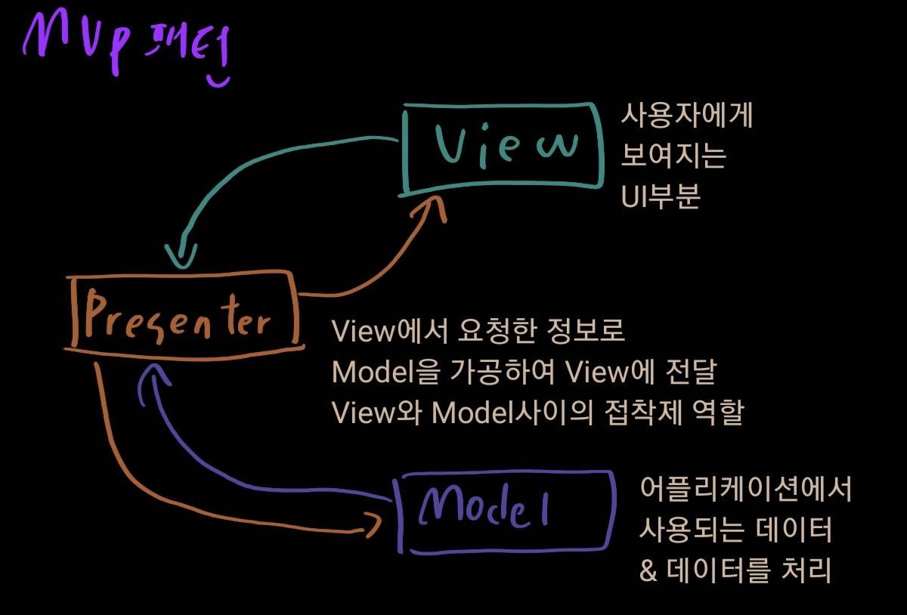
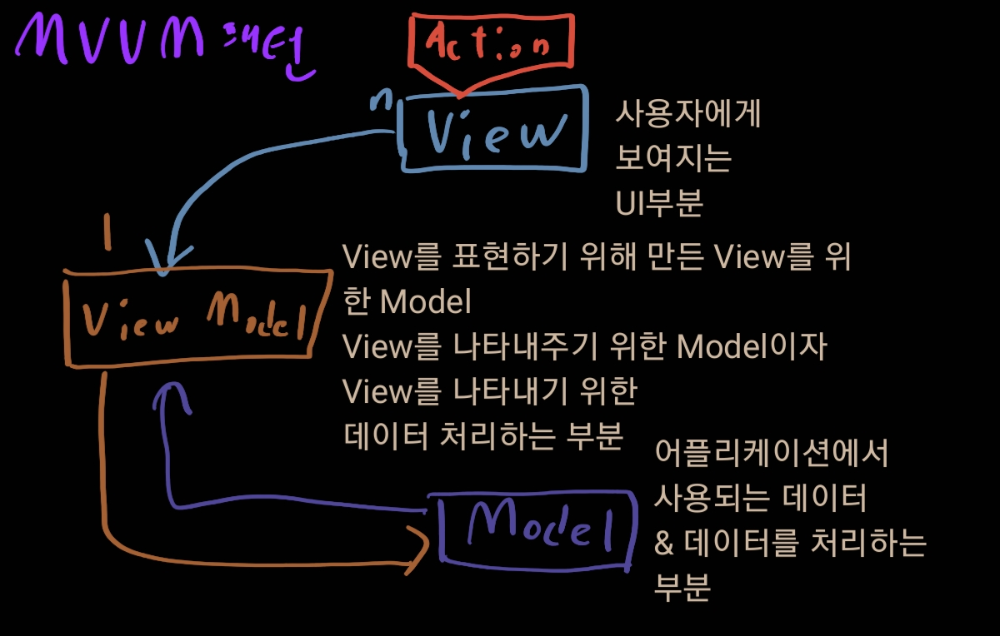

# 기타 프론트엔드 지식

1. es6,CommonJs에서의 모듈화

   - 모듈 정의하기

     - ES6

       ```javascript
       // 모듈 전체를 export, 파일내에서 한번만 이용 가능
       var module = {};
       export default module;
       
       // 모든 속성을 export
       export *;
       
       // 함수 자체를 직접
       export function moduleFunction() {};
       var property = 'some property';
       export {property};
       ```

     - CommonJs

       ```javascript
       // 모듈 전체를 export
       module.exports = module
       
       // 함수를 직접 export
       exports.moduleFunction = function () {};
       ```

   - 모듈 가져오기

     - ES6

       ```javascript
       // 모듈 전체를 import
       import module
       import module as otherName
       
       // 모든 속성 import
       import * from module
       
       // 특정 멤버(함수 등) 만 import
       import {moduleFunction, moduleFunction2} from module
       ```

     - CommonJs

       ```javascript
       // 모듈 전체를 import
       var module = require('./someModule.js')
       
       // 특정 멤버만
       module.moduleFunction
       ```

2. css 전처리기

   [참고자료 다시한번 읽기 바람](https://heropy.blog/2018/01/31/sass/#sasswa-scssneun-caijeomeun-mweongayo)

   - 사용법

     css를 우선 전처리기로 작성한다. 여러 로직이 전개가 가능해서 css보다 편할 것이다.

     그리고 이것을 css로 컴파일하는것이다.

   - 컴파일은 어떻게?

     전처리기 종류마다 방법이 조금씩 다르고 여러 방식을 제공한다. 보통의 경우 컴파일러가 필요

   - 대표적인 전처리기

     Less, Sass(SCSS), Stylus

     - Less

       기능적으로 아쉬운 부분이 조금 있다.

       하지만 진입장벽이 낮기 때문에 접하기 쉽고 그만큼 많이 사용한다

     - Stylus

       제일 최신에 나왔다.

       깔끔하고 좀 더 세련되며 기능도 휼륭하다

       하지만 덜 사용되며(덜 유명해서) 컴파일 후 사소한 버그 존대

     - Sass(SCSS)

       위 두개의 장점을 다 포함한다. 꽤 세련되며 기능도 괜찮고 많이 사용되어 커뮤니티도 꽤 있다

   - Sass, SCSS

     둘의 차이점은 구분방법이다. Sass는 들여쓰기로 구분하며 SCSS는 괄호로 유효범위를 구분한다.

     Mixins을 가져오는데에도 차이가 있다. Sass는 `=`와 `+`로 Mixins기능을 사용하고 SCSS는 `@mixin`과 `@include`로 기능을 사용한다

     컴파일은 다양한 방법이 있다

3. JS의 메모리 누수

   [참고자료](https://itstory.tk/entry/%EC%9E%90%EB%B0%94%EC%8A%A4%ED%81%AC%EB%A6%BD%ED%8A%B8%EC%97%90%EC%84%9C-%EB%A9%94%EB%AA%A8%EB%A6%AC-%EB%88%84%EC%88%98%EC%9D%98-4%EA%B0%80%EC%A7%80-%ED%98%95%ED%83%9C)

   자바 스크립트는 garbage collected 언어이다. 하지만 그럼에도 코드의 실수로 메모리 누수는 일어난다. 자바스크립트에서 자주 일어나는 누수(garbage collected 언어들에서 자주 일어나는) 주요 원인은 **예상치 못한 참조**이다. 그리고 우리가 일반적으로 일으키는 형태는 아래와 같은 세가지이다.

   1. 우발적으로 생성된 전역 변수

      아래 코드를 보자

      ```javascript
      function foo(arg) {
          bar = 'this is a hidden global variable';
      }
      ```

      우리 킹바스크립트님은 위를 에러 내지 못하고 실행시킨다. 일단 실행이 된다니 다행처럼 보이지만 위 코드는 아래와 같이 작용하는 것과 같다.

      ```javascript
      // 1
      function foo(arg) {
          window.bar = 'this is a hidden global variable';
      }
      
      // 2
      function foo(arg) {
          this.bar = 'this is a hidden global variable';
      }
      ```

      이 상황을 피하기 위해 `'use strict'`를 이용할 수도 있다. 엄격 모드는 위와 같은 1번과 같은 에러는 피할 수가 있다. 아니면 차근차근 조심을 하던가

   2. 잊혀진 타이머와 콜백

      [참고자료1](https://aljjabaegi.tistory.com/423)

      [참고자료2](https://jeongjihun.github.io/posts/Causes-of-Memory-Leaks-in-JavaScript-and-How-to-Avoid-Them)

      `setInterval`은 매우 흔하게 사용된다. 그리고 `setInterval`의 내부는 아래 형태와 비슷하게 자주 이용한다

      ```javascript
      var some_resource = getData();
      setInterval(function() {
          var node = document.getElementById('Node');
          if(node) {
              node.innerHTML = JSON.stringfy(someResource);
          }
      },1000);
      ```

      위 예제를 통해 타이머 내부에서 참조된 노드 혹은 데이터가 더 이상 사용되지 않을때 메모리가 누수될 것이 보인다. 객체가 제거 되어도 interval은 계쏙해서 작동하기에 collector에 의해 수집되지 않는다!

      그러니 우리는 명시적으로 `clearInterval`을 이용하여 지워주는 것이 중요하다

   3. DOM 외부에서의 참조

      선언하고 삭제를 해두고 선언했던 것을 해제해줘야 한다. 뭔가 복잡해 보이는 데 다음과 같이 메모리가 낭비되는 것을 확인 할 수가 있다

      ```javascript
      var elements = {
          button: document.getElementById('button'),
          image: document.getElementById('image'),
          text: document.getElementById('text')
      }
      
      function doStuff() {
          image.src = 'http://url';
          button.click();
          console.log(text.innerHTML);
      }
      
      function removeButton() {
          document.body.removeChild(document.getElementById('button'));
      }
      ```

      위와 같은 상황이 펼쳐진다면 DOM 내부에서는 button이라는 id를 가진 것은 제거가 될 것이다. 하지만 `elements`라는 객체에서는 계속해서 해당 dom객체를 이용하고 있기 때문에 자바스크립트 내에서는 남아있는 상황이 된다. 그래서 이 경우에는 GC가 이것을 캐치하지 못하기 때문에 조심해야한다

   4. 클로저

      우리가 전에 한 상황도 그렇고 객체가 객체를 서로 참고하는 경우도 GC가 캐치를 하지 못한다

      1depth의 참조는 캐치를 하여 지울수가 있지만 2depth이상은 GC가 캐치하지 못한다. 참조의 참조의 참조의... 이것을 연속적으로 계속시킨다면 메모리의 누수도 엄청날 것이다

4. CORS

   [참고자료](https://evan-moon.github.io/2020/05/21/about-cors/)

   프론트엔드 엔지니어면 자주 보는 상황이다. 정확히 무슨 에러인가?

   웹페이지는 same-origin 법칙이 중요하다. 같은 출처에서만 서로 접근이 가능한데 같은 출처란 `프로토콜, 호스트명, 포트`가 같다는 의미이다. 그리고 같은 출처에서만 ajax요청이 가능하다. 그리고 이 법칙을 무시하면 이러나는 것이 CORS이다.

   해결은 프론트와 백엔드 둘다 해줘야 한다

   1. 서버쪽 해결 (response)

      HTTP 응답헤더에 `Access-Control-Allow-Origin: *` 혹은 `Access-Control-Allow-Origin: 허용하고자 하는 도메인` 으로 설정 (일반적으로 Default로 설정되어 있다)

   2. 클라이언트쪽

      1. 개발자가 테스트 혹은 개발단계에서 쉽게 요청하기: 웹 브라우저 실행 옵션이나 플러그인을 통한 동일 출처 정책 회피
      2. CORS구현이 안되어 있는 서버로 ajax요청을 해야 하지만 서버 쪽 컨트롤이 불가능할 경우: jsonp방식으로 요청
      3. Ajax요청을 해야 하는 다른 도메인의 서버를 클라이언트와 같이 개발하거나 서버 개발 쪽 수정 요청이 가능한 경우: 서버에서 CORS 요청이 허용되도록 구현

5. React vs Angular vs Vue

   1. Angular
      - 장점
        - 강화된 RXJS, 빠른 컴파일, 새로운 HttpClient 런치와 같은 새로운 기능들
        - 아주 자세한 문서. (반대로 학습하는데에는 오랜 시간이 걸린다는 말이다)
        - 에러가 발생할 위험이 적은 앱을 위해 단일 동작을 가능하게 하는 양방향 데이터 바인딩
        - 동일한 데이터셋 사용하여 동일한 앱 섹션에서 개별적으로 작업할 수 있도록 MVVM
      - 단점
        - 구문이 복잡했었다. 5에서는 타입스크립트를 사용하여 덜 어려워지긴 함
        - 이전 버전에서 최신 버전으로 이전하는 동안 나타날 수 있는 마이그레이션 이슈
   2. React
      - 장점
        - 배우기 쉽다. 구문이 간편하여 쉽다
        - 높은 수준의 유연성과 최대의 응답성
        - 파싱하는 동안 웹브라우저가 접근하기 좋은 가상 DOM
        - es6/7과 결합된 쉬운 방법으로 고부하 작업을 쉽게 처리
        - 하위 데이터 바인딩
        - 100퍼센트 오픈 소스
        - 유저 사이드에서 수행하는 데이터를 서버 사이드에서 동시에 쉽게 나타낼 수 있기 때문에 절대적으로 가볍다
      - 단점
        - 공식 문서가 부족
        - 자유도가 높다
        - MVC프레임 워크에 사용자 인터페이스를 통합하는 방법에 대한 지식 필요
   3. Vue.js
      - 장점
        - 권한이 부여된 HTML
        - 자세한 문서.
        - 적응성. 디자인, 아키텍처 측면에서 위 두개와 유사해 빠른 스위칭 가능
        - 훌륭한 통합
        - 대규모 확장
        - 작은크기
      - 단점
        - 자원 부족. 시장이 좁음
        - 과도한 유연성

6. 디자인 패턴

   [참고 자료](https://beomy.tistory.com/43)

   1. MVC

      

      동작 순서

      1. 사용자의 action이 controller에 들어옴
      2. controller는 action에 따라 model을 업데이트
      3. controller는 model을 나타내줄 view를 선택
      4. view는 model을 이용하여 화면을 나타낸다
         - view가 업데이트 되는 방법
           - view가 model을 이용하여 직접 업데이트
           - model에서 view에게 notify하여 업데이트
           - view가 polling으로 주기적으로 model의 변경을 감지

      특징

      Controller는 여러개의 View를 선택할 수 있는 1:n구조

      controller는 view를 선택하기만 하고 업데이트는 직접 하지 않는다

      장점

      - 가장 단순. 단순하여 보편적으로 많이 사용됨

      단점

      - view와 model사이의 의존성이 높다. 둘 사이의 의존성이 높을 수록 복잡해지고 유지보수가 어려워짐

   2. MVP

      

      동작

      1. action이 view를 통해 들어옴
      2. view는 데이터를 presenter에게 요청
      3. presenter는 model에게 데이터를 요청
      4. model은 presenter에게 데이터 응답
      5. presenter는 view에게 데이터 응답
      6. view는 presenter의 응답을 이용해 화면에 나타냄

      특징

      - presenter는 view와 model의 인스턴스를 가지고 있어 둘을 연결하는 접착제 역할
      - presenter와 view는 1:1 관계

      장점

      - mvp패턴의 장점은 view와 model사이 의존성이 없다

      단점

      - 의존성은 해결했지만 view와 presenter사이의 의존성이 강해졌다

   3. MVVM 패턴

      

      동작

      1. action이 view를 통해 들어옴
      2. view는 command패턴으로 view model에게 action을 전달
      3. view model은 model에게 데이터 요청
      4. model은 view model에게 데이터 응답
      5. view model은 데이터를 가공하여 저장
      6. view는 view model과 data binding하여 화면에 나타냄

      특징

      - mvvm패턴은 command패턴과 data binding 두가지 패턴을 사용하여 구현
      - command패턴과 data binding을 이용하여 view와 view model사이의 의존성 제거
      - view model과 view는 1:n 관계

      장점

      - mvvm 패턴은 view와 model사이의 의존성이 없어졌다. 
      - command패턴과 data binding을 사용하여 view와 view model사이의 의존성도 제거했다
      - 각각의 부분은 독립적이기 때문에 모듈화 하여 개발 가능

      단점

      - 구현이 어렵다

7. 다른 참고 할 것들

   1. [실행 컨텍스트](https://poiemaweb.com/js-execution-context)
   2. [http 발전 과정](https://developer.mozilla.org/ko/docs/Web/HTTP/Basics_of_HTTP/Evolution_of_HTTP)

