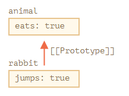
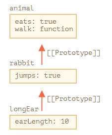

# 프로토타입 상속

[설명 링크](https://ko.javascript.info/prototype-inheritance) [다른 참고 컬럼](https://corock.tistory.com/476)

최근 내가 공부한 것에 따르면 상속을 받을때 extends를 이용하는 것은 그렇게 좋은 상황은 아님을 깨달았다. 인터페이스 분리 원칙과 의존성 역전 원칙을 생각한다면 extends는 그렇게 좋은 선택이 아닐 수 있음을 깨닫기도 했다.

예를 들어 복합기의 경우, 프린터 + 스캐너 + 팩스 의 기능이 있는 것이 완제품일 것이지만 유저는 다르게 생각한다 프린터 기능만 있는 것을 원할 수도 있고 다양하게 확장도 생각할 수 있을 것이다. 그런 의미에서 복합기를 상속받아 확장시킨다면 프린터만 원하는 사람들은 필요없는 스캐너와 팩스기능을 제거하는 수고를 겪어야 한다

그래서 아예 프린터, 스캐너, 팩스 등 기능만을 분리해두고 필요한 것을 합성시키는 것이 가장 좋을 것이다. 아니면 해당 기능만이 필요하면 해당 기능만을 상속받는 것이 좋을 것이다. 

## 프로토 타입 상속

자바스크립트에서 객체는 [[Prototype]]이라는 숨겨진 속성을 가지는데 보통 null이거나 다른 객체를 참조하고 있다. 다른 객체를 참조할 경우 prototype이라 부른다

js에서 프로토타입은 특이하다. 해당 객체에 어떤 특정한 속성이 없는데 호출을 한다면 프로토타입으로 찾아 올라간다. 그리고 루트 프로토타입까지 가는 경우도 있다. 아래 예시를 보자. 해당 방식으로 특정한 프로토타입을 상속받을 수가 있다

```javascript
let animal = {
    eats: true
};

let rabbit - {
    jumps: true
};

rabbit.__proto__ = animal;
alert(rabbit.eats);  // true
alert(rabbit.jumps); // true
```

여기서 `__proto__`는 getter이면서 setter이다. 그래서 위와같이 정의를 할 수가 있다. 요즘은 이러한 방식은 잘 안쓰고 [`Object.getPrototypeOf`](https://developer.mozilla.org/ko/docs/Web/JavaScript/Reference/Global_Objects/Object/getPrototypeOf)랑 [`Object.setPrototypeOf`](https://developer.mozilla.org/ko/docs/Web/JavaScript/Reference/Global_Objects/Object/setPrototypeOf)를 이용한다.



```javascript
let animal = {
  eats: true,
  walk() {
    alert("동물이 걷습니다.");
  }
};

let rabbit = {
  jumps: true,
  __proto__: animal
};

let longEar = {
  earLength: 10,
  __proto__: rabbit
};

// 메서드 walk는 프로토타입 체인을 통해 상속받았습니다.
longEar.walk(); // 동물이 걷습니다.
alert(longEar.jumps); // true (rabbit에서 상속받음)
```



이렇게 자신에게 없는 속성을 계속해서 찾아가게 하는 것이 가능하다!

이러한 점이 역이용되어 `this`쪽도 특이하게 갈 수 있다. 어찌보면 당연하긴 하다

```javascript
// animal엔 다양한 메서드가 있습니다.
let animal = {
  walk() {
    if (!this.isSleeping) {
      alert(`동물이 걸어갑니다.`);
    }
  },
  sleep() {
    this.isSleeping = true;
  }
};

let rabbit = {
  name: "하얀 토끼",
  __proto__: animal
};

// rabbit의 프로퍼티 isSleeping을 true로 변경합니다.
rabbit.sleep();

alert(rabbit.isSleeping); // true
alert(animal.isSleeping); // undefined (프로토타입에는 isSleeping이라는 프로퍼티가 없습니다.)
```

위의 경우 rabbit에는 `isSleeping` 속성이 생기지만 animal에서는 `isSleeping`이 생기지 않기때문에 undefined가 뜨게 된다.

```javascript
let animal = {
  eats: true
};

let rabbit = {
  jumps: true,
  __proto__: animal
};

// Object.keys는 객체 자신의 키만 반환합니다.
alert(Object.keys(rabbit)); // jumps

// for..in은 객체 자신의 키와 상속 프로퍼티의 키 모두를 순회합니다.
for(let prop in rabbit) alert(prop); // jumps, eats

for(let prop in rabbit) {
  let isOwn = rabbit.hasOwnProperty(prop);

  if (isOwn) {
    alert(`객체 자신의 프로퍼티: ${prop}`); // 객체 자신의 프로퍼티: jumps
  } else {
    alert(`상속 프로퍼티: ${prop}`); // 상속 프로퍼티: eats
  }
}
```

## 객체의 생성

자 약간 주어지는 방식으로 돌아가서 클래스를 만들고 할당하는 방법을 한번 보자. 매우 익숙할 것이다.

```javascript
function Person() {
    this.name = "anonymous";
    this.job = "none";
    this.sayHello = function () {
        alert(this.name);
    };
}

function Unikys() {
    this.name = "Unikys";
    this.job = "Programmer";
}

Unikys.prototype = new Person();
var unikys = new Unikys();
unikys.sayHello(); // Unikys
```

포토토타입 체인으로 만들어본 상황이다. 이럴경우 Unikys의 컨스트럭터가 덮어씌워지게 되어 unikys의 constructor가 Person을 바라보게 된다.

다른 방식을 고안해보자. 이렇게 constructor가 망가지는 상황은 안좋기 때문에 고안된 함수가 `Object,create()`이다. new를 사용한 객체의 생성이 JS스럽지 않기도 하고 자제를 하고 싶어하는 사람이 많기 때문에 생겼다. 이 기능으로 상속을 시켜보자

```javascript
function Person(name) {
    this.name = name;
}

Person.prototype = {
    yell: function () {
        alert(this.name);
    }
};

var unikys = Object.create(Person.prototype)
```

이렇게 하면 prototype만 상속받게 된다. 즉, unikys에는 name속성이 없다. `unikys.name = value`같이 지정을 해줘야한다. 아니면 call, bind 같은 것으로 엮어줄 수도 있다.

하지만 `Object.create`는 `new`에 익숙해진 사람들에게 굳이 이용할 필요성도 못느낄 것이며 속성을 따로 설정해줘야함이 매우 귀찮은 것이 있다. 하지만 우리는 확장하는 식의 상속은 조금 피하고 싶긴 하다. 그래서 생각해낸 것은 `Object.assign`이다. 아래와 같이 엮어볼 수가 있다.

```javascript
const target = { a: 1, b: 2 };
const source = { b: 4, c: 5 };
const returnedTarget = Object.assign(target,source);
```

이런식으로 엮는 것이 가능한 것이다! 그렇다면 이걸 어떻게 쓰나요? 아래와 같이 이용해보자

```javascript
function Person(name) {
    this.name = name;
}
const test3 = Object.assign({},new Person("test"));
```

어찌보면 뭔가 더 불합리해진 것 같은데 이것의 장점은 여러 클래스를 엮을 수가 있다는 것이다! target으로 들어가는 곳에 빈 객체가 들어간다면 prototype은 객체가 된다. assign이 마음에 들지 않는다면 spread방식도 있다

```javascript
const obj = {
  add: (a, b) => a + b,
};

const newObj = { ...obj };
console.log(newObj);
```

이런식의 확장도 가능하고 불변성이 중요하다면 스프레드 연산자가 오히려 더 좋다.