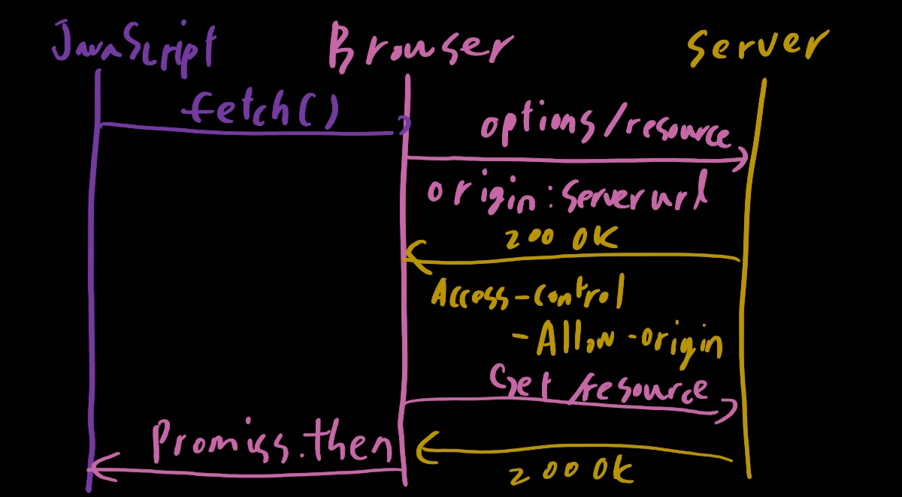

# E사 리마인딩

자기소개: 무난하게 진행된 듯 하다

최근 프로젝트: lumia를 언급했다. 모함핏을 언급할까도 고민 했지만 프론트앤드 역량을 좀 보여줘야한다고 생각했기 때문에 lumia를 언급

기술질문

1. CORS [참고용 사이트](https://evan-moon.github.io/2020/05/21/about-cors/)

   CORS란 `Cross-Origin Resources Sharing`의 줄임말로 한국어로 교차 출처 리소스 공유이다. 출처란 인터넷 주소 포트번호까지 모두 일치했을 때 같은 출처인 것이다. 즉 `google.com:443`과 `google.com:123`은 서로 **다른 출처**인 것이다.

   이것은 **SOP (Same-Origin Policy)** 정책때문에 일어나는 것으로 다른 출처에서 리소스를 요청한다면 예외가 생기는 것이다. 만약 이 정책이 없었다면 [CSRF](https://ko.wikipedia.org/wiki/%EC%82%AC%EC%9D%B4%ED%8A%B8_%EA%B0%84_%EC%9A%94%EC%B2%AD_%EC%9C%84%EC%A1%B0) 또는 [XSS](https://ko.wikipedia.org/wiki/%EC%82%AC%EC%9D%B4%ED%8A%B8_%EA%B0%84_%EC%8A%A4%ED%81%AC%EB%A6%BD%ED%8C%85)와 같은 방법으로 쉽게 털 수가 있을것이다. ~~해커의 맛집~~ 

   해결 방법은 무엇이 있을까? `Access-Control-Allow-Origin`이라는 값에 허용된 출처를 주는 방법도 있다. 다음과 같은 경우도 생길 수 있으니 주의하자

   1. Preflight Request

      프리플라이트 방식은 일반적으로 우리가 웹 어플리케이션을 개발할 때 가장 마주치는 시나리오. 브라우저는 요청을 한번에 보내지 않고 예비 요청과 본 요청을 나누어 서버로 전송한다.

      

      이러한 경우에는 헤더에 `Access-Control-Allow-Origin`이 있는가를 검사한다

   2. Simple Request

      예비 요청은 보내지 않고 위 그림에서 바로 Get요청을 보내는 본요청만이 있다고 생각하면 된다. 전반 적인 로직은 Preflight와 같다. 하지만 아무때나 가능한 것은 아니고 다음 조건을 충족 시켜야 한다

      1. 요청 메소드가 GET, HEAD, POST중 하나여야 한다.
      2. Accept, Accept-Language, Content-Language, Content-Type, DPR, Downlink, Save-Data, Viewport-Width, Width를 제외한 헤더를 사용하면 안됨
      3. Content-Type을 사용하는 경우에는 application/x-www-form-urlencoded, multipart/form-data, text/plain 만 허용가능하다

   3. Credentialed Request

      인증된 요청을 사용하는 방법. CORS의 기본적인 방식은 아니고 다른 출처 간 통신에서 좀 더 보안을 강화하고 싶을때 사용하는 방법

   그렇다면 해결 방법은 뭐가 있을까?

   1. Access-Controll-Allow-Origin 세팅

      가장 정석적인 방식이다. 그냥 정석대로 헤더에 세팅을 해주는 것이다

   2. Webpack Dev Server로 리버스 프록싱

      어렵지 않다! node.js를 이용할때 제대로 이용해보자

2. 호이스팅 [참고용 사이트](https://gmlwjd9405.github.io/2019/04/22/javascript-hoisting.html)

   var 변수와 함수 선언문이 유혀 범위의 최상단에 선언되는 것이다.

3. 콜백 [참고용 사이트](https://medium.com/@flqjsl/%EC%BD%9C%EB%B0%B1%EC%9D%B4%EB%9E%80-%EB%AC%B4%EC%97%87%EC%9D%B8%EA%B0%80-56c26e1f1bc3)

   이벤트 루프를 생각해보면 편하다.

   로직대로 작동되길 바래서 많은 사람들이 콜백지옥을 손쉽게 만들어버린다.

   그러한 콜백지옥을 피하기 위해 여러가지가 생겼다

   1. Promise

      ```javascript
      const promise = function(a){
        return new Promise(funtion(resolve,reject){
         if(a){
          resolve(1);
         }
         else{
          reject(0);
         }
       });
      }
      
      promise(a).then(function(res){
        console.log(res)///1;
      },funtion(err){
        console.log(err); //0;
      });
      ```

      Promist의 생성은 new Promise로 할 수 있다. promise을 실행하면 프로미스가 리턴되고 프로미스 안의 비동기 함수가 실행된다. 함수값이 true면 resolve가 실행되고 에러면 reject를 실행한다. 프로미스는 상태를 가지게 되는 것이다

   2. async & await

      로그인을 promise를 이용해서 짜본다고 생각하자

      ```javascript
      function login(){
        LoginUser('111.111.com/users/login',user=> {
          if(user.name==='kim'){
            console.log(user.name);
          }
        });
      }
      
      function login(){return new Promise(function(resolve,reject){
        LoginUser('111.111.com/users/login',user=>{
          if(user.name==='kim'){
           resolve(user)
          }
          else{
           reject(Error("failed"));
          }
        })
      }
      login().then(user=>{
        console.log(user.name);
      },err=> console.error(err)}
      ```

      조금 복잡함이 느껴진다. 하지만 await를 이용하면 다음과 같이 짧아진다

      ```javascript
      async function login(){try{
       let user = await LoginUser('111.111.com/users/login');
       if(user.name==='kim){
        console.log(user.name);
       }}catch(err){
      console.log(err);
      }}
      ```

      await에 오는 함수는 바드시 promise를 리턴해야하고 async함수 자체도 promise를 리턴한다.

4. AJAX [참고용 사이트](https://velog.io/@surim014/AJAX%EB%9E%80-%EB%AC%B4%EC%97%87%EC%9D%B8%EA%B0%80)

   자바스크립트의 비동기적 프로그래밍

개발론

- 납기 vs 퀄리티

  일단 퀄리티를 말했는데 납기 비유가 나와서 그럴 경우 납기가 우선일 거 같다고는 함 근데 이게 이렇게 공격오면 어쩌라는거지 슈....

- 가고싶은 부서가 아닌 곳에 배정 받는 경우

- 또 따로 배우고 싶은 기술

  스프링이랑 타입스크립트, 리액트 언급