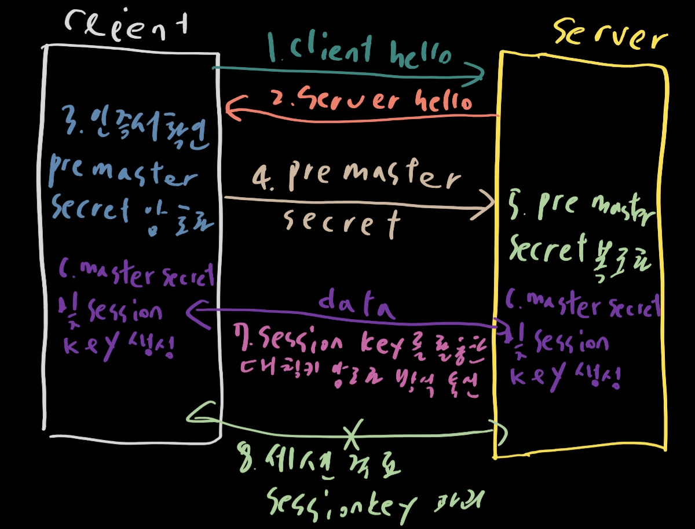

# 네트워크

- OSI 7계층

  1. 물리 계층 (physical)

     데이터가 전기적 신호로 존재하는 계층

     높은 수준의 기능의 논리 데이터 구조를 기초로 하는 계층

  2. 데이터 링크 계층 (data-link)

     p2p간 신뢰성 있는 전송을 보장하는 계층

     주소 값을 물리적으로 할당 받는다

  3. 네트워크 계층

     여러개의 노드를 거칠때마다 경로를 찾아주는 역할을 하는 계층

     라우팅, 흐름 제어, 세그멘테이션 등을 수행

  4. 전송 계층

     양 끝단의 사용자들이 신뢰성 있는 데이터를 주고 받을 수 있도록 해준다

  5. 세션 계층

     양 끝단의 응용 프로세스가 통신을 관리하기 위한 방법을 제공한다

  6. 프레젠테이션 계층

     코드 간의 번역을 담당

  7. 어플리케이션 계층

     응용 프로세스와 직접 관계하여 일반적인 응용 서비스를 수행

- TCP/IP, UDP

  - TCP

    투 호스트간의 교환하는 데이터와 승인 메시지의 형식을 정의하여 서버와 클라이언트간의 데이터를 신뢰성있게 전달하기 위해 만들어진 규약이다.

    TCP는 데이터 패킷에 일련의 번호를 부여함으로써, 데이터 손실을 찾아내서 교정하고, 순서를 재조합하여 클라이언트에게 전달할 수 있게 해준다

    3 way handshaking으로 연결시작 4 way handshaking으로 연결해제한다

    udp에 비해 좀 느림

  - IP

    컴퓨터의 주소

  - UDP

    비연결형 서비스를 데이터그램 방식을 제공한다. 정보의 교환에서 신호절차가 없다

    헤더에서 checksum 필드를 통해 최소한의 오류만 검출한다

    그래서 신뢰성이 낮지만 tcp에 비해 빠르다

  | 프로토콜 종류  |       TCP        |        UDP        |
  | :------------: | :--------------: | :---------------: |
  |   연결 방식    |  연결형 서비스   | 비 연결형 서비스  |
  | 패킷 교환 방식 |  가상 회선 방식  |  데이터그램 방식  |
  |   전송 순서    |   순서를 보장    | 바뀔 가능성 존재  |
  | 수신 여부 확인 | 수신 여부를 확인 |     하지않음      |
  |   통신 방식    |       1:1        | 1:1 OR 1:N OR N:N |
  |     신뢰성     |       높음       |       낮음        |
  |      속도      |       느림       |       빠름        |

- TCP와 관련된 질문

  1. 연결시와 종료시 단계 차이가 나는 이유는?

     연결 시 3단계, 종료시 4단계로 이루어진 통신을 한다. 종료시에는 client가 데이터 전송을 마쳤다고 하더라도 server측에서는 보낼 데이터가 남아있을 수가 있다. 그래서 서버에서 FIN요청에 대해 ACK만 보내고, 데이터를 다 처리하고 보낸 다음에 FIN메시지를 보내야하기 때문에

  2. Server에서 FIN플래그를 전송하기 전에 전송한 패킷이 Routing 지연이나 패킷 유실로 인한 재전송 등으로 인해 FIN패킷보다 늦게 도착하는 상황이 발생하면 어떻게 될까?

     이러한 현상을 대비할 수 있도록 client는 server로부터 FIN 플래그를 수신하더라도 일정시간동안 세션을 남겨두고 잉여패킷을 기다린다 (TIME WAIT상태)

  3. 초기 Sequence Number인 ISN을 0부터 시작하지 않고 난수를 생성해서 설정하는 이유

     Connection을 맺을 때 사용하는 포트는 유한 범위 내에서 사용하고 시간이 지남에 따라 재사용된다. 따라서 두 통신 호스트가 과거에 사용된 포트 번호 쌍을 사용하는 가능성이 존재한다. 서버 측에서는 패킷의 SYN을 보고 패킷을 구분하게 되는데 난수가 아닌 **순차적인 Number가 전송된다면 이전의 Connection으로부터 오는 패킷으로 인식할 수 있따**. 이런 문제가 발생할 가능성을 줄이기 위해서 난수로 ISN을 설정한다

- HTTP와 HTTPS

  - HTTP

    - 개념

      - 웹 상에서 클라이언트와 서버 간에 요청/응답으로 정보를 주고 받을 수 있는 프로토콜

    - 특징

      - 주로 HTML문서를 주고 받는 데에 쓰인다
      - TCP,UDP를 사용하며 80포트를 사용
      - 비연결: 클라이언트가 요청을 서버에 보내고 서버가 적절한 응답을 클라이언트에 보내면 바로 연결이 끊긴다
      - 무상태: 연결을 끊는 순간 클라이언트와 서버의 통신은 끝나며 상태 정보를 유지하지 않는다

    - 통신 순서

      - 서버 접속 => 클라이언트 => 요청 => 서버 => 응답 => 클라이언트 => 연결 종료

      1. 사용자가 웹 브라우저에 url주소 입력
      2. dns서버에서 url주소로 ip주소를 찾는다
      3. 웹 서버가 tcp연결 시도 (3way)
      4. 클라이언트가 서버에게 요청
      5. 서버가 클라이언트에 응답
      6. 서버 클라이언트간 연결 종료 (4way)
      7. 웹 브라우저가 웹 문서 출력

  - HTTPS

    - 개념

      - HTTP통신에 보안이 강화된 버전 SSL까지 끼얹으면 되나?

    - 특징

      - 443포트
      - HTTPS는 소켓 통신에서 일반 텍스트를 이용하는 대신에, 웹 상에서 정보를 암호화하는 SSL이나 TLS프로토콜을 통해 세션 데이터를 암호화한다
      - 데이터의 적절한 보호를 보장

    - 필요한 이유

      - HTTP는 HTML을 통신하기 위한 통신이다.
      - 그리고 HTML은 어찌되었든 텍스트이고 개인정보가 보내진다면 보안에 위험성이 생긴다.
      - 그래서 중간에 정보를 볼 수 없도록 하기 위한 암호화방법

    - 원리

      - 암호화, 복호화시킬 수 있는 서로 다른 키(공개키, 개인키)를 이용한 암호화 방법
        - 공개키: 모두가 쓸 수 있는 키로 저장소에 저장되어있다
        - 개인키: 개인에게만 제공, 클라이언트-서버 구조에서 서버가 가지고 있음
      - 클라이언트 => 서버
        - 사용자의 데이터를 공개키로 암호화
        - 서버로 전송
        - 서버는 받은 데이터를 개인키를 통해 복호화

    - 장단점

      - 장점
        - 네트워크상에서 열람, 수정이 불가능해 안전
      - 단점
        - 암호화 => 서버에 부하
        - HTTPS인증을 받고 유지하는데에 비용발생
        - HTTP보단 느림
        - 연결이 끊기면 재인증에 시간이 소요됨

    - 통신 순서

      1. Client Hello: 클라이언트가 브라우저나 다른 TCP 통신을 통해서 서버에 접속
      2. Server Hello: `client hello`에 대한 응답
      3. 클라이언트에 내장되어있는 CA리스트를 확인하여 어떤 CA에 의한 것인지 대조
      4. 서버는 클라이언트 간 전송한 pre master secret값을 자신의 비공개키로 복호화

      