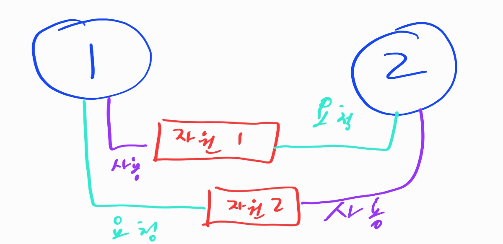

# 운영체제

- 멀티 프로세스보다 멀티 스레드를 더 많이 이용하는 이유

  1. 자원의 효율성

     프로세스를 생성하면 해당 프로세스에 대한 자원을 더 할당을 해야한다.

     하지만 스레드생성은 프로세스 내에서 자원을 프로세스가 할당하는 것으로 컴퓨터 전체 메모리 입장에서는 프로세스 하나가 그대로 있는 것처럼 보이기 때문이다

  2. 응답시간 단축

     프로세스간의 통신은 비용이 많이 들기도 하고 속도가 스레드간 통신보다 느리다

- 쓰레드 세이프

  - 멀티 스레드 환경에서 여러 스레드가 동시에 하나의 객체 및 변수에 접근할 때, 의도한 대로 동작하도록 한 것
  - 임계영역을 동기화 기법으로 제어해줘야 한다. (동기화 기법에는 뮤텍스, 세마포어등이 있다)
  - 재진입성 (Reentrant)가 필요하다. 여러 스레드가 동시에 접근해도 언제나 같은 결과를 보장해야한다

- 뮤텍스와 세마포어

  - 뮤텍스(Mutex)
    - 공유된 자원의 데이터를 여러 스레드가 접근하는 것을 막는 것
    - 상호 배제라고도 하며, Critical Section을 가진 스레드의 Running time이 서로 겹치지 않도록 각각 단독으로 실행하게 하는 기술
    - 다중 프로세스들의 공유 리소스에 대한 접근을 조율한다
  - 세마포어 (Semaphore)
    - 공유된 자원의 데이터를 여러 프로세스가 접근하는 것을 막는 것
    - 리소스 상태를 나타내는 간단한 카운터로 생각할 수 있다.
    - 공유 리소스에 접근할 수 있는 프로세스의 최대 허용치만큼 동시에 사용자가 접근 가능
    - 각 프로세스는 세마포어 값을 확인하고 변경할 수가 있다
  - 차이
    - 동기화 대상의 개수
      - Mutex는 동기화 대상이 오직 하나뿐일때 때
      - Semaphore은 하나 이상일 때
    - Semaphore은 Mutex가 될 수 있지만 반대는 불가능
      - Mutex는 상태가 0,1 두개뿐인 binary Semaphore이다
    - Semaphore은 소유할 수 없는 반면, Mutex는 소유가 가능하며 소유주가 이에 대한 책임을 가진다.
    - 뮤텍스는 뮤텍스를 소유한 스레드만이 뮤텍스 해제 가능. but 세마포어는 소유하지 않은 스레드도 세마포어를 해제할 수 있다

- 스케줄링

  - FCFS
    - 먼저 왔으면 먼저 처리
    - 소요시간이 긴 프로세스가 오면 그걸 처리하는데 프로세스를 소비하여 효율성이 낮아짐
  - SJF
    - 시간이 짧은 것부터 처리
    - 시간이 긴 작업은 계속 할당받지 못해 굶주림 현상(starvation)이 발생할 수 있다.
    - cpu 버스트 타임을 계속 계산해야한다
  - SRT
    - 현재 수행중인 프로세스의 남은 burst타임보다 새로 온 것이 더 짧으면 거기에 cpu할당
    - starvation가능, 도착때마다 스케줄링하기 때문에 cpu burst타임을 측정할 수가 없다
  - Priority scheduling
    - 우선순위가 높은 것에 cpu할당. 
    - 선점형 스케줄링: 더 높은 우선순위의 프로세스가 도착하면 현재 프로세스를 멈추고 cpu할당
    - 비선점형 스케줄링: 더 높은 우선순위 프로세스가 오면 ready queue의 head에 넣는다
    - 우선순위가 낮은 프로세스는  cpu할당이 안되는 무기한 대기가 가능
      - aging을 통해 기다린다면 우선순위를 높여주는 작업으로 해당 단점을 해결가능
  - Round Robin
    - 현대적인 cpu스케줄링
    - 각 프로세스는 동일한 크기의 할당시간을 갖는다
    - 할당 시간이 지나면 프로세스는 선점당하고 queue제일 뒤에 가게 된다
    - cpu 사용시간이 랜덤한 프로세스가 섞여있을 경우 효율적
    - 사용가능한 이유: process의 context를 저장할 수 있기 때문
    - 장점
      - response time이 빨라짐
      - 프로세스가 기다리는 시간이 cpu를 사용할 만큼 증가한다

- Deadlock (교착 상태)

  - 서로 포크 한손씩 쥐고 서로 계속 달라고 하는 상태

    

    위와 같은 상태가 되어 서로 자원이 필요하지만 자원을 받지 못해 로직을 진행하지 못하는 상태

  - 4가지 조건

    1. 상호 배제

       한 번에 한 프로세스만 공유 자원을 사용할 수 있음

    2. 점유대기

       공유 자원에 대한 접근 권한을 갖고 있는 프로세스가, 그 접근 권한을 양보하지 않은 상태에서 다른 자원에 대한 접근 권한을 요구할 수 있다

    3. 비선점

       한 프로세스가 다른 프로세스의 자원 접근을 강제로 취소할 수 없다

    4. 순환 대기

       두 개 이상의 프로세스가 자원 접근을 기다리는데, 그 관계에 사이클이 존재

  - 방지

    - 4가지 조건 중 하나를 제거
    - 공유 자원 중 많은 경우가 한 번에 한 프로세스만 사용할 수 있기 때문에 1번 조건은 제거 하기 어려움
    - 대부분의 교착상태 방지 알고리즘은 4번 조건, 즉 대기 상태의 사이클이 발생하는 일을 막는 데 초점이 맞춰져 있다.

- Context Switching

  - 현재 진행하고 있는 Task의 상태를 저장하고 다음 Task의 상태값을 읽어 적용하는 과정
  - 과정
    1. Task의 대부분 정보는 register에 저장되고 pcb로 관리
    2. 현재 실행하는 task의 pcb 정보를 저장
    3. 다음 실행할 task의 pcb 정보를 읽어 register에 적재하고 cpu가 진행했던 과정을 연속적으로 수행할 수 있따
  - 비용
    - 프로세스 스위칭 비용이 스레드 스위칭 비용보다 비싸다
    - 스레드는 스택 영역을 제외한 모든 메모리를 공유하므로

