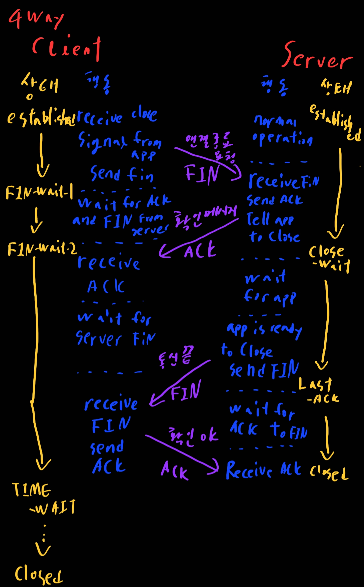
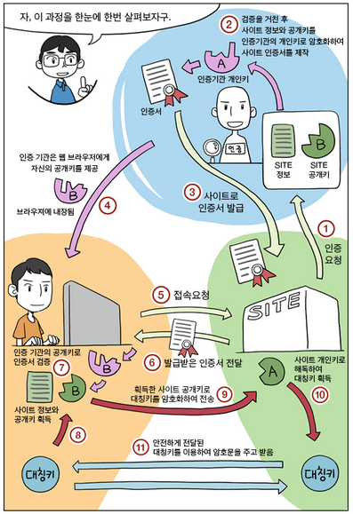

# 네트워크

> 1. OSI 7 계층
> 2. TCP와 UDP
> 3. HTTP와 HTTPS
> 4. 서버와 클라이언트 사이에
> 5. 쿠키와 세션
> 6. DNS
> 7. 로드밸런싱

# 1. OSI 7 계층

1. 물리

   주로 전기적, 기계적, 기능적인 특성을 이용해서 통신 케이블로 데이터를 전송한다

   프로토콜 종류: 전선, 전파, 광섬유, 동축 케이블

2. 데이터 링크

   물리 계층을 통해 송,수신 되는 정보의 오류와 흐름을 관리하여 안전한 정보의 전달을 수행할 수 있도록 도와주는 역할을 한다.

   MAC 주소를 이용해 통신하며 Frame에 MAC주소를 부여하고 에러검출 재전송, 흐름 제어를 진행한다.

   프로토콜 종류: Ethernet

3. 네트워크

   여러 개의 노드를 거칠 때마다 경로를 찾아주는 역할, 다양한 길이의 데이터를 목적지까지 가장 안전하고 빠르게 전달하는 기능을 담당

   라우터를 통해 이동할 경로를 선택하여 IP 주소를 지정하고, 해당 경로에 따라 패킷 전달. 라우팅, 흐름 제어, 오류 제어, 세그먼테이션 등을 수행

   프로토콜 종류: IP, ICMP, IGMP

4. 전송

   TCP, UDP 프로토콜을 통해 통신을 활성화 한다. 포트를 열어두고, 프로그램들이 전송을 할 수 있도록 제공. 이를 통해 양 끝 단의 사용자들이 데이터를 주고 받을 수 있다.

   - TCP: 신뢰성, 연결 지향적
   - UDP: 비신뢰성, 비연결성, 실시간

5. 세션

   양 끝 단의 응용 프로세스가 통신을 관리하기 위한 방법 제공. 논리적 연결을 담당. TCP/IP 세션을 만들고 없앤다

   프로토콜 종류: SSH, TLS

6. 표현

   데이터 표현에 대한 독립성을 제공하고 암호화하는 역할.

   코드 간의 번역을 담당하여 사용자 시스템에서 데이터 형식상 차이를 다루는 부담을 응용 계층으로부터 덜어준다.

   프로토콜 종류: JPEG, MPEG, SMB, AFP

7. 응용

   최종 목적지로 응용 프로세스와 직접 관계하여 일반적인 응용 서비스를 수행한다.

   프로토콜 종류: SMTP, DNS, FTP, HTTP

# 2. TCP와 UDP

## TCP

- 일반적으로 TCP와 IP를 함께 사용하는데, IP가 데이터의 배달을 처리한다면 TCP는 패킷을 추적 및 관리한다.

- 신뢰성 있는 데이터 전송을 지원하는 연결 지향형 프로토콜이다.

- 사전에 3-way handshake라는 과정을 통해 연결을 설정하고 통신을 시작한다.

- 4-way handshake 과정으로 연결을 해재

  > 3-way? 4-way?
  >
  > 3-way는 연결을 위해, 4-way는 연결 종료를 위해 이용하는 방식이다. 방식은 아래 그림과 같이 진행된다.
  >
  > 
  >
  > 
  >
  > 패킷?
  >
  > 인터냇 내에서 데이터를 봬기 위한 경로 배정을 효율적으로 하기 위해 데이터를 조각내는데 이 조각을 패킷이라 한다
  >
  > TCP가 어떻게 패킷을 추적 관리하는가
  >
  > 데이터는 패킷 단위로 나누어 같은 목적지로 전송된다.

- 흐름제어, 혼잡제어, 오류제어를 통해 신뢰성을 보장. 하지만 이것들 때문에 udp보다 전송속도가 느려짐

- 데이터의 전송 순서를 보장하며 수신여부 확인 가능

- 대부분의 HTTP, 이메일, 파일 전송에 사용

- TCP가 가상회선 방식을 제공한다 = 송신 수신 측을 연결하여 패킷을 전송하기 위한 논리적 경로를 배정한다는 뜻

## 흐름제어

- 송신측과 수신측 사이의 데이터 처리 속도 차이를 해결하기 위한 기법
- 수신쪽이 처리 가능한 량을 넘어서는 것을 송신할 때 이것은 손실될 가능성이 있어서 전송량을 제어한다
- 방식은 두가지가 있다
  1. Stop and Wait
     - 매번 전송한 패킷에 대한 확인 응답을 받아야 그 다음 패킷 전송이 가능
     - 설명에서 비효율적인 것이 느껴질 것이다
  2. Sliding Window
     -  송신 = 전송
     - 수신측에서 설정한 윈도우 크기만큼 송신측에서 확인 응답 없이 세그먼트를 전송할 수 있게 하여 데이터 흐름을 동적으로 조절하는 기법

## 오류제어

- 오류 검출과 재전송을 포함
- ARQ 기법을 통해 손상 or 손실 발생할 경우 재전송을 통해 오류를 복구
- ARQ는 흐름 제어 기법과 관련 있다.
  1. Stop and Wait ARQ
     - 송신측에서 1개의 프레임을 송신, 수신 측에서 에러 유무에 따라 ACK or NAK을 보내는 방식
     - 식별용 데이터 프레임과 ACK 프레임은 각각 0,1을 번갈아가며 부여
     - 수신측이 데이터를 못받으면 NAK을 보내서 송신측은 데이터를 재전송
     - 데이터나 ack가 분실되는 경우 일정 간격을 두고 타임아웃 => 재전송
  2. Go Back n ARQ
     - 전송된 프레임이 손상되거나 분실된 경우 그리고 ACK패킷의 손실로 인한 타임아웃 발생 => 확인된 마지막 프레임 이후로 모든 프레임 재전송
     - 슬라이딩 윈도우는 연속적인 프레임 전송 기법으로 전송측은 ㄴ전송된ㄴ 모든 프레임의 복사본을 가지고 있어야 한다. ACK와 NAK 모두 구별해야함

## 혼잡제어

- 송신측의 데이터 전달과 네트워크의 데이터 처리 속도를 해결하기 위한 기법
- 한 라우터에게 데이터가 몰려 모든 데이터를 처리할 수 없는 경우, 호스트들은 재전송을 하게 되고 결국 혼잡만 가중시켜 오버플로우나 데이터 손실 발생
- 이러한 네트워크의 혼잡을 피하기 위해 송신측에서 보내는 데이터의 전송속도를 제어해야함 = 혼잡 제어
  1. AIMD (Additive Increase Multicative Decrease)
     - 합 증가 / 곱 감소 알고리즘
     - 처음에 패킷 하나를 보내는 것으로 시작하여 전송한 패킷이 문제 없이 도착한다면 Window Size를 1씩 증가시키며 전송/ 만약 실패 or Time Out발생시 Window Size를 절반으로 감소
     - 문제점은 초기 네트워크의 높은 대역폭을 사용하지 못한다
  2. Slow Start
     - AIMD가 네트워크의 수용량 주변에서는 효율적으로 동작하지만, 처음에 전송 속도를 올리는 데 시간이 너무 길다는 단점이 있다.
     - Slow Start도 마찬가지로 하나씩 보내는 것에서 시작한다. 문제없이 도착할 경우 각각의 ack패킷마다 window size를 1씩 늘린다. 즉, 한주기가 지나면 2배가 되는것
     - 혼잡현상이 발생하였던 Window Size의 절반까지는 계속 2배씩 늘리고 그 이후부터는 1씩 증가시킨다.
     - 

## UDP

- user datagram protocol의 약자
- 데이터를 데이터 그램 단위로 처리하는 프로토콜
- 비연결형으로 사전에 연결 설정 없이 데이터를 전달
- 하나의 메시지에서 분할된 각각의 패킷은 서로 다른 경로로 전송될 수 있다
- 송신 측에서 전송한 패킷의 순서와 수신측에 도착한 패킷의 순서가 다를 수 있다. 그러나 서로 다른 경로로 패킷을 처리함에도 불구하고 순서를 부여하거나 재조립하지 않는다
- 손상된 세그먼트에 대한 재전송도 없다
- 속도가 빠르고 부하도 적지만 신뢰성 있는 데이터 전송이 보장이 안된다.

# 3. HTTP와 HTTPS

## HTTP

- 웹 서버와 클라이언트 간의 문서를 교환하기 위한 통신 규약
- 웹에서만 사용하는 프로토콜로 TCP/IP 기반으로 서버와 클라이언트간의 요청과 응답을 전송하다
- 특징
  - TCP 기반의 통신 방식
  - 비연결 지향
    - 브라우저를 통해 사용자의 요청으로 서버와 접속하여 요청에 대한 응답의 데이터를 전송후, 연결 종료
    - 간다해서 자워이 적게 든다
    - 하지만 연결이 지속적이지 앟아 사용자와 연결 종료후 추가적이 요청시 어떠 사용자의 요청인지 모르다는 점이 존재
    - 즉, 여러 사용자가 요청할 시 각각의 사용자 요청을 구분할 수 없어서 제대로 되 응답 데이터를 전송할 수 없다는 단점이 있다.
    - 해결 방법: 쿠키, 세션, 히든 폼 필드 등
  - 단 방향성
    - 사용자의 요청 한개에 대해 한개의 응답을 하는 방식
- 문제점
  - 평문 통신이라 도청이 가능
  - 통신 상대를 확인하지 않기 때문에 위장이 가능
  - 완전성을 증명할 수 없어서 변조 가능

## HTTPS

- HTTP 통신하는 소켓 부분을 정보를 암호화하는 SSL 프로토콜로 대체한 것
- HTTP는 TCP와 통신하지만 HTTPS에서 HTTP는 SSL이 TCP와 통신함
- 즉, 레이어가 하나 더 추가된 것
- HTTPS의 SSL에서는 대칭키 암호화 방식과 공개키 암호화 방식을 모두 사용한다.
  - 대칭키
    - 암호화에 사용되는 키와 복호화에 사용되는 키가 동일한 암호화 기법
    - 대칭키 암호 방식으로 암호화한 정보를 누군가에게 보낼 때, 암호키도 함께 보내야 한다. 암호키 자체는 암호화가 되지 않은 평문으로 분실하거나 타인에게 노출되면 보안에 매우 취약
    - 키 전달 및 과리에 어려움이 있다. 하지만 대칭키 암호화 방식은 속도가 빠르기 때문에 효율적인 암호시스템 구축이 가능하다
    - 블록 암호화, 스트림 암호화가 있다
  - 공개키
    - 암호화에 사용하는 키와 복호화에 사용하는 키를 분리
    - 자신이 가지고 있는 고유한 암호키(개인키 or 비밀키)로만 복호화할 수 있는 암호키(공개키)를 대중에게 공개
    - 진행과정
      1. B 사용자는 자신의 공개키를 공개. 이 공개키는 암호화에 사용되며 누구든 열람 가능
      2. A 사용자는 B 사용자의 공개키로 데이터를 암호화
      3. 암호화된 문서를 B에게 전송
      4. B는 자신만의 개인키(암호키 비밀키)를 이용하여 전송받은 암호화 문서를 복호화하여 데이터 열람
    - 복잡한 수학연산으로 대칭키에 비해 느리고 복잡하다

## SSL

SSL 프로토콜은 Netscape사에서 웹 서버와 브라우저 사이의 보안을 위해 만들어졌다. CAA라 불리는 서드파티로부터 서버와 클라이언트의 인증을 하는데 사용된다.

인증서 과정

1. 애플리케이션 서버를 운영하는 기업은 HTTPS 적용을 위해 공개키와 개인키를 생성
2. 신뢰할 수 있는 CA기업을 선택하고 인증서 생성 요청
3. CA는 서버의 공개키, 암호화 방법 등의 정보를 담은 인증서를 만들고 해당 CA의 개인키로 암호화하여 서버에 제공
4. 클라이언트가 SSL로 암호화된 페이지를 요청시 서버는 인증서를 전송한다

통신 과정 (밑의 그림을 보며 이해하자)

1. 클라이언트가 SSL로 암호화된 페이지 요청
2. 서버는 클라이언트에게 인증서를 전송
3. 클라이언트는 인증서가 신용이 있는 CA의 서명인지 판단. 브라우저는 CA리스트와 CA의 공개키를 가지고 있다. 이것들로 신용이 있는지 판단이 가능. 공개키가 데이터를 제공하 사람의 신원을 보장해주는 것으로 이러한 것을 전자 서명이라고 한다
4. 클라이언트느 CA의 공개키를 이용해 인증서를 복호화하고 서버의 공개키를 획득
5. 클라이언트는 서버의 공개키로 랜덤 대칭 암ㅁ호화키, 데이터 등을 암호화해 서버로 전송
6. 서버는 자신의 개인키를 이용해 복호화하고 랜덤 대칭 암호화키, 데이터 등을 획득
7. 서버는 랜덤 대칭 암호화키로 클라이언트 요청에 대한 응답을 암호화하여 전송
8. 클라이언트는 랜덤 대칭 암호화키를 이용해 복호화하고 데이터를 이용

인증서에 있는 내용

- 서버측 공개키
- 공개키 암호화 방법
- 인증서를 사용한 웹서버의 URL
- 이증서를 발행한 기관 이름

# 4. 서버와 클라이언트 사이에

1. 사용자가 서버 주소를 입력한다(naver나 github)
2. 웹 브라우저는 http를 통해 웹 url을 전송
3. http에서 dns로 도메인 네임을 보내면 dns에서는 ip주소를 준다
4. http에서 tcp를 통해 http 요청 메시지를 보내고 서버측 http에 요청메시지가 도착한다
5. 서버측 http에서 웹서버에 웹페이지 url을 보내주고 웹서버에서는 웹페이지 데이터를 준다
6. http에서는 받은 웹페이지 데이터를 tcp를 통해 응답메시지로 보내고 그것이 웹 브라우저에 도착

# 5. 쿠키와 세션

http는 기본적으로 상태를 저장안한다(stateless). 연결을 유지하지 않기 때문에 리소스 낭비가 줄어드는 것은 큰 장점이지만 통신때마다 연결 설정 + 이전 요청과 같은 사용자인지 구분을 못한다. 이것을 해결하기 위해 쿠키와 세션을 이용한다

## 저장위치

- 쿠키: 클라이언트의 브라우저가 지정한 메모리 or 하드
- 세션: 서버의 메모리

## 만료시점

- 쿠키: 저장할 때, expires 속성을 정의하여 무효화 시키면 삭제될 날짜를 지정 가능
- 세션: 클라이언트가 로그아웃 or 설정 시간동안 반응이 없으면 무효화 처리

## 리소스

- 쿠키: 클라이언트에 저장되기 때문에 서버 자원은 사용안함
- 세션: 서버에 저장되기에 클라이언트 자원은 사용안함

## 용량제한

- 쿠키: 클라이언트도 모르게 접속되는 사이트에 의해 설정될 수 있다. 쿠키는 이러한 문제를 막기위해 한 도메인당 20개, 하나의 쿠키당 4kb 제한을 둔다
- 세션: 서버측에서 마음껏쓴다

## 보안

- 쿠키: 클라이언트측에 저장해 보안이 취약
- 세션: 서버가 뚫려야 보안이 뚫린다

# 6. DNS

- Domain Name Service
- Host의 도메인 이름을 네트워크 주소로 바꾸거나 그 반대의 변환을 수행할 수 있도록 하기위해 개발됨 ([www.example.com](http://www.example.com/) -> 10.124.12.45 혹은 그 반대)
- Socket Library의 `리졸버`를 호출하여 도메인 이름으로부터 네트워크 주소를 받아온다.
- DNS Name Server: DNS 데이터베이스 레코드를 저장하는 물리적 서버
- 리졸버 호출 -> 리졸버가 DNS 서버에 `조회 메시지` 보냄 -> DNS 서버에서 응답 메시지 받음
- 조회 메시지
  - Name : 서버나 메일 배송 목적지와 같은 이름
  - Class : 인터넷 이외의 네트워크를 구분하기위해 설계되었지만 지금은 인터넷 이외엔 소멸되어 항상 `IN`이 적혀있음
  - Type
    - 타입에 따라 클라이언트에 회답하는 정보의 내용이 달라짐
    - **A** Type: 도메인 이름에서 IP 주소를 조사
    - **MX** Type: 메일 주소를 조사
    - **PTR** Type: IP 주소에서 도메인 이름을 조사
    - **CNAME** Type: 이름에 alias를 붙임
    - **NS** Type: 리졸버가 요청한 DNS 서버에 조회메시지에 알맞는 정보가 없다면 다른 DNS 서버의 IP를 NS TYPE과 함께 회답함
    - **SOA** Type: 도메인 자체의 속성 정보를 등록
  - 조회 메시지에 해당하는 Name, Class, Type이 모두 맞는 것을 DNS 서버에서 찾아서 회신함

# 7. 로드밸런싱

웹사이트에 접속하는 인원이 늘어나는 시대에 맞춰서 트래픽을 감당하기에는 1대의 서버로는 부족해졌다. 대응방안은 서버의 성능을 올리거나 여러대의 서버가 나눠서 일하도록 만드는 것이 있는데 여러대로 나눠서 균등하게 트래픽을 줄 수 있도록 하는 것이 바로 **로드 밸런싱**이다.

서버를 선택하는 방식은 다음과 같이 있다

- Round Robin: CPU 스케줄링의 라운드 로빈 방식 활용
- Least Connection: 연결 개수가 가장 적으 서버 서택 (트래픽으로 이해 세션이 길어지는 경우 권장)
- SSource: 사용자 IP를 해싱하여 분배 (특정 사용자가 항상 같은 서버로 연결되는 것 보정)

