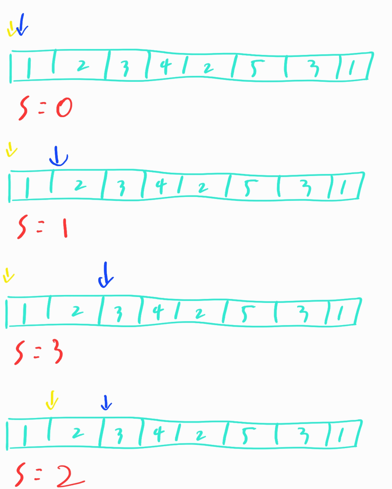

# 알고리즘

> 1. 선택정렬
> 2. 거품정렬
> 3. 병합정렬
> 4. 삽입정렬
> 5. 퀵정렬
> 6. 힙정렬
> 7. 기수정렬
> 8. 투포인터
> 9. 순열
> 10. BFS, DFS
> 11. 이분 탐색 (binary search)
> 12. 최대 공약수와 최소 공배수
> 13. LRU cache
> 15. 최장 증가 수열
> 16. 최소 공통 조상
> 17. 동적 계획법
> 18. 비트마스크
> 19. 재귀 알고리즘
> 20. 소수 구하기 (아리스토테네스의 체)
> 21. 문자열 검색

|   Algorithm    | Space Complexity | (average) Time Complexity | (worst) Time Complexity |
| :------------: | :--------------: | :-----------------------: | :---------------------: |
|  Bubble sort   |       O(1)       |          O(n^2)           |         O(n^2)          |
| Selection sort |       O(1)       |          O(n^2)           |         O(n^2)          |
| Insertion sort |       O(1)       |          O(n^2)           |         O(n^2)          |
|   Merge sort   |       O(n)       |         O(nlogn)          |        O(nlogn)         |
|   Heap sort    |       O(1)       |         O(nlogn)          |        O(nlogn)         |
|   Quick sort   |       O(1)       |         O(nlogn)          |         O(n^2)          |
|   Count sort   |       O(n)       |           O(n)            |          O(n)           |
|   Radix sort   |       O(n)       |           O(n)            |          O(n)           |

# 1. 선택정렬

크게 어려운 것은 없다. i번째에 들어갈 것을 찾기 위해 i+1~쭉 돌면서 최소인 것을 찾아서 i의 위치와 바꾸는 것이다

```python
def selectionSort(arr):
    for i in range(len(arr)-1):
        minimum = 9999999999
        minimum_position = i
        for j in range(i,len(arr)):
            if arr[j] < minimum:
                minimum = arr[j]
                minimum_position = j
        arr[i],arr[mimimum_position] = arr[minimum_position],arr[i]
    return arr
```

시간은 당연하게도 `O(N^2)`이 들어간다

# 2. 거품 정렬

이것도 크게 어렵지 않다. 현재 위치가 바로 오른쪽에 위치한 요소보다 클 경우 바꾸는 작업이다.

```python
def bubbleSort(arr):
    for i in range(len(arr)):
        for j in range(i,len(arr)-1):
            if arr[j] > arr[j+1]:
                arr[j],arr[j+1] = arr[j+1],arr[j]
    return arr
```

이것도 결국에 N을 중복해서 돌게 되니까 `O(N^2)`이 들어간다

# 3. 병합정렬

조금 생각할 거리가 있다. 일단 최대한 쪼개는 것이 중요하다. 그리고 최적의 형태에서 크기를 비교해서 합하는 과정이 중요하다.

```python
def mergeSort(arr):
    if len(arr)==1:
        return arr
    
    mid = len(arr)//2
    left = arr[:mid]
    right = arr[mid:]
    divided_left = mergeSort(left)
    divided_right = mergeSort(right)
    
    return merge(left,right)

def mergh(left,right):
    left_i = 0
    right_i = 0
    arr = []
    while left_i<len(left) and right_i<len(right):
        if left[left_i] < right[right_i]:
            arr.append(left[left_i])
            left_i += 1
        else:
            arr.append(right[right_i])
            right_i += 1
    while left_i<len(left):
        arr.append(left[left_i])
        left_i += 1
    while right_i<len(right):
        arr.append(right[right_i])
        right_i += 1
    return arr
```

시간 복잡도 면에서 이득을 볼 수 있다. 재귀적으로 반토막난 것을 하나로 합치는 과정이기 때문에 **시간면에서는 `O(NlogN)`**이 걸린다. 하지만 메모리 측면에선는 재귀함수로서 길이가 1인 list를 만들때까지 쪼개니까 그 길이만큼의 메모리를 먹게된다. 그래서 **공간 복잡도는 `O(N)`**이 된다.

# 4. 삽입정렬

카드를 정렬할때 처럼 하는 방식이다. 한 카드를 집고 그 앞에서 쭉 위치를 찾아서 그 위치에 넣는 방식의 정렬이다.

```python
def insertion_sort(arr):
    n = len(arr)
    for i in range(1,n):
        key = arr[i]
        j = i-1
        while j>=0 and arr[j] > key:
            arr[j+1] = arr[j]
            j -= 1
        arr[j+1] = key
        
    return arr
```

시간복잡도는 `O(N^2)`이지만 정렬이 되어 있는 경우에는 `O(N)`이 걸린다.

# 5. 퀵정렬

기준을 정하고 그 기준으로 왼쪽은 기준보다 작은것 오른쪽은 큰 것을 계속해서 배열 시킨다.

```python
def quickSort(arr,low,high):
    if low < high:
        pivot = partition(arr,low,high)
        quickSort(arr,low,pivot-1)
        quickSort(arr,pivot+1,high)

def partition(arr,pivot,high):
    left = pivot + 1
    right = high
    while True:
        while left < high and arr[left] < arr[pivot]:
            left += 1
        while right > pivot and arr[right] > arr[pivot]:
            right -= 1
        if left >= right:
            break
        arr[left],arr[right] = arr[right],arr[left]
        left += 1
        right -= 1
    arr[pivot], arr[right] = arr[right], arr[pibot]
    return right
```

일종의 병합정렬과 좀 비슷하다. 그래서 시간 복잡도는 `O(NlogN)`이 걸린다. 그리고 공간복잡도는 찾아가는 면에서 그렇게 많이 검색을 하지 않기 때문에 `O(logN)`이다.

# 6. 힙정렬

힙방식을 생각하자.

```python
def downheap(i,size,a):
    while 2*i <= size:
        k = 2*i
        if k < size and a[k] < a[k+1]:
            k += 1
        if a[i] >= a[k]:
            break
        a[i],a[k] = a[k],a[i]
        i=k
        print(a)
    return a

def create_heap(a):
    hsize = len(a) - 1
    for i in reversed(range(1,hsize//2+1)):
        a = downheap(i,hsize,a)
    return a

def heap_sort(a):
    N = len(a) - 1
    for i in range(N):
        a[1], a[N] = a[N], a[1]
        downheap(1,N-1,a)
        N -= 1
    return a

arr = create_heap(arr)
arr = heap_sort(arr)
```

힙을 만들고 힙 소팅을 한다. 최대 힙을 만들어두고 마지막 노드와 루트 노드를 바꾸면 이제 최대값이 맨 뒤로 온다. 그러면 그 부분을 빼고 앞에부분을 계속 반복 해주면 그때 그때 최대값이 뒤쪽부터 계속 쌓일 것이다.

시간복잡도는 heap구조를 이용하는 것이기 때문에 `O(NlogN)`이 걸린다. 공간 복잡도는 `O(1)` 

# 7. 기수정렬

조금 특이한 정렬이다. 처음에는 모든 원소의 1의 자리 기준으로 정렬한다. 그 이후에는 10의 자리 100의 자리를 계쏙해서 형태를 유지하면서 정렬을 진행한다.

```python
def redix_sort(array,n):
    length = len(array)
    for i in range(n):
        queue = {0:[],1:[],2:[],3:[],4:[],5:[],6:[],7:[],8:[],9:[]}
        redix_array = []
        for j in range(length):
            queue[(array[j]//(10**i))%10].append(array[j])
        for key in queue.keys():
            for value in queue[key]:
                redix_array.append(value)
        array = redix_array
        print(array)
    return array

arr = list(map(int,input().split()))
n = 0
for i in range(len(arr)):
    cnt = 0
    while True:
        if arr[i]//(10**cnt) > 0:
            cnt += 1
        else:
            break
    if cnt > n:
        n = cnt
print(n)
print(redix_sort(arr,n))
```

기수정렬은 특이하게 자리수가 속도에 영향을 미친다. `O(dN)`이라고 말할 수가 있다. 그리고 계속해서 N만큼 저장할 공간이 필요하기 때문에 공간복잡도는 `O(N)`이 필요하다.

# 8. 투포인터

크게 어려운 것은 없다. (보통 정렬되어 있는) 리스트에서 특정 구간의 연속된 합에 대해 문제를 풀어야할 경우 이용할 수가 있다. 왼쪽과 오른쪽을 두고 그 구간의 합이 더 적으면 더하면서 오른쪽을 한칸 앞으로 그 구간의 합이 더 크면 왼쪽을 빼면서 한칸 앞으로 하는 식으로 진행한다. 밑의 그림을 참고하면 쉬울 것이다.



# 9. 순열

순열을 구하는 방식은 생각보다 어렵지 않다. 간단하게 생각할 수가 있다. 바로 재귀를 이용하면 어렵지 않게 할 수 있다!

```python
def perm(visit,arr,now=[]):
    if False not in visit:
        print(now)
        return
    
    for i in range(len(arr)):
        if not visit[i]:
            visit[i] = True
            perm(visit,arr,now+[arr[i]])
            visit[i] = False

perm([False,False,False],[1,2,3])
```

# 10. BFS, DFS

탐색에 자주 이용되는 방식. 둘은 속도 면에서 이론적으로는 차이가 나지 않을 것이다. 하지만 dfs를 재귀로 만들면 재귀 특성때문에 약간의 속도차이가 생기기 시작한다.

# 11. 이분탐색

바이너리 서치는 시간복잡도가 `O(logN)`밖에 걸리지 않는 엄청난 탐색이다. 하지만 소팅이 되어있어야하긴 한다. 중심부터 시작하여 찾는 값이 현재보다 작을경우 작은쪽의 중심으로 클 경우 오른쪽의 중심으로 계속 이동해서 찾는 방식이다.

# 12. 최대공약수와 최소공배수

최대 공약수를 빠르게 구하는 방법에는 **유클리드 호제법**이라는 것이 존재한다.

유클리트 호제법이란? 두 수가 서로 상대방 수를 나누어서 결국 원하는 수를 얻는 방법으로, a,b에 대해 a를 b로 나눈 나머지를 r이라 하면 a와 b의 최대 공약수는 b와 r의 최대공약수와 같다. 그 러한 점에서 계속해서 나눠서 지속하는 것이다

85와 51을 예로 들자

- 85 % 51 = 34
- 51 % 34 = 17
- 34 % 17 = 0

이때 17이 최대 공약수가 되는 것이다.

그러면 최소 공배수는 어떻게 구할까? 어렵지 않다 **두 수의 곱을 최대 공약수로 나누면 그것**이 최소 공배수가 된다.

# 13. LRU cache

## cache의 개념

캐시는 데이터나 값을 미리 복사해 놓는 임시 장소를 가리킨다. 캐시는 접근 시간에 비해 원래 데이터를 접근하는 시간이 오래 걸리는 경우나 값을 다시 계산하는 시간을 절약하는 경우 사용한다. 캐시에 데이터를 미리 복사해 놓으면 계산이나 접근 시간 없이 빠른 속도로 데이터에 접근할 수 있다.

[1,2,3] 이렇게 메모리에 있다고 하자 그럼 계속 부르는 것을 앞으로 넣는다. 만약 2를 부르면 [2,1,3]이 될 것이고 3을 부르면 [3,2,1]을 부를 것이다. 그런데 이렇게 항상 있는 것만 부르는 것은 아니다. 4를 부를경우 이제 제일 안쓰였던 1은 쫓겨나고 [4,3,2]의 형태가 될 것이다.

# 14. 최장 증가 수열

1. DP: `O(N^2)`

   ```java
   int arr[] = {7, 2, 3, 8, 4, 5};
   int dp[] = new int[arr.length]; // LIS 저장 배열
   
   
   for(int i = 1; i < dp.length; i++) {
       for(int j = i-1; j>=0; j--) {
           if(arr[i] > arr[j]) {
               dp[i] = (dp[i] < dp[j]+1) ? dp[j]+1 : dp[i];
           }
       }
   }
   
   for (int i = 0; i < dp.length; i++) {
   	if(max < dp[i]) max = dp[i];
   }
   ```

2. Lower Bound `O(NlogN)`

# 15. 최소 공통 조상

자료구조 정리하면서 트리쪽 보면 됨

# 16.동적계획법

- Bottom-up : 작은 문제부터 차근차근 구하는 방법
- Top-down : 큰 문제를 풀다가 풀리지 않은 작은 문제가 있다면 그때 해결하는 방법 (재귀 방식)

# 17. 비트마스크

비트마스크를 이용하는 가장 대표적인 방법은 리스트에서 집합처럼 생각할 때이다. `[1,2,3,4,5]`라는 집합이 있고 부분집합인 `[1,3,4]`가 있다고 하자 이러면 우리는 이걸 비트마스크로 `10110`으로 표현할 수가 있다.

# 18. 재귀 알고리즘

자기 자신을 이용하는 것이다.

위의 유클리드 호제도 재귀로 구현이 가능하고 대표적인 알고리즘은 하노이의 탑이다

# 19. 소수구하기 (아리스토테네스의 체)

알고리즘의 순서는 다음과 같다

1. 2부터 소수를 구하고자 하는 구간의 모든 수를 나열한다.
2. 2는 소수이므로 오른쪽에 2를 쓴다.
3. 자기 자신을 제외한 2의 배수를 모두 지운다.
4. 남아있는 수 가운데 3은 소수이므로 오른쪽에 3을 쓴다.
5. 자기 자신을 제외한 3의 배수는 모두 재운다
6. 무한 반복

```python
arr = [True]*1001
arr[0] = False
arr[1] = False

i = 2
while i**2<=1000:
    j = i*i
    while j <= 1000:
        arr[j] = False
        j += i
    i += 1

for i in range(1001):
    if arr[i]:
        print(i, end=" ")
```

# 20. 문자열검색

1. KMP

   ```
   패턴의 표 
   ABCABD
   -00120
   
          0123456789
   텍스트 ZABCABXACC  
   패턴   ABCABD  
          x
   
   첫번째 문자와 패턴이 일치하지 않는다 1칸 뒤로 이동시켜 탐색한다.
   
          0123456789
   텍스트 ZABCABXACC  
   패턴    ABCABD  
           ooooox  
   
   패턴의 D가 일치하지 않는다. 
   위의 표를 보면 패턴에 겹치는 부분이 존재하며 AB까지는 패턴과 텍스트가 일치했다.
   해당 인덱스로 이동해 탐색한다.
   
          0123456789
   텍스트 ZABCABXACC  
   패턴       ABCABD  
              oox  
   
   더이상 이동 불가 탐색 실패
   ```

   위와 같은 알고리즘으로 진행된다.

2. 보이어 무어 알고리즘

   일단 찾을려는 문자들이 무엇이 있는지 정리하고 비교한다고 생각하면 된다

   찾을려는 끝 문자를 현재 위치와 비교하고 같으면 그 위치에서부터 역순으로 일치하는지 확인

   같지 않으면 이제 해당 문자가 내가 찾을려는 문자열 안에 있는 문자와 같은가? 아닌가를 따진다

   찾을려는 문자열안에 없는 것이면 바로 해당 다음 문자부터 쭉 밀어 넣는 식

   있으면 거기에 맞춰서 해당 문자를 옮겨서 비교한다.

   [참고](https://chanhuiseok.github.io/posts/algo-15/)

   