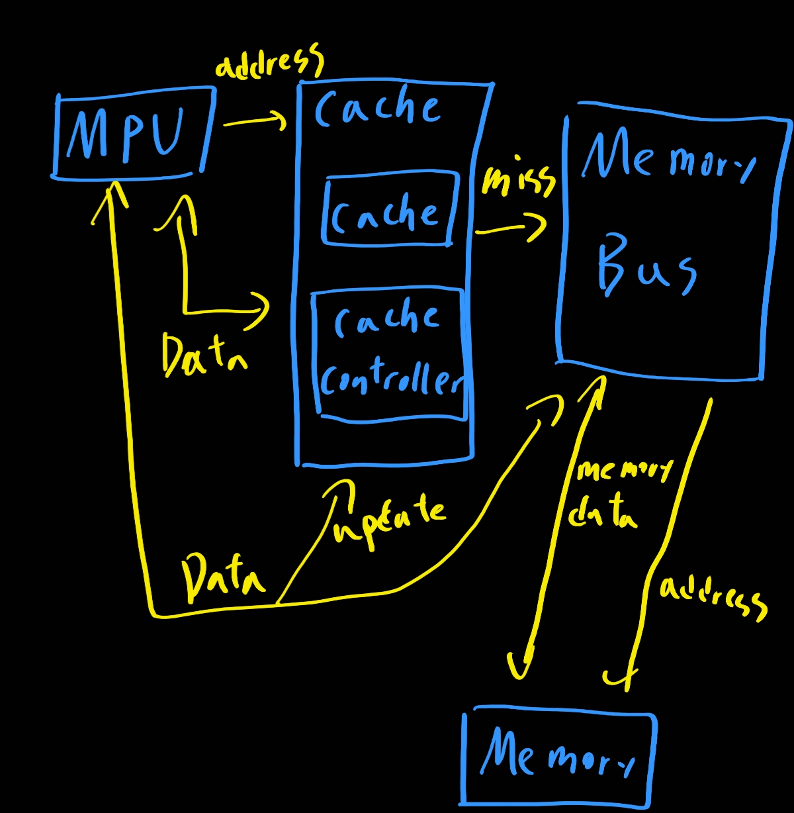
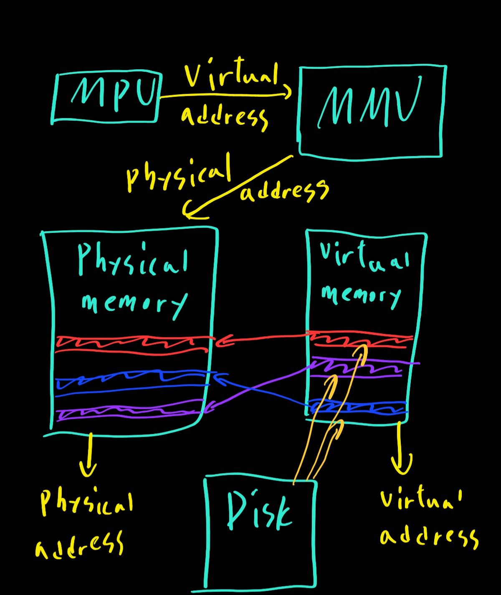
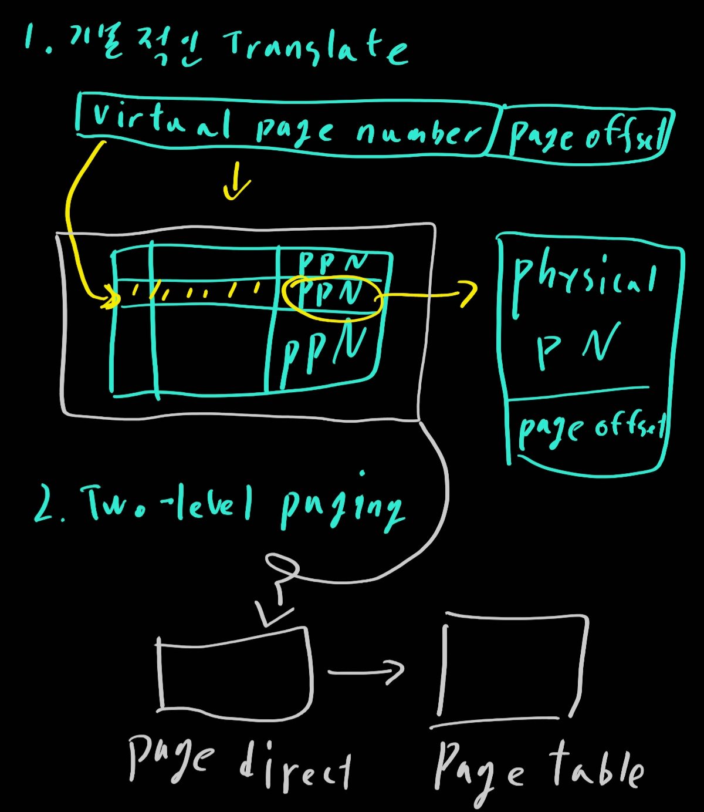
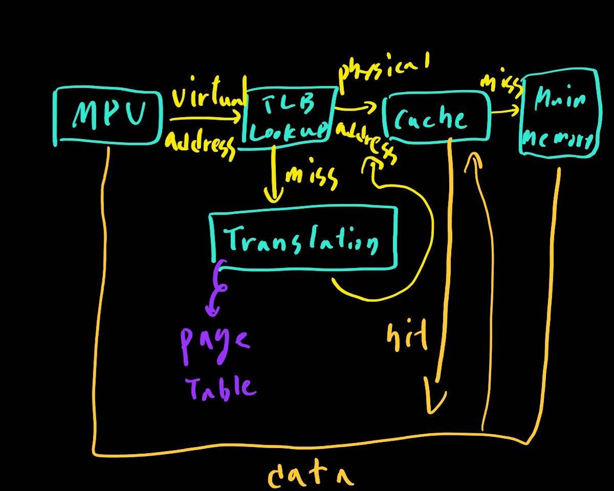
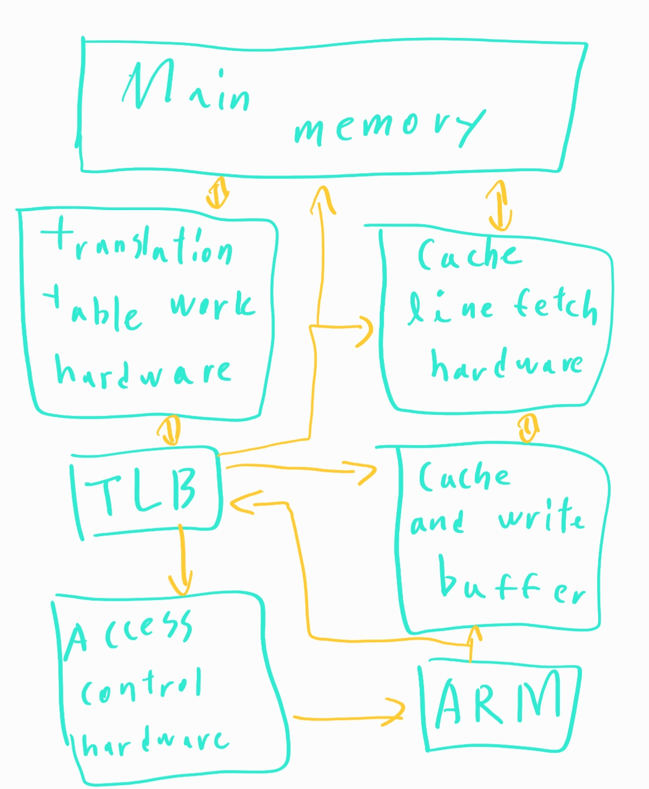
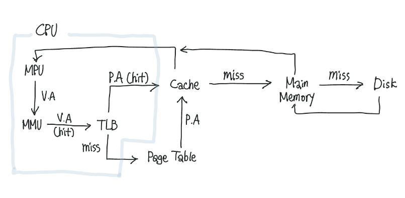

# 컴퓨터 아키텍쳐

> 1. 컴퓨터 구조
> 2. 컴퓨터의 구성
> 3. CPU의 작동 원리
> 4. 캐시 메모리

# 1. 컴퓨터 구조

- Microprocessor cache

  

- Virtual Memory

  

  => 동적 메모리 할당. 가상메모리 주소와 물리 메모리 주소를 관리

- 어떻게 Virtual Address를 Physical Address로 바꾸는가

  

  3. TLB

     

     - translate 속도 향상

     - cached mmu memory overview

       

       

# 2. 컴퓨터의 구성

## 하드웨어

- 중앙처리장치 CPU
  - 주기억장치에서 프로그램 명령어와 데이터를 읽어와 처리하고 명령어의 수행 순서를 제어함. 중앙처리장치는 비교와 연산을 담당하는 **산술논리장치(ALU)**와 명령어의 해석과 실행을 담당하는 **제어장치**, 속도가 빠른 데이터 기억장소인 **레지스터**로 구성
- 기억장치: RAM, HDD
  - 프로그램, 데이터, 연산의 중간 결과를 저장
- 입출력 장치: 마우스, 키보드, 모니터
- 위 세가지는 시스템 버스로 연결되어 있으며, 시스템 버스는 데이터와 명령 제어 신호를 각 장치로 실어나르는 역할을 한다
- 시스템 버스
  - 하드웨어 구성 요소를 물리적으로 연결하는 선
  - 각 구성 요소가 다른 구성요소로 데이터를 보낼 수 있도록 통로가 되어줌
  - 용도에 따라 데이터 버스, 주소 버스, 제어 버스로 나눔
    - 데이터 버스: 중앙처리장치와 기타 장치 사이
    - 주소 버스: 데이터를 정확히 실어나르기 위해서는 기억장치 '주소'를 정해주어야함
    - 제어 버스: 주소 버스와 데이터 버스를 제어할 수단

## 소프트웨어

- 시스템 소프트웨어: 운영체제, 컴파일러
- 응용 소프트웨어: 프로그램들

# 3. CPU의 작동 원리

## 구성요소

- 연산 장치
  - 산술 연산과 논리 연산 수행
  - 연산에 필요한 데이터를 레지스터에서 가져오고, 연산 결과를 다시 레지스터에게 보냄
- 제어 장치
  - 명령어를 순서대로 실행할 수 있도록 제어하는 장치
  - 주기억장치에서 프로그램 명령어를 꺼내 해독하고, 그 결과에 따라 명령어 실행에 필요한 제어 신호를 기억장치, 연산장치, 입출력장치로 보냄
  - 또한 이들 장치가 보낸 신호를 받아, 다음에 수행할 동작을 결정함
- 레지스터
  - 고속 기억 장치
  - 명령어 주소, 코드, 데이터, 연산 결과등을 임시로 저장
  - 용도에 따라 범용 레지스터와 특수목적 레지스터로 구분됨
  - 중앙처리장치 종류에 따라 사용할 수 있는 레지스터 개수와 크기가 다름
  - 범용과 특수목적으로 나눈다
  - 특수목적 레지스터 중 중요한 것들
    - MAR(메모리 주소 레지스터): 읽기와 쓰기 연산을 수행할 주기억장치 주소 저장
    - PC(프로그램 카운터): 다음에 수행할 명령어 주소 저장
    - IR(명령어 레지스터): 현재 실행 중인 명령어 저장
    - MBR(메모리 버퍼 레지스터): 주기억장치에서 읽어온 데이터 or 저장할 데이터 임시 저장
    - AC(누산기): 연사 결과 임시 저장

## 동작 과정

1. 주기억장치는 입력장치에서 입력받은 데이터 또는 보조기억장치에 저장된 프로그램 읽어옴
2. CPU는 프로그램 실행하기 위해 주기억장치에 저장된 프로그램 명령어와 데이터를 읽어오고 처리하여 결과를 다시 주 기억장치에 저장
3. 주기억장치는 처리 결과를 보조기억장치에 저장하거나 출력장치로 보냄
4. 제어 장치는 1~3과정에서 명령어가 순서대로 실행되도록 각 장치를 제어

## 명령어 세트

CPU가 실행할 명령어의 집합

- 연산 코드(실행할 연산) + 피연산자의 구성(필요한 데이터 or 저장 위치)
- cpu는 프로그램 실행을 위해 주기억장치에서 명령어를 순차적으로 인출하여 해독하고 실행하는 과정을 반복
- cpu가 주기억장치에서 한번에 하나의 명령어를 인출하여 실행하는데 필요한 일련의 활동을 **명령어 사이클**
- 명령어 사이클은 인출/실행/간접/인터럽트로 나뉜다

### 인출 사이클과 실행 사이클에 의한 명령어 처리 과정

> 인출 사이클에서 가장 중요한 부분은 PC(프로그램 카운터) 값 증가

- PC에 저장된 주소를 MAR로 전달
- 저장된 내용을 토대로 주기억장치의 해당 주소에서 명령어 인출
- 인출한 명령어를 MBR에 저장
- 다음 명령어를 위해 PC증가
- MBR에 저장된 내용을 IR에 전달

```
T0 : MAR ← PC
T1 : MBR ← M[MAR], PC ← PC+1
T2 : IR ← MBR
```

여기까지는 인출하기까지의 과정

##### 인출한 이후, 명령어를 실행하는 과정

> ADD addr 명령어 연산

```
T0 : MAR ← IR(Addr)
T1 : MBR ← M[MAR]
T2 : AC ← AC + MBR
```

이미 인출이 진행되고 명령어만 실행하면 되기 때문에 PC를 증가할 필요x

IR에 MBR의 값이 이미 저장된 상태를 의미함

따라서 AC에 MBR을 더해주기만 하면 됨

# 4. 캐시메모리

속도가 빠른 장치와 느린 장치에서 속도차이로 인한 병목 현상을 줄이기 위한 메모리

CPU가 주기억장치에서 저장된 데이터를 읽어올 때, 자주 사용하는 데이터를 캐시 메모리에 저장한 뒤, 다음에 이용할 때 주기억장치가 아닌 캐시메모리에서 먼저 가져오면서 속도를 향상시킨ㄴ다.

속도와 용량이 적기도 하고 비용도 비싼 점이 있다.

cpu는 일반적으로 이런 캐시메모리를 2~3개 사용한다. 속도와 크기에 따라 분류하고 먼저 L1부터 사용한다(cpu에서 가장 빠르게 접근하고, 못찾으면 L2로 넘어감)

듀얼 코어 프로세서의 캐시 메모리: 각 코어마다 독립된 L1 캐시 메모리를 가지고, 두 코어가 공유하는 L2 캐시 메모리가 내장

- L1: cpu 내부에 존재
- L2: cpu와 ram사이에 존재
- L3: 보통 메인보드에 존재

디스크 캐시: 주기억장치와 보조기억장치 사이에 존재하는 캐시

## 작동원리

- 시간 지역성

  for나 while 같은 반복문에 사용하는 조건변수처럼 한번 참조된 데이터는 잠시후 또 참조될 가능성이 높음

- 공간 지역성

  A[0],A[1]과 같은 연속 접근 시, 참조된 데이터 근처에 있는 데이터가 잠시후 또 사용될 가능성이 높음

- 캐시가 있으면 cache hit, 없으면 cache miss

## miss의 경우 3가지

1. ##### Cold miss

   해당 메모리 주소를 처음 불러서 나는 미스

2. ##### Conflict miss

   캐시 메모리에 A와 B 데이터를 저장해야 하는데, A와 B가 같은 캐시 메모리 주소에 할당되어 있어서 나는 미스 (driect mapped cache에서 많이 발생)

   ```
   항상 핸드폰과 열쇠를 오른쪽 주머니에 넣고 다니는데, 잠깐 친구가 준 물건을 받느라 손에 들고 있던 핸드폰을 가방에 넣었음. 그 이후 핸드폰을 찾으려 오른쪽 주머니에서 찾는데 없는 상황
   ```

3. ##### Capacity miss

   캐시 메모리의 공간이 부족해서 나는 미스 (Conflict는 주소 할당 문제, Capacity는 공간 문제)

## 구조 및 작동 방식

- Direct Mapped Cache

  가장 기본적인 구조, DRAM의 여러 주소가 캐시 메모리의 한 주소에 대응되는 다대일 방식.

  간단하고 빠른 장점이 있지만, Conflict Miss가 발생하는 단점

- Fully Associative Cache

  비어있는 캐시 메모리가 있으면, 마음대로 저장하는 방식

  저장에는 편하지만 찾을때 불편

  조건이나 규칙이 없어서 특정 캐시 set안에 있는 모든 블럭을 한번에 찾아서 검색해야함

- Set Associative Cache

  Direct + Fully 방식. 특정행을 지정하고 비어 있는 곳에 마음대로 저장.