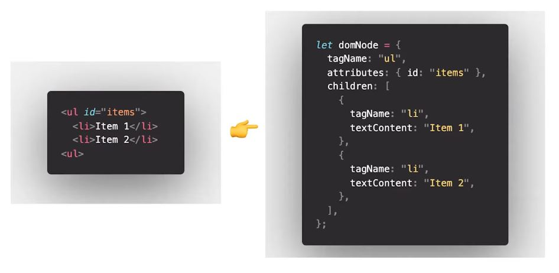

# 프론트 면접 질문 모음

## SSR과 CSR

- SSR
  - 서버 사이드 랜더링
  - 서버에서 Data가 결합된 HTML파일을 보내주는 방식
- CSR
  - 클라이언트 사이드 랜더링
  - 클라이언트측에서 렌더링을 하는 방식으로 `SSR`보단 더 많은 리소스를 요청한다
  - 허나 이후 다른 페이지 전환 속도는 `SSR`보다 빠르다
- SEO문제
  - 검색되어야 하는 사이트라면 SEO때문에 SSR에 대해 생각하게 된다
  - 구글의 경우 상관없지만 다른 검색 사이트의 경우 자바스크립트를 해석할 엔진이 없다
    - 즉, 그들은 빈페이지로 인식하게 된다!
  - 이러한 문제를 타파하기 위해 spa도 ssr을 이용하는 경우가 있다
    - react에게는 next.js
    - vue에게는 nuxt.js가 있다

## DOM과 가상DOM

[참고 영상](https://www.youtube.com/watch?v=PN_WmsgbQCo)

> 1. 브라우저의 동작
>    1. 브라우저 렌더링 과정
>    2. DOM 조작의 비효율성
> 2. Virtual DOM의 등장
>    1. 가상 DOM의 등장
>    2. 동작 원리

1. 브라우저의 동작

   1. 브라우저 랜더링 과정

      - DOM tree 생성
        - 렌더 엔진이 HTML을 파싱
      - render tree 생성
        - DOM과 파싱된 css인 cssom트리의 합으로 렌더 트리 생성
      - 리플로우
        - 각 노드 들의 스크린에서의 좌표에 따라 위치 결정
      - 리페인드
        - 실제 화면에 그리기

   2. DOM 조작의 비효율성

      일반적인 dom조작을 한다면 위 과정이 순서대로 계속 다시 일어나게 된다는 문제점이 있다.

      우리는 필요한 부분만 수정하고 싶기 때문이다.

2. 가상 DOM의 등장

   1. 가상 DOM의 등장

      dom 조작이 최적화할 필요성 이 생기게 되었다

   2. 동작 원리

      dom이 갖고 있는 api는 존재하지 않음

      데이터가 변경되면 가상 DOM이 변경 => 진짜 DOM과 비교하여 필요한 부분만 업데이트를 적용

      html객체에 기반한 javascript객체이다.

      

## 트래픽 또는 동시접속자가 많을 경우 프론트엔드단에서 할 수 있는 일

[참고자료1](https://toss.tech/article/smart-web-service-cache) [참고자료2](https://www.slideshare.net/heungrae_kim/jco-frontend)

- 로딩 최적화
  - HTTP 요청 최소화
    - Cache 적용
    - Static 파일 통합
    - Static 자원 Domain 이원화
  - 파일 크기 최소화
    - image resize
    - sciprt 압축으로 파일 사이즈 최소화
- 랜더링 최적화
  - Render Tree를 고려한  css우선 다운로드
  - DOMContentLoaded이벤트 사용
- DOM 핸들링 최적화
  - Reflow 발생 최소화
  - DOM Tree 순환 최소화
  - Ajax Script 동적 생성

## preload preconnect prefetch

1. preload
   - 브라우저에게 로딩 중인 리소스의 유형을 알려주고 올바르게 처리하도록 한다
   - `as`속성이 없을경우 사용하지 않음
   - 동일한 우선순위로 로드 되지만, 브라우저에게 미리 알기 알기 때문에 다운로드가 먼저 되는 것을 허용한다는 점
   - 3초내에 사용되지 않으면 콘솔에 경고가 뜬다
2. preconnect
   - 브라우저에 우리의 페이지가 다른 출발지에 연결하도록 구축되었다는 것
   - 가능한 한 빠르게 처리를 시작하고자 한다는 두가지를 알린다
     - `<link rel="preconnect" href="https://example.com">`
     - 위와 같은 경우는 해당 주소에 연결하고 여기에서 콘텐츠를 가져오려 한다는 것을 알린다
   - 미디어 스트리밍에 자주 이용된다
3. prefetch
   - 기회가 있으면 중요하지 않은 것을 먼저 발생시키려 하게 한다

## babel

크로스 브라우징 이슈를 처리하기 위해 생겨난 툴이다. 바벨은 아래와 같은 진행 순서로 빌드된다

1. Parsing: 코드를 읽고 추상 구문 트리로 변환하는 단계
2. Transforming: 추상 구문 트리를 변경
3. Printing: 변경된 결과물을 출력

## put patch

- put
  - 모든 부분에 대해 수정함
  - 즉, 수정시 선언하지 않은 부분은 그냥 null로 처리함
- patch
  - 일부분만 수정
  - 수정시 선언하지 않은 부분은 그대로 유지된다.

