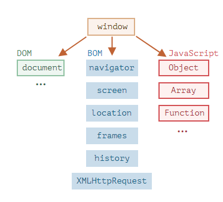
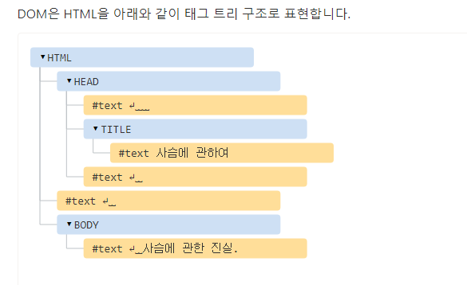
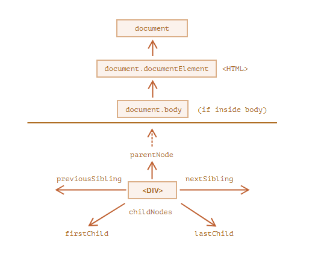
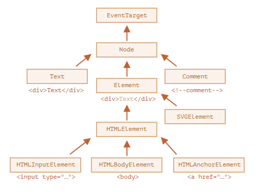

# 브라우저: 문서, 이벤트, 인터페이

## 브라우저 환경과 다양한 명세서

> js는 본래 웹 브라우저에서 사용하려고 만든 언어입니다. 이후 진화를 거쳐 다양한 사용처와 플랫폼을 지원한느 언어로 변모하였습니다.
>
> 자바스크립트가 돌아가는 플랫폼은 호스트(host)라고 불립니다. 호스트는 브라우저, 웹서버, 심지어는 커피 머신이 될 수도 있습니다. 각 플랫폼은 해당 플랫폼에 특정되는 기능을 제공하는데, 자바스크립트 명세서에선 이를 호스트(host environment) 이라고 부릅니다



- 최상단 `window`라는 루트 객체가 있다. 이것은 두가지 역할을 합니다
  1. 전역 객체 챕터에서 설명한 바와 같이, 자바스크립트 코드의 전역 객체입니다
  2. 브라우저 창을 대변하고, 이를 제어할 수 있는 메서드를 제공합니다.

전역함수는 전역 객체의 메서드가 될 수 있고, 브라우저 창도 대변하여 창의 높이를 알 수 있습니다

```javascript
function sayHi() {
  alert("안녕하세요.");
}

// 전역 함수는 전역 객체(window)의 메서드임
window.sayHi();

alert(window.innerHeight); // 창 내부(inner window) 높이
```

### 문서 객체 모델(DOM)

> 문서 객체 모델(Document Object Model, DOM)은 웹 페이지내의 모든 모든 콘텐츠를 객체로 나타내줍니다. 이 객체는 수정 가능합니다.

`document` 객체는 페이지의 기본 진입점 역할을 합니다. document 객체를 이용해 페이지 내 그 무엇이든 변경할 수 있고, 원하는 것을 만들 수도 있다

```javascript
// 아니 근데 스타일을 js로 변경하지 말라고!!! (라고 할뻔~)
// 배경을 붉은색으로 변경하기
document.body.style.background = "red";

// 1초 후 원상태로 복구하기
setTimeout(() => (document.body.style.background = ""), 1000);
```

- DOM은 브라우저만을 위한 모델이 아니다
  - 문서의 구조와 이를 조작할 수 있는 객체에 대한 설명이 있다
  - 그런데 브라우저가 아닌 곳에서도 쓸 수 있다
  - SSR에서도 사용한다
- CSSOM
  - CSS객체 모델
  - DOM과 함께 쓰인다.
  - 하지만 요건 정적이라 실무에서 요걸 직접 조절하는 일은 거의 없을 거다

### 브라우저 객체 모델(BOM)

> 브라우저 객체 모델(Browser Object Model, BOM)은 문서 이외의 모든 것을 제어하기 위해 브라우저(호스트 환경)가 제공하는 추가 객체를 나타냅니다
>
> - 예시
>   - navigator 객체는 브라우저와 운영체제에 대한 정보를 제공
>   - location 객체는 현재 URL을 읽을 수 있게 해주고 새로운 URL로 변경할 수 있게 해줍니다

## DOM 트리

> HTML을 지탱하는 것은 태그(tag)입니다.
>
> 문서 객체 모델(DOM)에 따르면, 모든 HTML 태그는 객체입니다.

### DOM 예제

```html
<!DOCTYPE html>
<html>
  <head>
    <title>사슴에 관하여</title>
  </head>
  <body>
    사슴에 관한 진실.
  </body>
</html>
```



텍스트 노드 생성에 예외도 있다

1. 역사적인 이유로, `<head></head>` 이전의 공백과 새 줄은 무시됩니다.
2. HTML 명세서에서 모든 콘텐츠는 `body` 안쪽에 있어야 한다고 했으므로, `</body>` 뒤에 무언가를 넣더라도 그 콘텐츠는 자동으로 `body` 안쪽으로 옮겨집니다. `</body>` 뒤엔 공백이 있을 수 없다

### 자동 교정

> 기형적인 HTML을 만나면 브라우저는 DOM 생성과정에서 HTML을 자동으로 교정합니다.

### 기타 노드 타입

요소와 텍스트 노드 외에도 다양한 노드 타입이 있다

주석도 노드가 된다

## DOM 탐색하기

> DOM을 이용하면 요소와 요소의 콘텐츠에 무엇이든 할 수 있습니다. 하지만 무언가를 하기 전엔, 당연히 조작하고자 하는 DOM 객체에 접근하는 것이 선행되어야 합니다.



### 트리 상단의 documentElement와 body

- html === document.documentElement
  - document를 제외하고 DOM 트리 꼭대기에 있는 문서 노드는 html 태그에 해당하는 document.documentElement
- body === document.body
  - document.body는 body 요소에 해당하는 DOM 노드로, 자주 쓰이는 노드 중 하나입니다
- head === document.head
  - head 태그는 document.head 로 접근할 수 있습니다

> document.body는 null 일 수도 있다
>
> 스크립트를 읽는 도중에 존재하지 않는 요소는 스크립트에서 접근할 수 없습니다

### 노드 탐색하기

- childNodes
  - 자식 노드들을 어레이로 접근 가능하다
- firstChild
  - 첫번째 자식 요소
- lastChild
  - 마지막 자식 요소
- nextSibling
  - 다음 형제 노드
- previousSibling
  - 이전 형제 노드
- parentNode
  - 부모 노드

## getElement, querySelector로 요소 검색하기

> 요소들이 가까이 붙어있다면 노드 탐색하기에서 알아봤던 것들로 탐색이 될 것이지만 그러지 않은 경우도 많다
>
> 그럴 경우 이번 챕터에서 배우는 것들을 이용해보자

### document.getElementById 혹은 id를 사용해 요소 검색하기

> 요소에 id 속성이 있다면 위치에 상관없이 document.getElementById(id)로 접근 가능

```html
<div id="elem">
  <div id="elem-content">Element</div>
</div>

<script>
  // 요소 얻기
  let elem = document.getElementById("elem");

  // 배경색 변경하기
  elem.style.background = "red";
</script>

<div id="elem">
  <div id="elem-content">Element</div>
</div>

<script>
  // 변수 elem은 id가 'elem'인 요소를 참조합니다.
  elem.style.background = "red";

  // id가 elem-content인 요소는 중간에 하이픈(-)이 있기 때문에 변수 이름으로 쓸 수 없습니다.
  // 이럴 땐 대괄호(`[...]`)를 사용해서 window['elem-content']로 접근하면 됩니다.
</script>
```

### querySelectorAll

> elem.querySelectorAll(css)은 다재다능한 요소 검색 메서드입니다.
>
> querySelector로 해당하는 첫번째 요소만 받을 수도 있다

```html
<ul>
  <li>1-1</li>
  <li>1-2</li>
</ul>
<ul>
  <li>2-1</li>
  <li>2-2</li>
</ul>
<script>
  let elements = document.querySelectorAll("ul > li:last-child");

  for (let elem of elements) {
    alert(elem.innerHTML); // "1-2", "2-2"
  }
</script>
```

### 메소드 정리

| 메서드                | 검색기준    | 호출 대상이 요소가 될 수 있는지에 대한 여부 | 컬렉션 갱신 여부 |
| --------------------- | ----------- | ------------------------------------------- | ---------------- |
| querySelector         | css 선택자  | O                                           | X                |
| querySelectorAll      | css 선택자  | O                                           | X                |
| getElementById        | id          | X                                           | X                |
| getElementsByName     | name        | X                                           | O                |
| getElementsByTagName  | 태그나 '\*' | O                                           | O                |
| getElementByClassName | class       | O                                           | O                |

## 주요 노드 프로퍼티

> DOM 노드란 무엇인지, DOM 노드의 주요 프로퍼티는 무엇이 있는지 학습하겠습니다.

### DOM 노드 클래스



- [EventTarget](https://dom.spec.whatwg.org/#eventtarget)
  - 루트에 있는 추상(abstract) 클래스로, 이 클래스에 대응하는 객체는 실제로 만들어지지 않습니다.
  - EventTarget가 모든 DOM 노드의 베이스에 있기 때문에 DOM 노드에서 이벤트를 사용할 수 있습니다.
- [Node](http://dom.spec.whatwg.org/#interface-node)
  - 역시 추상 클래스로, DOM 노드의 베이스 역할을 합니다.
  - 주로 트리 탐색 기능을 제공
  - Node 클래스의 객체는 절대 생성되지 않습니다. 하지만 이 클래스를 상속받는 클래스는 여럿 있다
- [Element](http://dom.spec.whatwg.org/#interface-element)
  - DOM 요소를 위한 베이스 클래스입니다.
  - 요소 전용 탐색을 도와주는 프로퍼티나 메서드가 이를 기반으로 한다
  - HTML뿐만 아니라 XML, SVG도 지원한다

### nodeType 프로퍼티

> nodeType 프로퍼티는 DOM 노드의 타입을 알아내고자 할 때 쓰이는 구식 프로퍼티입니다.

### nodeName과 tagName으로 태그 이름 확인하기

> nodeName이나 tagName 프로퍼티를 사용하면 DOM 노드의 태그 이름을 알아낼 수 있습니다.

### innerHTML로 내용 조작하기

> [innerHTML](https://w3c.github.io/DOM-Parsing/#widl-Element-innerHTML) 프로퍼티를 사용하면 요소 안의 HTML을 문자열 형태로 받아올 수 있고 수정도 가능합니다

## 속성과 프로퍼티

> 브라우저는 웹페이지를 만나면 HTML을 읽어(파싱(parsing)) DOM 객체를 생성합니다. 요소 노드에서 대부분의 표준 HTML 속성은 DOM 객체의 프로퍼티가 됩니다

### DOM 프로퍼티

새로운 자신만의 프로퍼티를 한번 만들어봅시다

```javascript
document.body.myData = {
  name: "Caesar",
  title: "Imperator",
};

alert(document.body.myData.title); // Imperator

document.body.sayTagName = function () {
  alert(this.tagName);
};

document.body.sayTagName(); // BODY (sayTagName의 'this'엔 document.body가 저장됩니다.)

Element.prototype.sayHi = function () {
  alert(`Hello, I'm ${this.tagName}`);
};

document.documentElement.sayHi(); // Hello, I'm HTML
document.body.sayHi(); // Hello, I'm BODY
```

### HTML 속성

> HTML에서 태그는 복수의 속성을 가질 수 있습니다. 브라우저는 HTML을 파싱해 DOM 객체를 만들 때 HTML 표준 속성을 인식하고, 이 표준 속성을 사용해 DOM 프로퍼티를 만듭니다.

```html
<body>
  <div id="elem" about="Elephant"></div>

  <script>
    alert(elem.getAttribute("About")); // (1) 'Elephant', 속성 읽기

    elem.setAttribute("Test", 123); // (2) 속성 추가하기

    alert(elem.outerHTML); // (3) 추가된 속성 확인하기

    for (let attr of elem.attributes) {
      // (4) 속성 전체 나열하기
      alert(`${attr.name} = ${attr.value}`);
    }
  </script>
</body>
```

### 프로퍼티 - 속성 동기화

> 표준 속성이 변하면 대응하는 프로퍼티는 자동으로 갱신됩니다. 몇몇 경우를 제외하고 프로퍼티가 변하면 속성 역시 마찬가지로 갱신됩니다.

### DOM 프로퍼티 값의 타입

> DOM 프로퍼티는 항상 문자열이 아닙니다.

체크 박스에 사용되는 `input.checked` 프로퍼티의 경우 불린 값을 가집니다.

style 송성의 경우 문자열이지만 프로퍼티는 객체입니다

### 비표준 속성, dataset

> HTML에 데이터를 저장할 때 쓰일 수 있습니다
