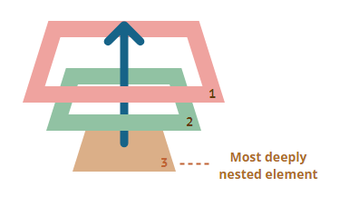
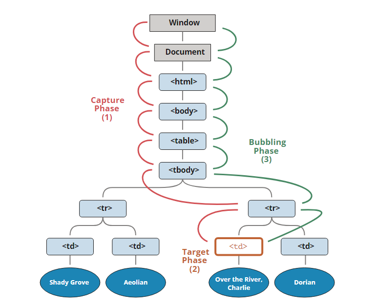

# 이벤트 기초

## 브라우저 이벤트 소개

- 마우스 이벤트
  - click - 요소 위에서 마우스 왼쪽 버튼을 눌렀을 때(터치스크린이 있는 장치에선 탭 했을 때) 발생합니다.
  - contextmenu - 요소 위에서 마우스 오른쪽 버튼을 눌렀을 때 발생합니다
  - mouseover, mouseout - 마우스 커서를 요소 위로 움직였을때, 요소 밖으로 움직였을때
  - mousedown, mouseup - 요소 위에서 마우스 오인쪽 버튼을 누르고 있을 때, 땔 때
  - mousemove - 마우스 움직임
- 폼 요소 이벤트
  - submit - form을 제출할 때
  - focus - input과 같은 요소에 포커스가 발생할 때
- 키보드 이벤트
  - keydown, keyup - 사용자가 키보드 버튼을 누르거나 뗄 때
- css 이벤트
  - transitionend - css 애니메이션 종료

이벤트 핸들러는 하나뿐이라 추가를 하면 `덮어 씌워집니다`

### 이벤트 객체

> 이벤트가 발생하면 브라우저는 `이벤트 객체`라는 것을 만듭니다

```javascript
elem.onclick = function (event) {
  // 이벤트 타입과 요소, 클릭 이벤트가 발생한 좌표를 보여줌
  alert(event.type + " 이벤트가 " + event.currentTarget + "에서 발생했습니다.");
  alert(
    "이벤트가 발생한 곳의 좌표는 " +
      event.clientX +
      ":" +
      event.clientY +
      "입니다."
  );
};
```

- event.type
  - 이벤트 타입, 위 예시에서는 클릭
- event.currentTarget
  - 이벤트를 처리하는 요소.
  - 바인딩하지 않으면 this가 가리키는 값과 같음
- event.clientX, event.clientY
  - 포인터 관련 이벤트에서, 커서의 상대 좌표(브라우저 화면 기준 좌표)

## 버블링과 캡처링

### 버블링

> 한 요소에 이벤트가 발생하면, 이 요소에 할당된 핸들러가 동작하고, 이어서 부모 요소의 핸들러가 동작합니다. 가장 최상단의 조상 요소를 만날 때까지 이 과정이 반복되면서 요소 각각에 할당된 핸들러가 동작합니다.
>
> 

```html
<style>
  body * {
    margin: 10px;
    border: 1px solid blue;
  }
</style>

<form onclick="alert('form')">
  FORM
  <div onclick="alert('div')">
    DIV
    <p onclick="alert('p')">P</p>
  </div>
</form>
```

1. p에 할당된 onclick 동작
2. div에 할당된 핸들러 동작
3. form에 할당된 핸들러 동작
4. document 객체를 만날 때까지, 각 요소에 할당된 onclick 핸들러가 동작

### event.target

> 이벤트가 발생한 가장 안쪽의 요소는 target ㅇ요소라고 불리고, event.targetㅇ을 사용해 접근할 수 있습니다

- event.target과 this(event.currentTarget)는 차이점이 있다
  - event.target은 실제 이벤트가 시작된 '타깃' 요소. 버블링이 진행되어도 변하지 않음
  - this는 현재 요소

### 버블링 중단하기

event.stopPropagation을 사용하자

- event.stopImmediatePropagation
  - event.stopPropagation은 버블링은 막지만 다른 핸들러가 동작하는 것은 막지 못함
  - 요건 다른 핸들러 동작도 막는다

### 캡처링

> 표준 DOM 이벤트에서 정의한 이벤트 흐름
>
> 1. 캡처링 단계 - 이벤트가 하위 요소로 전파되는 단계
> 2. 타깃 단계 - 이벤트가 실제 타깃 요소에 전달되는 단계
> 3. 버블링 단계 - 이벤트가 상위 요소로 전파되는 단계
>
> 

캡처링 단계를 이용해야 하는 경우는 흔치 않다. 그래도 보고자 하면 addEventListener에 capture 옵션이 있다

```javascript
elem.addEventListener(..., {capture: true})
// 아니면, 아래 같이 {capture: true} 대신, true를 써줘도 됩니다.
elem.addEventListener(..., true)
```

```html
<style>
  body * {
    margin: 10px;
    border: 1px solid blue;
  }
</style>

<form>
  FORM
  <div>
    DIV
    <p>P</p>
  </div>
</form>

<script>
  for (let elem of document.querySelectorAll("*")) {
    elem.addEventListener(
      "click",
      (e) => alert(`캡쳐링: ${elem.tagName}`),
      true
    );
    elem.addEventListener("click", (e) => alert(`버블링: ${elem.tagName}`));
  }
</script>
```

1. html => body => form => div (캡처링 단계)
2. p (타깃 단계, 캡쳐 + 버블 효과로 두번 호출)
3. div => form => body => html (버블링 단계)

## 브라우저 기본 동작

### 브라우저 기본 동작 막기

- event 객체 사용
- addEventListener가 아닌 onEvent를 사용해 할당되었다면 false를 반환

```html
<a href="/" onclick="return false">이곳</a>
이나
<a href="/" onclick="event.preventDefault()">이곳을</a> 클릭해주세요.
```

js만을 이용해서도 당연히 가능하다

```javascript
/**
 * html 문서
 * <ul id="menu" class="menu">
 *  <li><a href="/html">HTML</a></li>
 *  <li><a href="/javascript">JavaScript</a></li>
 *  <li><a href="/css">CSS</a></li>
 * </ul>
 */
menu.onclick = function (event) {
  if (event.target.nodeName != "A") return;

  let href = event.target.getAttribute("href");
  alert(href); // 서버에서 데이터를 읽어오거나, UI를 새로 만든다거나 하는 등의 작업이 여기에 들어갑니다.

  return false; // 브라우저 동작을 취소합니다(URL로 넘어가지 않음).
};
```

#### 후속 이벤트

어떤 이벤트들은 순차적으로 발생한다. 대표적으로 mousedown이벤트는 focus를 유발시킨다. 즉, mousedown을 막으면 focus도 생기지 않는다

```html
<input value="focus가 동작합니다," onfocus="this.value=''" />
<input
  onmousedown="return false"
  onfocus="this.value=''"
  value="클릭해 주세요."
/>
```

### addEventListener의 passive

> passive: true 옵션은 브라우저에게 preventDefault()를 호출하지 않겠다고 알리는 역할을 합니다.

touchmove와 같은 이벤트는 스크롤링을 발생시킵니다. 하지만 preventDefault를 사용하면 스크롤링을 막을 수 있습니다.

여기서 브라우저는 preventDefault가 어디에서도 호출되지 않았다고 판단해야 스크롤링을 진행합니다! `불필요한 지연과 화면이 덜덜 떨리는 현상을 방지`할 수 있습니다.

passive: true 옵션은 이러한 현상을 막을 수 있다. 몇 브라우저는 이게 디폴트기도 하다

### event.defaultPrevented

우클릭으로 커스텀 메뉴를 만들고 싶은 경우가 왕왕있는데 그럴 때 이용가능합니다

```html
<p>문서 레벨 컨텍스트 메뉴</p>
<button id="elem">
  버튼 레벨 컨텍스트 메뉴(event.stopPropagation를 사용해 버그 수정)
</button>

<script>
  elem.oncontextmenu = function (event) {
    event.preventDefault();
    event.stopPropagation();
    alert("버튼 컨텍스트 메뉴");
  };

  document.oncontextmenu = function (event) {
    event.preventDefault();
    alert("문서 컨텍스트 메뉴");
  };
</script>

조금 더 깔끔한 코드
<p>문서 레벨 컨텍스트 메뉴(event.defaultPrevented를 확인함)</p>
<button id="elem">버튼 레벨 컨텍스트 메뉴</button>

<script>
  elem.oncontextmenu = function (event) {
    event.preventDefault();
    alert("버튼 컨텍스트 메뉴");
  };

  document.oncontextmenu = function (event) {
    if (event.defaultPrevented) return; // if위에서 dom전체에서 필요한 동작을 추가할 수 있다

    event.preventDefault();
    alert("문서 컨텍스트 메뉴");
  };
</script>
```
