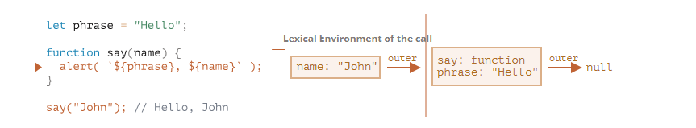
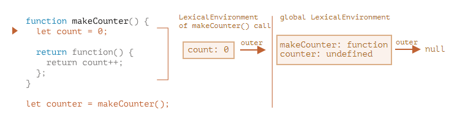
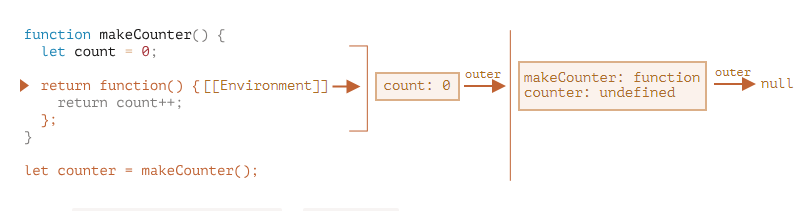
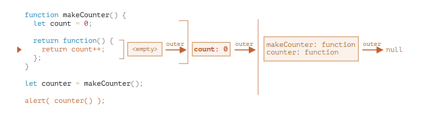
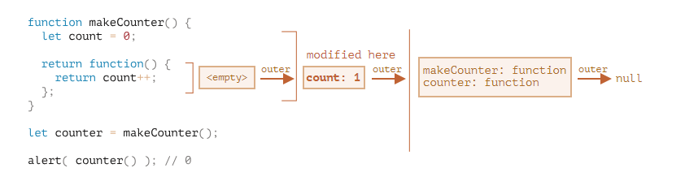

# 함수 심화학습

## 재귀와 스택

> 특정 조건이 될 때 함수가 계속 자기자신을 호출함

## 나머지 매개변수와 스프레드 문법

자바스크립트는 정말 특이하다. 아래와 같은 문법이 에러가 안난다 ㅋㅋㅋㅋ `제발 타입스크립트...`

```javascript
function sum(a, b) {
  return a + b;
}

alert(sum(1, 2, 3, 4, 5)); // 에러 안남 ㅋㅋ
```

위와 같은 에러가 안나는게 반대로 스프래드 형식의 함수도 작성이 가능하다

```javascript
function sumAll(...args) {
  // args는 배열의 이름입니다.
  let sum = 0;

  for (let arg of args) sum += arg;

  return sum;
}

alert(sumAll(1)); // 1
alert(sumAll(1, 2)); // 3
alert(sumAll(1, 2, 3)); // 6
```

## 변수의 유효범위와 클로저

코드 블록 안에서 선언한 변수는 블록안에서만 사용 가능하다.

```javascript
{
  // 지역 변수를 선언하고 몇 가지 조작을 했지만 그 결과를 밖에서 볼 수 없습니다.

  let message = "안녕하세요."; // 블록 내에서만 변숫값을 얻을 수 있습니다.

  alert(message); // 안녕하세요.
}

alert(message); // ReferenceError: message is not defined

{
  // 메시지 출력
  let message = "안녕하세요.";
  alert(message);
}

{
  // 또 다른 메시지 출력
  let message = "안녕히 가세요.";
  alert(message);
}

if (true) {
  let phrase = "안녕하세요!";

  alert(phrase); // 안녕하세요!
}

alert(phrase); // ReferenceError: phrase is not defined
```

### 렉시컬 환경

> 어렵다

1. 변수
   - 자바스크립트에선 실행 중인 함수, 코드 블록 `{...}`, 스크립트 전체는 **렉시컬 환경**이라 불리는 내부 숨김 연관 객체를 갖는다
   - 렉시컬 환경 객체는 두 부분으로 구성된다
     - 환경 레코드 - 모든 지역 변수를 프로퍼티로 저장하고 있는 객체입니다. `this` 값과 같은 기타 정보도 여기에 저장됩니다
     - 외부 렉시컬 환경에 대한 참조 - 외부 코드와 연관됨
   - **'변수'는 특수 내부 객체인 환경 레코드의 프로퍼티일 뿐이다**
   - ```javascript
     // 1 phrase => uninitialized, null
     let phrase;
     // 2 phrase => undefined
     phrase = "Hello";
     // 3 phrase => Hello
     phrase = "Bye";
     // 4 phrase => bye
     ```
   - 위 코드를 순서대로 해석해보자
     1. 스크립트가 시작되면 스크립트 내에서 선언한 변수 전체가 렉시컬 환경에 올라갑니다(pre-populated).
        1. 이때 변수의 상태는 특수 내부 상태(special internal state)인 'uninitialized’가 됩니다. 자바스크립트 엔진은 uninitialized 상태의 변수를 인지하긴 하지만, let을 만나기 전까진 이 변수를 참조할 수 없습니다.
     2. let phrase가 나타났네요. 아직 값을 할당하기 전이기 때문에 프로퍼티 값은 undefined입니다. phrase는 이 시점 이후부터 사용할 수 있습니다.
     3. phrase에 값이 할당되었습니다.
     4. phrase의 값이 변경되었습니다.
2. 함수 선언문
   - 함수는 변수와 마찬가지로 값이다
   - **다만 함수 선언문(function declaration)으로 선언한 함수는 일반 변수와는 달리 바로 초기화된다는 점에서 차이가 있다.**
   - 함수는 아래에서 정의해도 위에서 사용이 가능하다
3. 내부와 외부 렉시컬 환경
   - 아래 그림을 보고 이해해보자
   - 
   - 코드에서 변수에 접근할 때
     - 먼저 내부 렉시컬 환경을 검색 범위로 잡느다
     - 내부 렉시컬 환경에서 원하는 변수를 찾지 못하면 검색 범위를 내부 렉시컬 환경이 참조하는 외부 렉시컬 환경으로 확장
     - 이 과정은 검색범위가 전역 렉시컬로 확장될때까지 반복
4. 함수를 반환하는 함수

   - 아래와 같은 코드를 보자
   - ```javascript
     function makeCounter() {
       let count = 0;

       return function () {
         return count++;
       };
     }
     let counter = makeCounter();
     ```

   - 흐름대로 보자
     1. makeCounter를 호출할 때
        - 
     2. makeCounter 내부의 리턴 함수의 경우
        - 
     3. 만약 `counter()`를 쓴다면?
        - 
     4. counter까지 호출되고 종료된 상황
        - 

### 오래된 var

> 옛날 코드를 읽을 때 도움이 될 것입니다
>
> var는 블록스코프가 없습니다

var는 블록스코프가 없습니다. 그래서 특이한 상황이 발생합니다

```javascript
if (true) {
  var test = true; // 'let' 대신 'var'를 사용했습니다.
}

alert(test); // true(if 문이 끝났어도 변수에 여전히 접근할 수 있음)

function sayHi() {
  if (true) {
    var phrase = "Hello";
  }

  alert(phrase); // 제대로 출력됩니다.
}

sayHi();
alert(phrase); // Error: phrase is not defined
```

var는 중복선언도 허용되며 호이스팅이 되어 선언 전에도 사용이 가능합니다

하지만 할당은 호이스팅 되지 않습니다
