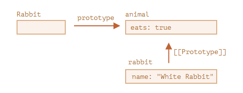
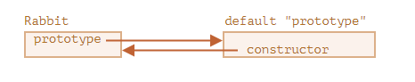
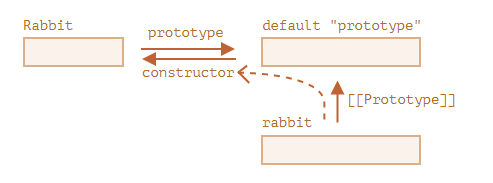
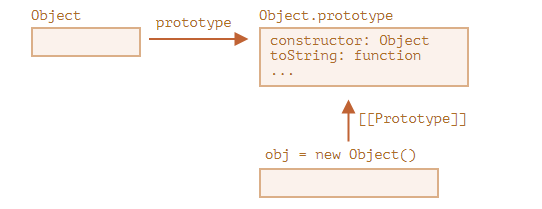

# 프로토타입과 프로토타입 상속

## 프로토타입 상속

> 개발을 하다 보면 기존에 있는 기능을 가져와 확장해야 하는 경우가 생깁니다
>
> 어떠한 객체가 있는데 유사하지만 약간의 차이가 있을 때 사용한다고 생각하면 됩니다

- `[[prototype]]`

  - 자바스크립트의 객체는 `[[prototype]]`이라는 숨김 프로퍼티가 있다
  - 다른 객체를 참조하는 경우 참조 대상을 프로토타입이라 부릅니다
  - 이걸 이용해서 상속을 시킬 수도 있다
  - ```javascript
    let animal = {
      eats: true,
    };
    let rabbit = {
      jumps: true,
    };

    rabbit.__proto__ = animal; // (*)

    // 프로퍼티 eats과 jumps를 rabbit에서도 사용할 수 있게 되었습니다.
    alert(rabbit.eats); // true (**)
    alert(rabbit.jumps); // true
    ```

  - 조금 멋들어지게 상속은 아래와 같이 가능하다
  - ```javascript
    let animal = {
      eats: true,
      walk() {
        alert("동물이 걷습니다.");
      },
    };

    let rabbit = {
      jumps: true,
      __proto__: animal,
    };

    // 메서드 walk는 rabbit의 프로토타입인 animal에서 상속받았습니다.
    rabbit.walk(); // 동물이 걷습니다.
    ```

  - 이중으로도 가능하다
  - 하지만 프로토타입을 계속해서 체이닝하려면 두가지 제약사항이 있습니다
    1. 순환 참조는 허용되지 않습니다. `__proto__`를 이용해 닫힌 형태로 다른 객체를 참조하면 에러가 발생합니다
    2. `__proto__`의 값은 객체나 null 만 가능합니다. 다른 자료형은 무시됩니다

- 프로토타입은 읽기 전용이다

  - 읽기 전용이라 덮어씌우는 것이 가능합니다. 아래 코드를 참조합시다
  - ```javascript
    let user = {
      name: "John",
      surname: "Smith",

      set fullName(value) {
        [this.name, this.surname] = value.split(" ");
      },

      get fullName() {
        return `${this.name} ${this.surname}`;
      },
    };

    let admin = {
      __proto__: user,
      isAdmin: true,
    };

    alert(admin.fullName); // John Smith (*)

    // setter 함수가 실행됩니다!
    admin.fullName = "Alice Cooper"; // (**)

    alert(admin.fullName); // Alice Cooper, setter에 의해 추가된 admin의 프로퍼티(name, surname)에서 값을 가져옴
    alert(user.fullName); // John Smith, 본래 user에 있었던 프로퍼티 값
    ```

- this가 나타내는 것

  - 언제나 해당 객체를 본다고 생각하면 된다.
  - 말보단 코드가 역시 이해하기 편하니 아래 코드를 봅시다
  - ```javascript
    // animal엔 다양한 메서드가 있습니다.
    let animal = {
      walk() {
        if (!this.isSleeping) {
          alert(`동물이 걸어갑니다.`);
        }
      },
      sleep() {
        this.isSleeping = true;
      },
    };

    let rabbit = {
      name: "하얀 토끼",
      __proto__: animal,
    };

    // rabbit에 새로운 프로퍼티 isSleeping을 추가하고 그 값을 true로 변경합니다.
    rabbit.sleep();

    alert(rabbit.isSleeping); // true
    alert(animal.isSleeping); // undefined (프로토타입에는 isSleeping이라는 프로퍼티가 없습니다.)
    ```

- for in

  - 반복문은 상속프로퍼티도 순회대상이다
  - 그런데 object.keys에는 안나온다
  - ```javascript
    let animal = {
      eats: true,
    };

    let rabbit = {
      jumps: true,
      __proto__: animal,
    };

    // Object.keys는 객체 자신의 키만 반환합니다.
    alert(Object.keys(rabbit)); // jumps

    // for..in은 객체 자신의 키와 상속 프로퍼티의 키 모두를 순회합니다.
    for (let prop in rabbit) alert(prop); // jumps, eats
    ```

## 함수의 prototype 프로퍼티

> 우리는 리터럴 뿐만 아니라 `new F()`와 같은 생성자 함수로도 새로운 객체를 만들 수 있다는 걸 배운 바 있습니다

```javascript
let animal = {
  eats: true,
};

function Rabbit(name) {
  this.name = name;
}

Rabbit.prototype = animal;

let rabbit = new Rabbit("흰 토끼"); //  rabbit.__proto__ == animal

alert(rabbit.eats); // true
```

위 상황을 그림으로 표현하면 아래와 같다



### 함수의 디폴트 프로퍼티 prototype과 constructor 프로퍼티

> 개발자가 특별히 할당하지 않더라도 모든 함수는 기본적으로 `prototype` 프로퍼티를 갖습니다

```javascript
function Rabbit() {}

/* 디폴트 prototype
Rabbit.prototype = { constructor: Rabbit };
*/
```



위 상황을 직접 코드로 보내보자

```javascript
function Rabbit() {}
// 함수를 만들기만 해도 디폴트 프로퍼티인 prototype이 설정됩니다.
// Rabbit.prototype = { constructor: Rabbit }

alert(Rabbit.prototype.constructor == Rabbit); // true

function Rabbit() {}
// 디폴트 prototype:
// Rabbit.prototype = { constructor: Rabbit }

let rabbit = new Rabbit(); // {constructor: Rabbit}을 상속받음

alert(rabbit.constructor == Rabbit); // true ([[Prototype]]을 거쳐 접근함)
```



우리 중요한 점은 **자바스크립트는 알맞은 constructor값을 보장하지 않는다**는 점입니다

```javascript
function Rabbit() {}
Rabbit.prototype = {
  jumps: true,
};

let rabbit = new Rabbit();
alert(rabbit.constructor === Rabbit); // false
```

## 내장 객체의 프로토타입

> `prototype` 프로퍼티는 자바스크립트 내부에서도 광범위하게 사용됩니다

### Object.prototype

```javascript
let obj = {};
alert(obj); // [object object]
```

뭔가 당연히 봐왔던 결과인데 저 `[object object]`는 어디서 나왔을까?



위와 같은 상황으로 진행되는 것이다. 즉 아래 코드를 살펴본다면 이해가 쉬울 것이다

```javascript
let obj = {};

alert(obj.__proto__ === Object.prototype); // true

alert(obj.toString === obj.__proto__.toString); //true
alert(obj.toString === Object.prototype.toString); //true

alert(Object.prototype.__proto__); // null
```

### 네이티브 프로토타입 변경하기

의외로 네이티브 프로토타입은 수정할 수 있다! ~~왜?~~

```javascript
String.prototype.show = function () {
  alert(this);
};

"BOOM!".show(); // BOOM!
```

사실 변경을 허용하는 경우는 있어야한다. 딱 하나 **폴리필을 만들 때**

### 프로토타입에서 메서드 빌려오기

의외로 신기하게 아래와 같은 것도 가능하다

```javascript
let obj = {
  0: "Hello",
  1: "world!",
  length: 2,
};

obj.join = Array.prototype.join;

alert(obj.join(",")); // Hello,world!
```

## 프로토타입 메서드와 **proto**가 없는 객체

> `__proto__`는 브라우저를 대상으로 개발하고 있다면 다소 구식이기 때문에 더는 사용하지 않는 것이 좋습니다. 표준에도 관련 내용이 명시되어있습니다.

아래와 같은 모던한 메서드들을 사용하자

- Object.create(proto, [descriptors]) – [[Prototype]]이 proto를 참조하는 빈 객체를 만듭니다. 이때 프로퍼티 설명자를 추가로 넘길 수 있습니다.
- Object.getPrototypeOf(obj) – obj의 [[Prototype]]을 반환합니다.
- Object.setPrototypeOf(obj, proto) – obj의 [[Prototype]]이 proto가 되도록 설정합니다.

```javascript
let animal = {
  eats: true,
};

// 프로토타입이 animal인 새로운 객체를 생성합니다.
let rabbit = Object.create(animal);

alert(rabbit.eats); // true

alert(Object.getPrototypeOf(rabbit) === animal); // true

Object.setPrototypeOf(rabbit, {}); // rabbit의 프로토타입을 {}으로 바꿉니다.

let animal = {
  eats: true,
};

let rabbit = Object.create(animal, {
  jumps: {
    value: true,
  },
});

alert(rabbit.jumps); // true
```
