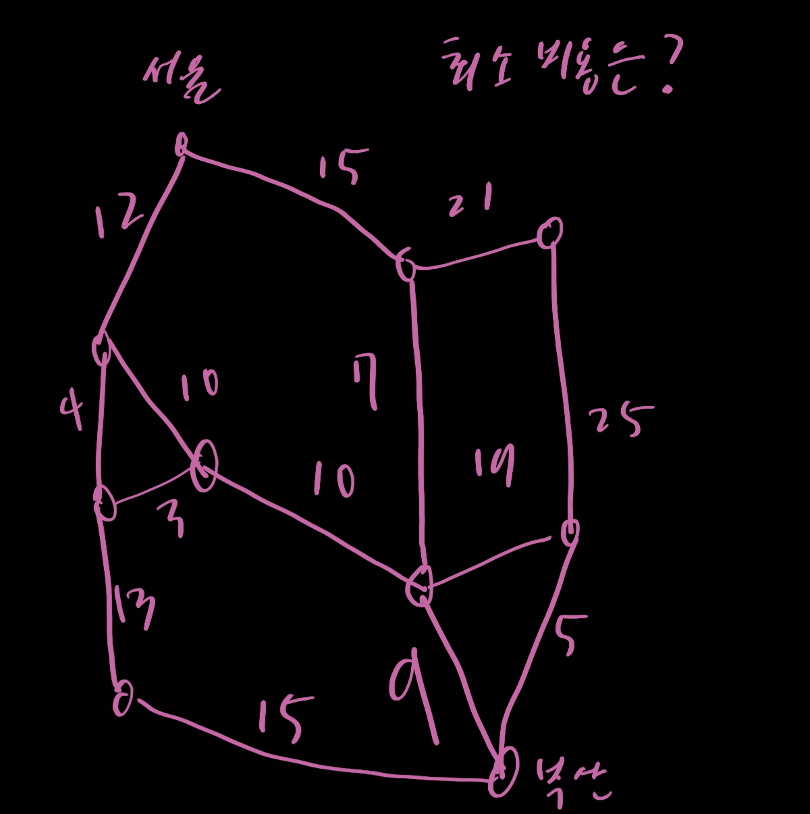
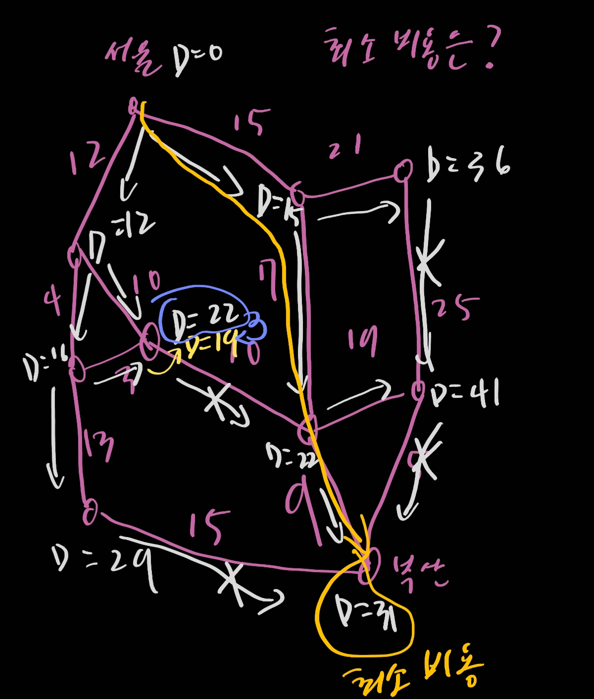

# 3. Greedy Algorithm - 1

- 항상 최적의 선택을 하는 방법
- 문제는 이게 잘못된 결정일 경우가 나올 수도 있으니 항상 조심해야한다.
  - 대표적인 예까 거스름돈 동전 나눠주기이다.
- 선택을 하고 그 선택을 바꾸지 않는다.
- 가장 간단한 알고리즘이다.

1. 잔돈 거슬러 주기

   - 그리디하게 생각해보자
     - 제일 큰 동전부터 나눠주는게 합리적인 듯한데?
     - initialization all counts of each coin to 0
     - From the largest unit, use the coin until remaining change is less than the unit price
     - Count the used coins in the iteration
     - Repeat the process until the remaining change is 0
     - Return total counts of all coins
   - 근데 위에 것은 문제가 있다 200원짜리를 거스름돈으로 나눌때 동전이 160,100,10 이렇게 있다고 하면 문제가 생긴다.

2. Minimum Spanning Tree (MST)

   - Definition of Minimum Spanning Tree
     - A tree
     - Conneccted to all verices of a given graph
     - Sum of the weights of its edge is the minimum over all trees
   - 대표적인 두가지 그리디 알고리즘이 있다
     - 크루스칼
       - 수도코드
         - Sort all edges by their weights in ascending order
         - L = the sorted list
         - T = 공집합
         - while |T| < n-1 {
         - temp_e = argmin w(e)
         - L = L/{e}
         - if iscycle T union {e}
         - else skip
         - }
         - return T
       - 시간복잡도 `O(NlogN)` 
       - 프림에 비해 줄어든 시간 복잡도를 보여준다
     - 프림
       - 무작위 노드 하나를 찍는다
       - 브루트 포스라고 생각 할 수 있다
       - 선택되지 않은 노드를 고른다 가장 작은 웨이트를 선택하게 한다
       - 생김새를 보니 큐로 구현하는 것이 편할 것으로 예상이 된다
       - dp도 같이 이용되고 있는 것이다
       - 시간복잡도는 `O(N^2)`
       - 수도 코드
         - select a startin vertex 'p', set D[p] = 0
         - N = {p}
         - for (v not in T) {
         - if ((p,v) dege exists){
         - D[v] = the given weight of (p,v)
         - E[v] = p
         - } else {
         - D[v] = infinite
         - E[v] = None
         - }
         - }
         - 대충 연결된 노드랑 등록되어있는 길이 계속 비교

3. Searching Shortest Path

   - Given Information

     - A weighted Graph
     - A tarting Point

   - Search the shortest path from the starting to all the other vertices

   - the shortest path : the sum of weights of edges to build the path is minimum in all possible paths on the graph

     - 

       코스트를 계산 해보면 아래와 같이 진행이 되고

       최소 비용은 노란색 선을 따라가게 된다는 것을 쉽게 알 수가 있다.

       

