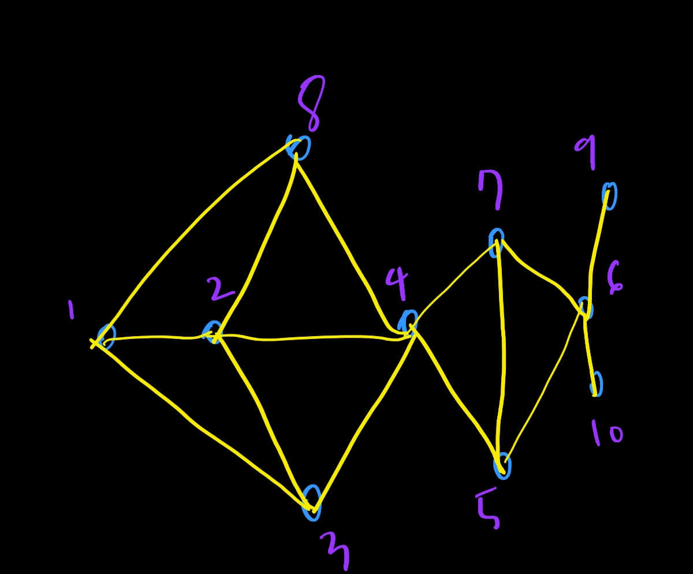

# 4. Greedy Algorithm - 2

4. Fractional Knapsack Problem

   - Conditions
     - N Products
     - Each product has weight and price
     - A knapsack has weight limit
   - Goal
     - Find the product carried by the knapsack to maximize total price
     - Splitting products is not allowed
     - fractional knapsack, if it's allowed
   - 해결방법 그냥 가성비좋은거부터 때려넣는다
     - 왜? 쪼갤수있기 때문에

5. Set Covering [참고자료](https://jackpot53.tistory.com/107)

   - Conditions

     - Set U : N objects
     - Power set F of U
     - Select elements of F to include U

   - Goal

     - Minimize the number of selected subsets

   - Example

     - Locating schools in a new city

     - 10 towns in this city as the following graph

     - Two conditions should be satisfied

       - school should be in one of the towns
       - Distance from any town to a school should be les than 15

       

       2,6에 학교를 세우면 모든 도시를 커버한다
       
     - 수도코드
     
       1. input: U, F={Si | Si is a subset of U, 1<= i <=n}
       2. output: a subset C of F
       3. C = 공집합
       4. while (U != 공집합) {
       5. S = argmax(Si) |U 교집합 Si|
       6. U = U-S
       7. F = F \ S
       8. C = C U S
       9. }
       10. return C
   
6. Task Scheduling

   - Starting and ending time of tasks are fixed
   - The number of machine are not restricted
   - Like assigning classes to your schedule
   - what us the factor to affect the number of machine?
   - If there are two rules to run at the same time, we need to assign two machines
   - If one of the tasks has the same relation to another task, we need to add one more machine
   - how to reduce the relations?
   - What we know?
     - the number of task
     - their starting ending time and length
   - 수도 코드
     1. input T = {t1,t2,....}
     2. output: Task Schedule for Each Machine
     3. L = Sorted T in the ascending order of starting time
     4. M = {}
     5. while (L != 공집합) {
     6. ti = L[0]
     7. if (isRunnable(ti,m) for m in M) {m = m U {ti}}
     8. else {
     9.   m' = {ti}
     10.   M = M U m
     11.   }
     12. L = L \ {ti}
     13. }
     14. return M

7. Huffman Coding

   - 압축하는 방식

