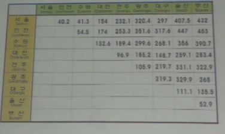
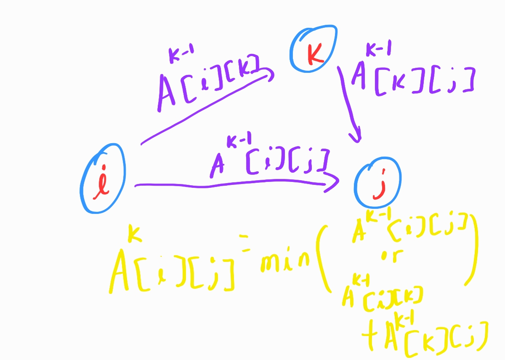

# 5. Dynamic Programming

## Idea

- 분할 정복과 비슷하다. 잘게 나누고 크게 점점 보는 것
- 메모리제이션으로 정답을 도출해나가는 과정이 필요하다
- Dependency to previous results should be considered when we get the solution of larger problem

1. Searching All Pairs of Shortest Paths

   - Goal

     Searching the shortest paths of all starting and ending point pairs

   - 

   - 플로이드 워셜을 이용해보자 아래와 같은 상황이다

     

     - 시간복잡도는 아쉽게도 `O(N^3)`이 투자가 된다
     - 수도 코드
       1. Input: 2D array D, D[i,j] = weight of edge (i,j)
       2. output: 2d array
       3. for k = 1 to n
       4.   for i = 1 to n (i!=k)
       5. ​    for j = 1 to n (j!=k and i!=k)
       6. ​      D[i,j] = min(D[i,k]+D[k,j],D[i,j])

   - 벨만 포드 알고리즘 [참고자료](https://ratsgo.github.io/data%20structure&algorithm/2017/11/27/bellmanford/)

     - 스타팅포인트를 k개만큼 받는다 => timeN까지 그 지점까지 도달하는 최소값을 계속해서 저장해나가는 방식
     - 수도코드
       - BellmanFord(G,r) {
       -   for each u in V: du = infinite
       -   dr = 0
       -   for i = 1 to |V|-1
       - ​    for each (u,v) in E
       - ​      if (du + Wuv < dv) then dv = du + Wuv
       - }

2. Chained Matrix Multiplications

   - Goal

     가장 연산 횟수가 적은 곱하는 순서를 찾아라