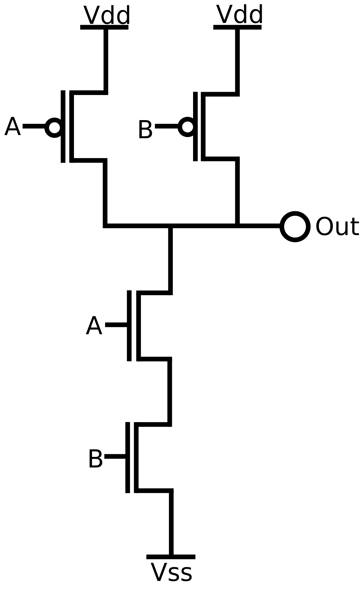
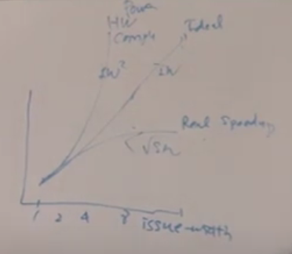
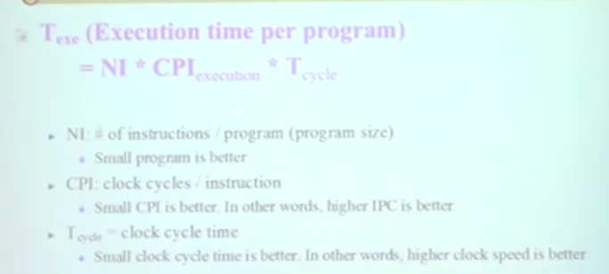

# 1. introduction

dram을 제외한 모든 것은 nand게이트이다.

[하이퍼 스레드?](https://www.intel.co.kr/content/www/kr/ko/gaming/resources/hyper-threading.html) : 대충 같은 파이프라인을 두 프로그램이 쓴다 => 순차적으로 해결을 하는데 좀 빠르게 진행되다보니 동시에 실행되듯이 보임. => 성능이 좋아진다

hardware complexity는 제곱수로 빠르게 증가하고 이상적인 문제해결은 linear하게 증가해야한다. 하지만 실제 스피드는 루트보다도 작기 때문에 기계는 커지지만 성능이 그렇게 향상되지 않는듯한 느낌이 드는 문제가 생긴다.

2000년대 이전에는 저 이슈가 크지 않아서 ILP(Instruction-Level Parallelism) 명령어 간의 상관 관계를 그저 비순차적으로 해결하는 방법을 많이 이용했지만 2000년대 이후에는 위와 같은 이슈가 많이 생겨서 TLP(Thread-level Parallelism)형식으로 바뀌었다. TLP는 멀티코어 방식과 멀티 스레딩 방식으로 나뉜다. 그래서 체감 성능이 매우 향상되어있다.

위 수식이 정리가 된다면 한 프로그램의 실행시간이 나온다. (가운데 `/`가 있다 잘봐라)

[cisk와 risk](https://m.blog.naver.com/PostView.naver?blogId=scw0531&logNo=220601865340&proxyReferer=https:%2F%2Fwww.google.com%2F)

## SPEC (Standard Performance Evaluation Corporation)

- Non-profit organization to endorse a standardized set of benchmakrs
  - SPEC CPU 2006, SPECviewperf, SPECweb, etc
- SPECCPU: provide performance measurements for compute-intensive workloads