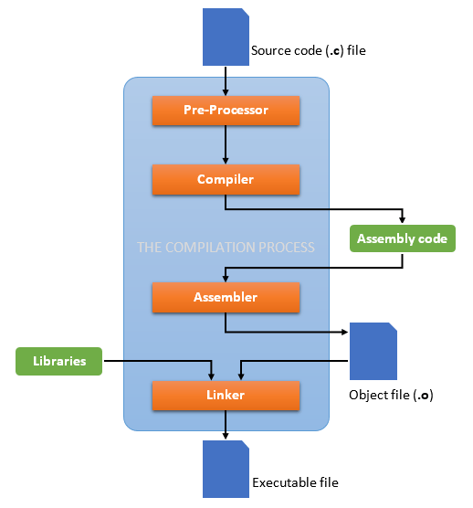
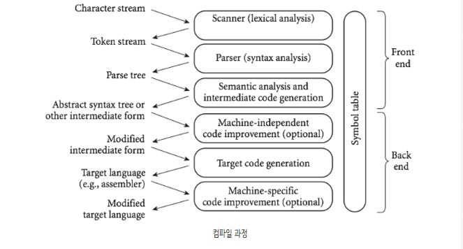

# 2. Instruction Set Architecture 1

- programming language
  - 실질 적으로 우리의 일반적인 코드는 사실 컴퓨터가 이해를 못한다.
  - 언어의 컴파일러가 기계가 알아들을 수 있도록 트랜슬레이트해준다.
  - 
  - 컴파일 과정
    - 
    - 컴파일 과정
      - 프론트엔드: 소스 프로그램의 의미를 알아내는 역할
      - 백엔드: 해당되는 목표 프로그램으로 구현역할
    - 과정에서 각 역할
      - Scanner
        - 공백 제거, 주석제거, 낱ㅁ말 분석
        - 소스 코드를 읽고 토큰화 한다.
      - Parser
        - 토큰들이 순서대로 잘 배치 되었는지 규칙 검사하며 **parse tree**로 만든다 (문법적 오류 파악)
      - Semantic analysis
        - 프로그램의 변수, 타입들의 올바른 사용을 검증 (논리적 오류 파악)
        - parse tree를 추상적 문법 트리로 만든다
        - 크게 두 부분으로 나뉜다.
          - 현재 과정(Compile time)에서 하면 Static semantic analysis (변수 문법등 검증)
          - 실행 시점(Run time)에서 하는 것이 Dynamic semantic analysis (변수 초기화, 포인터 유효값 배열 overflow, 타입 overflow 등 검증)
      - Target code generation
        - 중간 형태를 목표 언어로 변환
      - 최적화(optional)의 역할
        - 목표 언어로 변환된 코드를 최적화
- 레지스터
  - 프로세서에 위치한 고속 메모리로 극히 소량의 데이터나 처리 중인 중간 결과와도 같은 프로세서가 바로 사용할 수 있는 데이터를 담고 있는 영역
- 메모리
  - 저장되어있는 위치, 캐시부터 디스크까지 정보가 있는 전체를 말한다
  - 의외로 프로그래머에게 위치는 중요치 않다! 메모리에서 레지스터로 가지고 온다 그것만 기억해도 충분하다
- 프로그램 카운터
  - 다음에 실행될 명령어의 주소를 가지고 있어 실행할 기계어 코드의 위치를 지정하는 것.
  - 명령어 포인터라고도 한다
  - 실행되면 다음 프로그램카운터를 보고 명령어를 찾고 실행되면 다음 프로그램 카운터를 보고 계속 반복하는 방식이다

