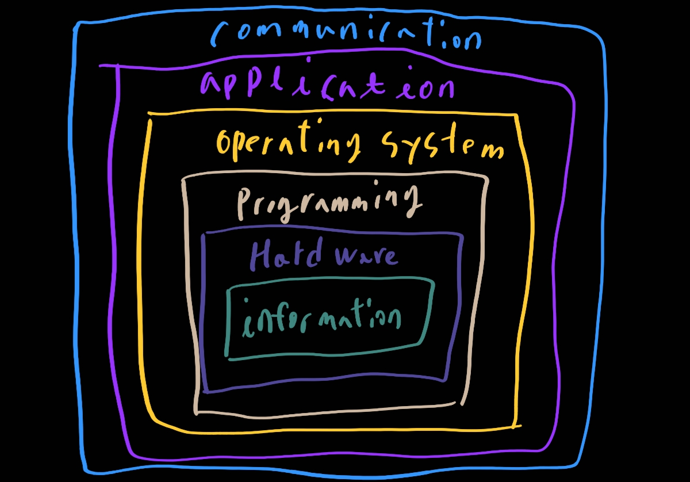

# 1. 컴퓨터 시스템 전체 개요

## 컴퓨팅 시스템

## 하드웨어

컴퓨팅 시스템을 구성하는 물리적인 요소들 (프린터, 회로기판, 와이어, 키보드 등등)

### 소프트웨어

컴퓨터를 실항시키기 위해서 지시하는 명령어들로 구성된 프로그램들

### 컴퓨터 시스템의 계층들

### 추상화

추상화: 복잡합 세부사항이 제거된 개념 모델

이는 핵심 개념이다. 추상화는 교재 전반에 걸쳐 등장하게 되므로 반드시 이해할 수 있어야 한다!

## 컴퓨팅의 초기 역사

- 주판

  수치를 기록하는 초기 장비

- Blaise Pascal

  사칙연산을 할 수 있는 기계식 계산기

- Joseph Jacquard

  자커드의 방직기, 구멍이 뚫려 있는 카드

- 찰스 배비지

- Ada Lovelace

  최초의 프로그래머, 루프

- Alan Turing

  튜링 기계, 인공지능 시험

- Havard Mark 1, Eniac, Univac 1

  수학, 물리학, 엔지니어링 그리고 경제학에 새로운 시대를 연 컴퓨터들

### 제 1 세대 하드웨어

- 진공관

  부피가 크고, 많은 열을 발생시켜 믿을 수 없었음

- 마그네틱 드럽

  입출력 헤드 밑에서 돌아가는 기억 장치

- 카드 리더 => 마드네틱 테이프 장치

  순차적 보조 기억 장치

### 제 2세대 하드웨어

- 트랜지스터

  진공관 대체, 빠르고 작으며 오래가고 가격도 저렴

- 마그테틱 코어

  마그네틱 드럼 대체, 정보처리가 즉시 이루어짐

- 마그네틱 디스크

  마그네틱 테이프 대체, 데이터에 직접 접근 가능

### 제 3세대 하드웨어

- Integrated Circuits 직접회로 (IC)

  회로 기판을 대체, 더 작고, 싸며, 빠르고, 더 믿을만함

- Transistors 트렌지스터

  현재는 기억 장치 구성에 쓰임

- Terminal

  키보드와 스크린으로 구성된 입출력 장치

### 제 4세대 하드웨어

- 대규모 직접 회로

  칩 기술의 커다란 발전

- 개인용 컴퓨터, 컴퓨터의 상용화, 워크스테이션

  개인용 컴퓨터와 워크스테이션이 나타남. 새로운 기업들이 등장: 애플, 썬, 델....

- 노트북, 태블릿 컴퓨터, 그리고 스마트폰

  개인이 컴퓨터를 휴대하게 됨

### 병렬 컴퓨팅과 네트워킹

- 병렬 컴퓨팅

  컴퓨터들은 서로 연결되어 처리 속도를 높여주는 중앙 처리 장치와 기억 장치들에 의존한다

- Networking 네트워킹

  Ethernet이 소형 컴퓨터들을 연결하여 자원 공유를 가능하게 함

  1980년대 후반에 파일 서버들이 PC들을 연결해 줌

- ARPANET과 랜 => 인터넷

### 제 1세대 소프트웨어

- 기계 언어

  컴퓨터 프로그램들이 이진수로 작성됨

- 어셈블리어와 번역기

  연상 기호로 프로그램으로 작성하여 기계어로 번역함

- 프로그래머들의 변화

  두 그룹으로 나뉘게 됨: 응용 프로그래머와 시스템 프로그래머

### 제 2세대 소프트웨어

- 고급 언어

  영어와 닮은 문장들의 사용으로 프로그래밍이 쉬워졌다 (Fortran, COBOL, Lisp)

### 제 3세대 소프트웨어

- 시스템 소프트웨어
  1. 유틸리티 프로그램
  2. 언어 번역기
  3. 운영체제가 시행할 프로그램과 시간을 결정
- 사용자와 하드웨어의 분리

### 제 4세대 소프트웨어

- 구조화된 프로그래밍

  파스칼, C++

- 사용자를 위한 새로운 응용 소프트웨어

  스프레드쉬트, 문서 편집기, 데이터베이스 관리 시스템

### 제 5세대 소프트웨어

- Microsoft

  윈도우즈 운영체제와 마이크로소프트 사의 다른 응용프로그램들이 시장을 점령

- 객체지향 설계

  객체 데이터의 서열을 따르는 방식

- 월드와이드웹

- 새로운 사용자들

## 원리로서의 컴퓨팅

### 무엇을 (효과적으로) 자동화 할 수 있는가?

### 꼭 필요한 네가지 기술

- 알고리즘적인 사고
- 표현
- 프로그래밍
- 설계

