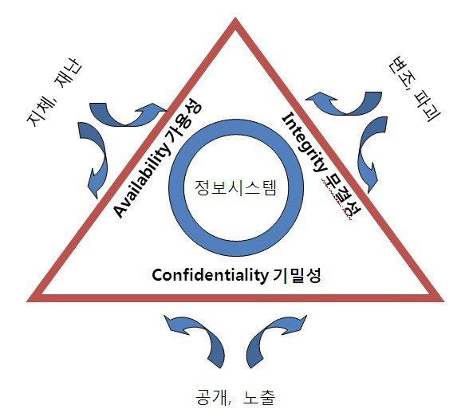

# 13. 컴퓨터 보안. 정보 보안

## 정보 보안

- 정보 보안

  데이터에 대한 적절한 접근을 보장하기 위한 기술과 정책들

- 기밀 유지

  데이터가 인증되지 않은 접근으로부터 보호되었다는 것을 보장하는 것

  

- 위험 분석

  중요한 데이터에 대한 위험의 성질과 가능성을 식별하는 것이다.

  정보 분석에 대한 계획은 위험 분석을 필요로 한다.

  그 목적은 한 시스템을 최대의 위기로 몰아넣는 위협에 대한 취약점을 최소화하는 것이다.

## 미승인 접근 방지

- 공인 인증서

  정보 이용자들이 컴퓨터에 접근하기 위해 본인임을 입증할 수 있도록 제공하는 정보

- 사용자 인증

  이름, 비밀번호, 개인 식별 번호

- 스마트 카드

  사용자를 인증하기 위해 내장 메모리 칩을 가진 카드

- 생체 인증

  지문, 망막이나 음성패턴과 같은 생체 특성

- CAPCHA

  사용자가 또다른 컴퓨터가 아님을 인증

## 컴퓨터 보안

- 악성 코드

  적절한 인증을 우회 하고/하거나 인증되지 않은 기능을 수행하려는 시도를 하는 컴퓨터 프로그램

- 웜

  독립적으로 네트워크 자원을 목표로 함

- 트로이 목마

  유용한 자원으로 가장함

- 바이러스

  자기-복제

- 논리 폭탄 특정 시스템

  이벤트가 발생했을 때 실행되도록 설정됨

- 보안 공격

  컴퓨터 시스템에 대한 공격

- 비밀번호 추측

  체계적인 접근 시도

- 피싱

  사용자를 속여서 보안 정보를 드러내게 함

- 스푸핑

  악성 사용자가 인증된 사용자로 가장함

- 백도어

  그것이 존재한다는 것을 아는 누구에게든 인증되지 않은 접근

- 버퍼 오버플로우

  컴퓨터 프로그램에서 시스템이 붕괴되고 사용자가 최고 권한을 갖게 만드는 결함

- 서비스 거부

  인증된 사용자가 시스템에 접근하지 못하게 만드는 공격

- 중간자

  중요한 데이터를 얻기 위해 네트워크 통신을 가로채는 공격