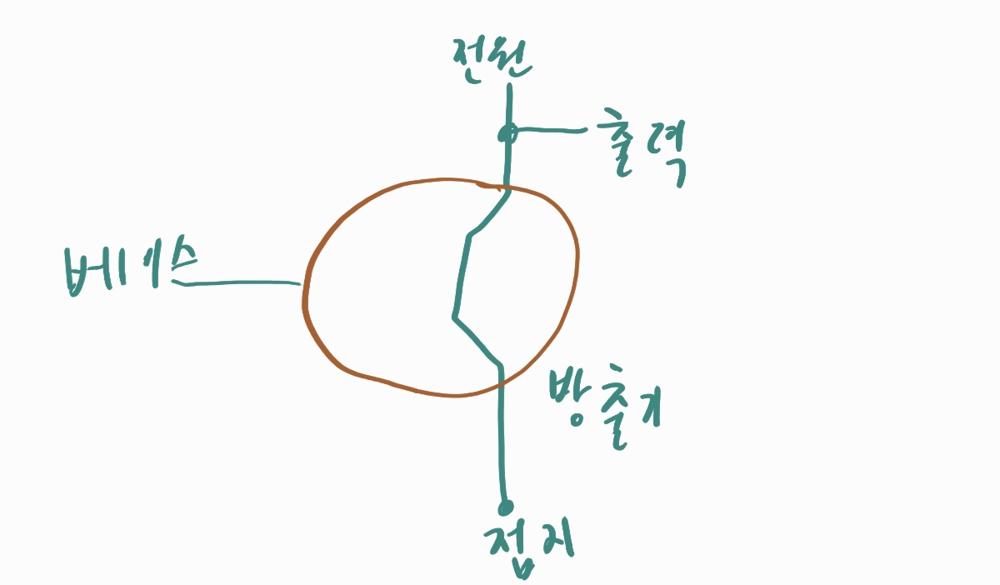
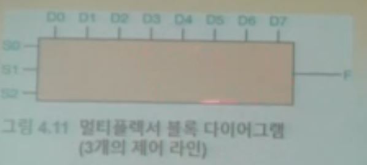

# 5. 컴퓨터 구성요소

## 컴퓨터와 전기

- 게이트

  전기적 신호에 맞춰 기본적인 연산을 수행하는 장치

  NOT, AND, OR, XOR, NAND, NOR

- 회로

  좀 더 복잡한 작업을 수행할 수 있도록 결합한 게이트들

- 게이트와 회로는 어떻게 설명하는가?

  - 부울 수식

    부울 대수학을 사용, 두개의 값을 가진 논리적 수식을 표현하기 위한 수학적 표기

  - 논리 다이어그램

    회로의 그래픽적 표현, 각 게이트는 고유의 기호를 갖음

  - 진리표

    입력 값들과 출력값을 연산이 진행되면 어떻게 되는지 보여줌

## 게이트 구성

- 트랜지스터

  입력 신호의 전압에 따라서 전기를 통하게 하는 도선이거나 전기의 흐름을 차단하는 저항으로 작용하는 장치

  움직이는 부분은 없지만 스위치와 같은 역할을 함

  특별히 성능 좋은 전기 전도체(구리 등)도 아니고 특별히 성능 좋은 절연체(고무 등)도 아닌 반도체로 이루어져있다

  트렌지스터는 3단자를 갖는다 (전원, 베이스, 방출기)

  전기 신호가 접지된 상태라면, 전기는 대체 경로를 통해서 땅으로 흐르게 되어, 위험하지 않게 된다.

  

## 회로

- 조합 회로

  입력 값들에 의해서만 출력 값이 결정되는 회로

- 순차 회로

  출력 값은 입력 값들과 회로의 현재 상태에 대한 작용에 의해 결정됨

  회로의 동작은 3가지로 설명할 수 있다.

  - 부울수식
  - 논리 다이어그램
  - 진리표

## 멀티 플렉서

제어라인 S0,S1및 S2는 8개의 다른 입력 라인(D0~D7) 중에서 어느 라인이 출력(F)으로 이어질지를 결정

