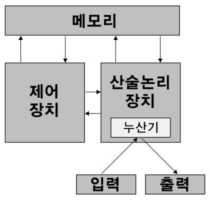
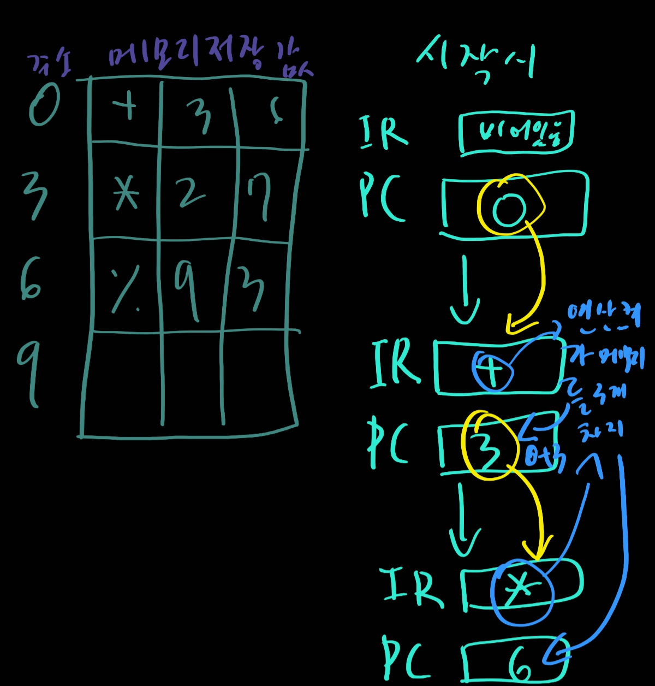
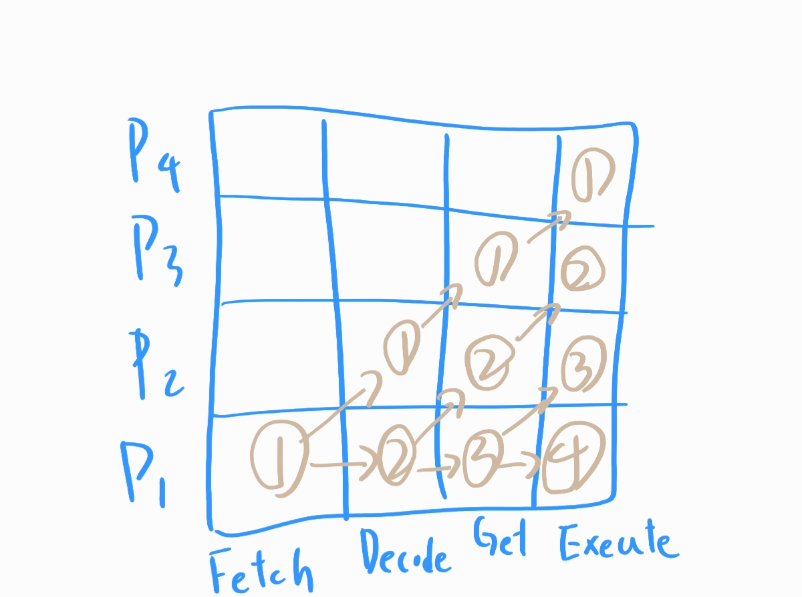

# 6,7. 하위레벨 프로그래밍 언어 샌드 스프레드 코드

## 저장된 프로그램의 개념

- 폰 노이만 아키텍쳐

  

## 기억장치

- 고유한 물리 주소를 가진 셀들을 모아 놓은 것
- 주소와 내용 모두 이진수

## 산술/논리 연산 장치 (ALU)

- 덧셈과 같은 기본적인 산술 연산을 수행
- AND,OR및 NOT과 같은 논리 연산을 수행
- 대부분의 현대의 ALU는 **레지스터**라고 불리는 적은 수의 특별한 저장장치를 가지고 있다.

## 제어장치

- 제어장치

  컴퓨터에서 정리를 담당하는 부분

- 명령어 레지스터 (IR)

  실행중인 명령어를 갖고 있음

- 프로그램 카운터 (PC)

  다음에 실행될 명령어의 주소를 갖고 있음

- 중앙 처리 장치 (CPU)

  ALU와 제어장치의 조합

- 동작방식 (간소화)

  

## 정보의 흐름

- 버스

  컴퓨터의 주요 부분들을 연결하는 전선들의 모음

## 인출 - 실행 주기

- 다음 명령어를 **가져온다** (Fetch)
- 가져온 명령어를 **해석한다** (Decode)
- 필요하다면 데이터를 **가져온다** (Get)
- 명령어를 **실행한다** (Execute)

## RAM과 ROM

- RAM

  랜덤 액세스 기억장치

  각 셀에 직접적으로 접근하여 바꿀 수 있는 기억장치

- ROM

  읽기 전용 기억장치

  각 셀에 직접적으로 접근할 수는 있으나 바꿀 수는 없는 기억장치

## 동기화 처리

병렬 처리의 한 방법으로 다수의 프로세스들을 이용해 다수의 데이터 집합에 동일한 프로그램을 적용하는 것이 있다.

## 파이프라인

프로세서들이 일렬로 배치되고, 각 프로세서는 전체 처리과정의 일부를 담당한다. 프로세스가 하나일때는 별 의미가 없다

위 상황은 모든 처리과정이 같으면 이상적이긴 하지만 다를경우 약간의 대기시간이 생길 수가 있다.

## 컴퓨터의 동작

- 컴퓨터

  프로그래밍이 가능하고 정보를 저장, 검색, 처리하는 전기장치

  **정보**와 그 **정보를 처리하는 명령어** 모두 기계 내에 함께 저장된다.

- 기계언어

  2진수의 실행 명령어들로 이루어진 특정 컴퓨터에 내장된 언어로서 컴퓨터가 직접 사용할 수 있는 언어

## pep/8

학습을 위해 만든 가상의 컴퓨터

- pep/8의 레지스터 / 상태 감당 가능 비트

  - 프로그램 계수기
  - 명령어 레지스터
  - 누산기
  - 기억장치는 65536바이트의 저장공간 보유중

- 명령어 형식

  - 연산 코드

    실행할 명령어 지정

  - 레지스터 지정자

    사용할 레지스터 지정

  - 주소 지정 방식 지정자

    명령어의 피연산자부의 해석 방식 지정