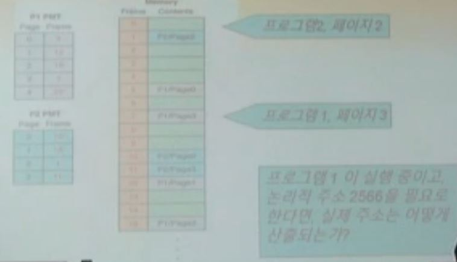

# 9. OS

## 운영체제의 역할

- 시스템 소프트웨어로서
  - 기억 장치와 입출력 장치와 같은 컴퓨터 자원을 관리한다
  - 사용자가 컴퓨터와 상호작용할 수 있게 하는 인터페이스를 제공한다
  - 응용 프로그램이 다른 시스템 자원과 상호 작용할 수 있게 해준다

## 자원관리

- 멀티프로그래밍

  CPU를 사용하여 실행할 수 있게 경쟁하는 복수의 프로그램을 주 기억장치에 동시에 유지하는 기술

- 메모리 관리

  주 기억장치에 어떤 프로그램이 어디에 저장되어 있는지를 추적하는 과정

- 프로세스

  실행중인 프로그램

- 프로세스 점검

  프로세스와 전 중간 단계의 진행 과정을 신중하게 추적하는 행위

- CPU스케줄링

  어떤 프로세스를 CPU에서 실행할지를 결정하는 행위

## 일괄 (배치) 처리

최초의 운영체제 운영자는 사람이었는데, 그 운영자는 다수의 사용자가 건넨 다양한 작업을 같은 자원을 필요로 하는 작업 별로 배치했다.

## 시 분할(Timesharing)

- 시 분할 시스템

  다수의 사용자가 컴퓨터와 동시에 상호작용 할 수 있게 하는 시스템

- 가상 기계 (Virtual machine)

  사용자가 단독으로 기계를 사용하고 있는 것처럼 느끼게 시 분할 시스템이 만들어낸 환상

## 다른 요인들

- 실시간 시스템

  응용 분야의 특성상 반응 시간이 결정적인 역할을 하는 시스템

- 반응 시간

  자극을 받아서 반응을 하는 데 걸리는 시간

- 장치 드라이버

  특정 장치가 예상대로 정보를 받아서 전달하는 방법을 "알고 있는" 작은 프로그램

## 기억장치 관리

운영 체제는 다음의 작업을 수행하기 위한 기술들을 사용해야 한다

- 프로그램ㅁ이 메모리에 저장되어 있는 위치 및 방법을 추적

- 논리적 주소를 실제적인 메모리 주소로 변환

  - 논리적 주소

    참조를 만들어내는 프로그램에 대한 저장된 값의 참조

  - 물리적 주소

    실제로 저장되어있는 메모리내 실제 주소

## 분할 (파티션) 메모리 관리

- 단일 연속 메모리 관리

  운영체제와 다른 한 개의 프로그램ㅁ만 동시에 메모리에 있다

- 분할 (파티션) 메모리 관리

  OS와 다른 프로그램들이 몀ㅊ 개이든 동시에 메몸리에 갖고 있다

- 메모리를 나누는 두가지 방식

  - 고정 분할

    메모리가 프로그램들이 탑재되는 수만큼 파티션들로 분할된다

  - 동적 분할

    파티션이 프로그램을 탑재하기 위해 필요한 수만큼 분할된다

메모리는 파티션으로 나누어지는데, 일부는 프로그램에 쓰이고, 일부는 비어있다

- 기준 레지스터

  현재 파티션 (지금 실행 중인)의 시작 주소를 담은 레지스터

- 경계 레지스터

  현재 파티션의 길이

- 둘을 이용하여 해당 프로그램의 메모리인지 아닌지를 적절히 이용한다

  예를 들어 기준레지스터가 00을 가르키고 경계 레지스터가 1GB라고 한다면 00~1GB에 해당하는 주소까지가 해당 프로세스의 메모리 영역이라는 소리이다 그 밖은 다르 프로세스들의 영역이고

## 파티션 선택 알고리즘

- 최초 적합

  프로그램을 저장하기에 충분히 큰 첫 번째 파티션에 할당

- 최적 적합

  프로그램을 저장하기에 충분하면서 가장 작은 파티션에 할당

- 최악 접합

  프로그램을 저장하기에 충분하면서 가장 큰 파티션에 할당

## 페이지화 메모리 관리

- 페이지화 메모리 기술

  탑재될 때 프로세스가 고정된 크기의 페이지로 분할되어 메모리 프레임에 저장되는 메모리 관리 기법

- 프레임

  프로세스의 페이지를 보유하고 있는 주 기억장치의 크기가 고정된 일부

  메모리 프레임에 저장되어 있는 프로세스의 크기가 고정된 일부 페이지

  페이지와 프레임의 크기가 같다고 가정한다
  
- 정수 값으로된 논리적 주소는 논리적 주소 <페이지, 오프셋>으로 기록된다

  - 페이지 번호

    주소를 페이지 크기로 나눈 몫

  - 오프셋

    주소를 페이지 크기로 나눈 나머지 값