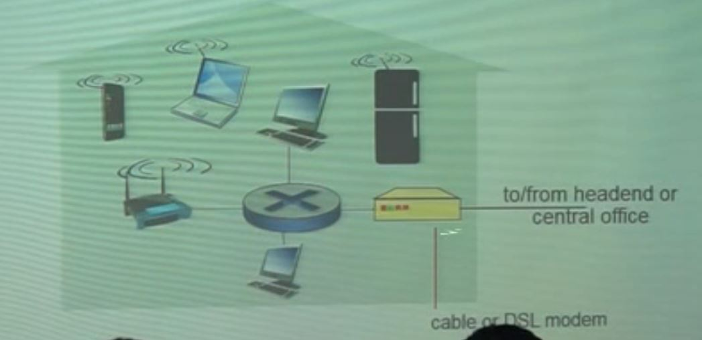

# 1. Computer Networks and the Internet

- Access network

  - DSL (digital subscriber line)

    

    전화선을 통해 데이터 통신을 함

  - cable network

    

    cable을 통해 데이터를 받음

  - Home network

    

  - Ethernet

    

- Host: sends packets of data

  - host ending function:

    - takes application message

    - breaks into smaller chunks, known as ***packets***, of length ***L*** bits

    - transmits packet into access network at ***transmission rate R***

    - 

    - packet transmission delay = time needed to transmit L-bit packet into link
      $$
      = \frac {L(bits)} {R (bits/sec)}
      $$

      - link transmission rate, aka link capacity, aka link bandwidth

- Physical media

  - bit: propagates between transmitter/receiver pairs
  - physical link: what lies between transmitter & receiver
  - guided media: signals propagate in solid media: copper, fiber, coax

