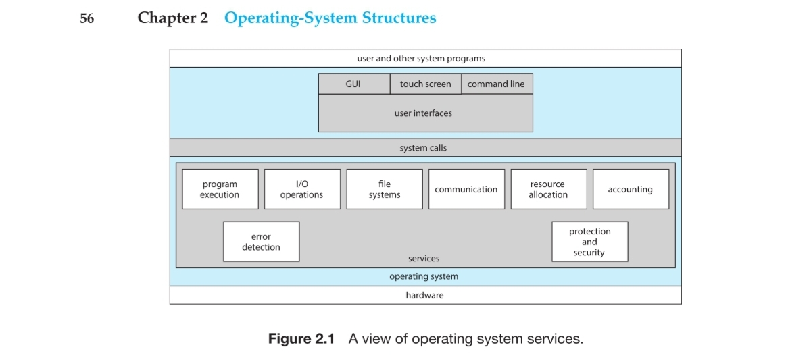

# 1. 운영체제 개요

- Course overview
  1. OS overview
  2. Process
  3. Thread
  4. Mutual Exclusion and Synchronization
  5. Deadlock and Starvation
  6. Memory Management
  7. Virtual Memory
  8. Uniprocessor scheduling
  9. Multiprocessor and Realtime Scheduling
  10. IO (input and output)
  11. File Management
  12. Virtual Machine

## OS

- 컴퓨터 시스템은 메모리와 cpu가 있다면 컴퓨터 시스템이라고 할 수가 있다.
- 
- os마다 cpu마다 machine language가 다르다
  - 인텔과 암드는 왜 서로 같지? IBM이 같은 형식의 machine language를 MS에게 팔고 cpu 아키택쳐는 인텔에게 팔았기 때문에, 암드는 MS의 랭기지에 맞는 아키텍쳐를 만들면 같은 프로그램을 돌릴 수가 있기 때문이다
- ISA, ABI, API를 이용해서 OS가 누구나 이용할 수 있도록 돌아가게 된다. (뭔지 좀 검색해봐야할듯)
- 마이크로 프로세서: 싱글 칩 프로세서
- ISA (Instruction Set Architecture)
  - defines machine Instructions and visible machine states
  - Examples
    - ARM, MIPS 등등
- Michroarchitecture
- CISC (Complex Instruction Set Computer): 구식 필요하다고 생각되는 모든걸 다 미리 만들어둠
- RISC (Reduced Instruction Set Computer): 신식 필요한 것만 만들어두고 그걸 응용해서 작업함
- Word: Default data size for computation
- Address: Points to a location in memory
- Caches

