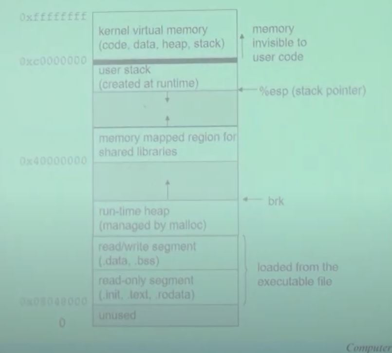
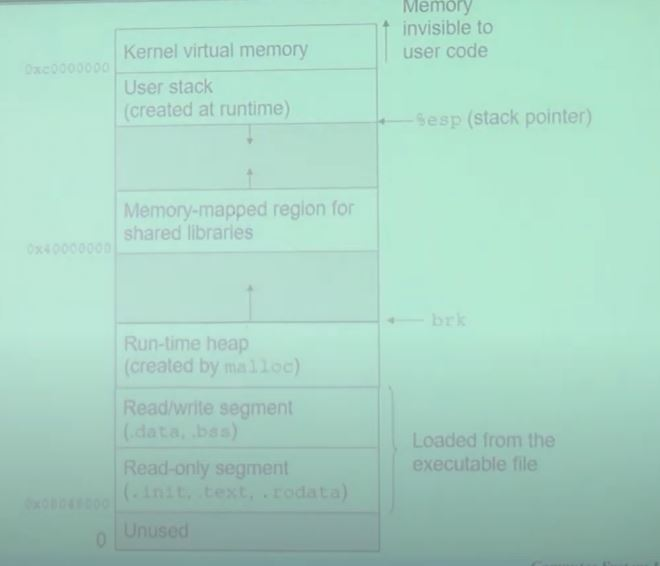

# 2. 운영체제 역사, 프로세스

- ENIAC

  국방의 목적

  미사일 탄도 궤적 계산

- The Von Neumann Machine & IAS

- Simple Batch System

- Multiprogrammed Batch System

- Time-sharing System

- Compatible Time-sharing System

  - CTSS: One of the first time-sharing OS
  - Time slicing

# 프로세스

- Def: A process in an instance of a program in execution
  - One of the most profound ideas in computer science
  - Not the same as 'program' or 'processor'
- Process Provides two key abstractions
  - Logical control flow
    - Each process has an exclusive use of the processor
  - Private address space
    - Each process has an exclusive use of private memory
- How are these Illusions maintained?
  - Multiprogramming(multitasking): process execultions are interleaved
    - In reality, many other programs are running on the system
    - Processes take turns in using the processor
      - Each time period that a process executes a portion of its flow is called a time slice
  - Virtual memory: OS provides a private space for each process

## Private Address Spaces

- Each process has its own private address space (위쪽은 로컬변수 아래쪽은 글로벌변수를 주로 이용한다)

  

## Life anad scope of an object

- Live vs scope
  - Life of an object determines whether the object is still in memory (of the process) whereas the scope of aan object determines whether the object can be accessed at this position
  - It is possible that an object is live but not visible
  - It is not possible that an object is visible but nor live
- Local variables
  - Varialbes defined inside a function
  - The scope of these variables is only within this function
  - The life of these variables ends when this function completes
  - So when we call the function again, sotrage for variables is created and values are reinitialized
  - static local variables - if we want the value to be extent throughout the life of a program, we can define the local variable as 'static'
- Global variables
  - Variaables defined outside a function
  - The cope of these variables is throughout the entire program
  - The life of these variables ends when the program end
- Static variables
  - Static variables are local in cope to their module in which they are defined but life is throughout the program
  - Static local variables; static variables inside a function cannot be called from outside the function (because it's not in scope) but is alive and exists in memory
  - Static vaaribles; if a statuc variable is defined in a global space then this variable will be accessible only in this file

## Linux run-time memory Image

## Context Switching

- Processes are managed by OS code called the kernel
  - 운영체제를 커널이라고 생각해도 되다
  - 커널은 항상 실행중이다
- User mode and kernel mode
  - 어떠한 모드인지 확인이 당연히 가능하다
  - 커널이 프로그램 실행시에 적절히 판단하여 유저모드와 커널모드를 계속해서 변환한다
  - 저 변환 상태에서는 무조건 전의 실행 상황을 기억하고 있어야 한다
- Context
  - The kernel maintains a context for each process
- Context switching