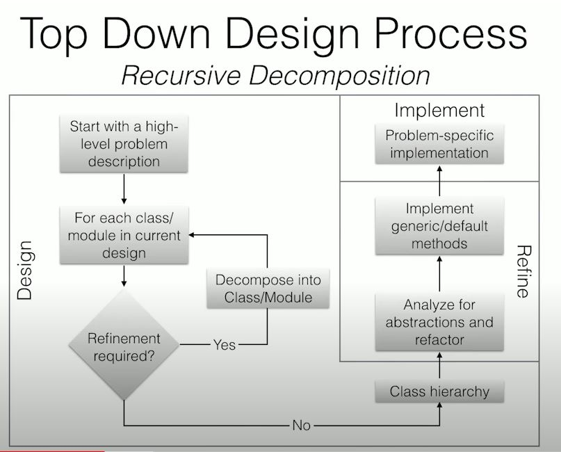
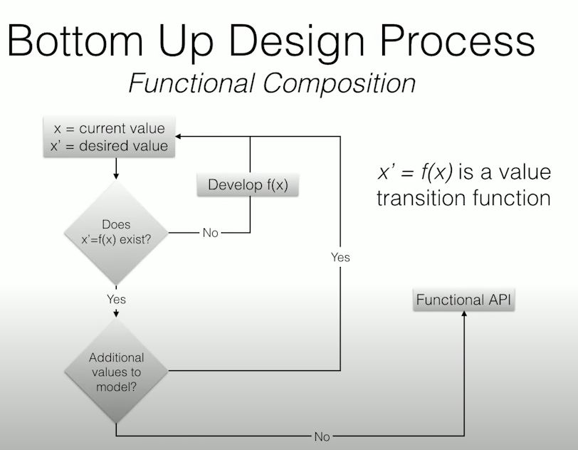

# Bottom Up vs Top Down Design in Clojure

[영상주소](https://www.youtube.com/watch?v=Tb823aqgX_0)

추천 영상으로 뜨길래 함 봤고 `clojure`만에 국한되는 이야기는 아니라 정리해볼 가치가 있어서 정리해볼까 한다. 보드게임과 비유해주면서 설명해주기에 괜찮으 것 같다

decomposing games라는 것을 생각해봤다는 듯하다

> A game is a system in which players engage in an artificial conflict, defined by rules, that results in a quantifiable outcome

작업을 계속해서 반복하면 refine을 계속 반복적으로 해줘야 한다. 그리고 그런 경우에 decompose again을 생각하면 된다. 보드게임과 같이 설명하면 다음과 같다

- Some board games have cards
- Some card games have boards
- Solutions
  - multiple inheritance
  - Single inheritaance
  - Composition

위 짓을 계속해서 반복하게 된다. 코드를 짜고 확장해서 리파인 하고 다시 짜고 확장해서 리파인하고 한무 반복이 일어난다. why r u doing this? stop it

관찰해볼 점들은 다음과 같다

- Seemingly simple decompositions can become become very complicated, especially when trying to create generalizations
- Nearly everything is connected because objects naturally complect
- No methods - so far the API is only structural
- Top-down API design can be very time consuming and result in massive code bloat
- this happens all the time

즉, 탑다운 방식의 디자인은 간단해보인다. 하지만 서로간의 의존성을 매우 높일 가능성이 높다는 것이다. 우리는 코드를 재사용하기 위해서는 의존성이 매우 낮아야 한다

그렇다면 바탐업 디자인을 생각해보자. 바탐업 디자인을 할때 아래와 같은 질문은 무조건 따라올 것이다.

- How do I represent my domain as data
- What functions do I need to manipulate that data

탑다운은 빠르게 구현하는데에 좋을 것이다

하지만 바탐업은 의존성을 낮게 디자인하여 코드의 재사용성을 매우 높일 수 있을 것이다. 프로젝트에서 어떤 부분이 중요한지 계속 생각하고 설계를 제대로해서 프로그래밍을 시작하는 것이 좋을 것이다. 개발은 기획도 매우 중요하고 설계도 매우 중요하기 때문이다.

의존성이 낮으면 왜 좋은가요?

코드가 재사용성이 높아질 수 있다. 재사용성이 높아진다고 하면 대표적으로 OOP(객체지향)이 있다. 객체지향식으로 잘 코딩했다고 하자. DB쪽에서는 그 객체가 필요한 입력을 받았을때 그것을 제대로 표현하고 프론트쪽에서는 해당 객체의 상태에 따라 UI로 잘 표현할 수 있을 것이다. 이런 부분에 있어서 의존성을 낮추고 재사용성을 높인다는 것은 매우 중요하다고 할 수 있다.